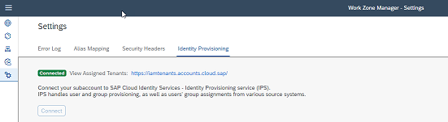

<!-- loioe567b51e2e554814836bf2d7b0e2a9fc -->

<link rel="stylesheet" type="text/css" href="css/sap-icons.css"/>

# Post Booster Configuration

The following steps can be executed only after successfully running the booster. They are required to connect your subaccount to the SAP Cloud Identity Services - Identity Provisioning, and to switch the authentication mechanism to SAP Cloud Identity Services - Identity Authentication.

<a name="loioe567b51e2e554814836bf2d7b0e2a9fc__section_epl_zqp_5wb"/>

## Switch to SAP Cloud Identity Services - Identity Authentication

By default SAP Build Work Zone, advanced edition uses the SAP Authentication and Trust Management service \(XSUAA\) for identity authentication. To use custom domains and other enhanced capabilities, we recommend switching to SAP Cloud Identity Services - Identity Authentication as the authentication mechanism.

1.  In the side panel of the Site Manager, click :gear: \(Settings\).

2.  Select the *Identity Authentication* tab.

3.  Confirm that your subaccount has an active trust configuration with SAP Cloud Identity Services - Identity Authentication.

4.  Click *Enable*.

    > ### Note:  
    > This action can take up to 15 minutes to take effect.

    > ### Note:  
    > For instructions how to switch back to SAP Authorization and Trust Management service \(XSUAA\), refer to [3311634](https://launchpad.support.sap.com/#/notes/3311634).

<a name="loioe567b51e2e554814836bf2d7b0e2a9fc__section_zz3_k2g_mxb"/>

## Connect Your Subaccount to SAP Cloud Identity Services - Identity Provisioning

### Prerequisites

-   The integration with the Identity Provisioning service supports only one active Identity Authentication tenant. Before you start the configuration, open the cockpit, *Security* \> *Trust Configuration*, and verify that you have only one active SAML or OIDC – based Identity Authentication trust configuration in the list. The default IdP, `sap.default`, is not relevant to the flow and can be ignored for this requirement. After the connection is formed, you can configure additional active IdPs.
-   If you already have an active Identity Authentication tenant, you are required to reconnect it to the Identity Provisioning service after you've modified it.

SAP Build Work Zone, advanced edition uses SAP Cloud Identity Services - Identity Authentication as the user management system, and SAP Cloud Identity Services - Identity Provisioning as the user provisioning system.

To be able to use Identity Provisioning for user and user group provisioning, complete the following procedure:

1.  In the SAP BTP cockpit, *Services* \> *Instances and Subscriptions*, open the *Subscriptions* tab.
2.  Click the  \(Actions\) next to the SAP Build Work Zone, advanced edition entry, and then select *Go to Application*.
3.  In the Site Manager, open the *Settings* screen from the left-side menu.
4.  Go to the *Identity Provisioning* tab, and click the *Connect* button.
    -   If your subaccount is not yet connected to the Identity Provisioning service, a new tenant will be created for your subaccount, and it will include the SAP Build Work Zone, advanced edition connector. In addition, a connection will be created between the Identity Authentication service and the Identity Provisioning service.
    -   If your subaccount already has an Identity Provisioning tenant connected to the Identity Authentication service, clicking the connect button will expand the scope of the tenant to include the SAP Build Work Zone, advanced edition connectors.

        

> ### Note:  
> If you are using content federation in your subaccount, hence, content from remote content providers, you should also configure the SAP Build Work Zone, standard edition connector in your Identity Provisioning tenant. For more information, see [Configure Integration with the Identity Provisioning Service](https://help.sap.com/docs/Launchpad_Service/8c8e1958338140699bd4811b37b82ece/1c231333f1d24ae0a8e60ce688c4f692.html)

For more information, see [SAP Build Work Zone Bundle](https://help.sap.com/viewer/f48e822d6d484fa5ade7dda78b64d9f5/Cloud/en-US/930015d483a74ee8b68a132db7699825.html)

> ### Note:  
> If your system is not using the Identity Authentication service as a primary IdP, please see [User Authentication, Provisioning and Authorization](user-authentication-provisioning-and-authorization-f04c185.md)

**Troubleshooting**

<table>
<tr>
<th valign="top">

Error

</th>
<th valign="top">

Cause

</th>
<th valign="top">

Possible Solution

</th>
</tr>
<tr>
<td valign="top">

The connection to the Identity Provisioning service has failed.

</td>
<td valign="top">

Connection failed due to an internal issue.

</td>
<td valign="top">

As instructed on the screen, please open a support ticket. To find the component details, see [Getting Support](getting-support-37b7948.md)

In this case, the *Retry* button isn't active.

</td>
</tr>
<tr>
<td valign="top">

Could not find an active Identity Authentication service tenant. Please check your configuration and try again.

</td>
<td valign="top">

Connection failed due to lack of an active Identity Authentication Service tenant.

</td>
<td valign="top">

Verify that you have an active tenant. Open the SAP BTP cockpit, *Security* \> *Trust Configuration* and verify that your Identity Authentication Service tenant is set to *Active*. Note that an active default identity provider is not sufficient for this scenario.

Once you've fixed the configuration, click *Retry*.

</td>
</tr>
<tr>
<td valign="top">

Sorry, something has gone wrong. Please try again later.

</td>
<td valign="top">

Connection failed due to a temporary issue.

</td>
<td valign="top">

This error is presented when there's a temporary glitch. In this case, you should try again later.

The *Retry* button is active in this case.

</td>
</tr>
</table>

