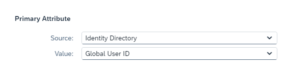

<!-- loio96b51b1aaf8349b5a053c56ec6d6fe19 -->

# Prerequisites

Complete the following steps before executing the SAP SuccessFactors Work Zone booster.

<a name="loio96b51b1aaf8349b5a053c56ec6d6fe19__section_bln_gzf_3qb"/>

## Migrate SAP Jam to the Preferred Domain \(ondemand.com or a custom domain\)

If you already have an SAP Jam tenant, open a support ticket to migrate from `sapjam.com` domain to the domain you are planning to use, either `ondemand.com` domain or a custom domain. For more information, see SAP note [0002920494](https://me.sap.com/notes/0002920494)

> ### Note:  
> To migrate your data from your SAP Jam tenant to your preferred domain, please open a ticket on component **LOD-SF-SWZ**.
> 
> In the ticket please include all the information about your subaccount, which you can can find in the*Administration Console* \> *Overview* screen.

> ### Note:  
> From February 2022, SAP Jam must be connected to Identity Authentication directly instead of HXM core/BizX. For more information, see SAP note [0003111415](https://me.sap.com/notes/0003111415) - How to decouple SAP Jam or SAP SuccessFactors Work Zone from BizX, guidelines to switch to the new setup.

<a name="loio96b51b1aaf8349b5a053c56ec6d6fe19__section_kht_y4q_qlb"/>

## Create a Subaccount

In this step, you'll create a subaccount in SAP BTP, Cloud Foundry Environment \(if you don't have one already\).

> ### Note:  
> If you're already onboarded to SAP Build Work Zone, advanced edition on this subaccount, you can't onboard to SAP SuccessFactors Work Zone on the same subaccount.

### Create a subaccount

For optimal performance and to **avoid latency issues**, create the subaccount on the recommended data center according to this table. If your data center is not listed, select the closest location for optimal performance.

-   When using an existing SAP Jam system that should be upgraded, column \[C / 3\] should be looked at to find the suggested data center mapping for the subscription \(column \[A / 1\]\).
-   When setting up a new tenant, the deployment of the DWS\*\* component in column \[D / 4\] should be considered in addition.

<table>
<tr>
<th valign="top">

\[A\] SAP BTP, Cloud Foundry Environment Data Center

</th>
<th valign="top">

\[B\] SAP BTP, Cloud Foundry Environment Infrastructure Provider

</th>
<th valign="top">

\[C\] Existing SAP Jam / SAP SuccessFactors Data Center\*

</th>
<th valign="top">

\[D\] New customers setup for DWS\*\* component Data Center

</th>
</tr>
<tr>
<td valign="top">

cf-cn20 - China North 3 \(Hebei\)

</td>
<td valign="top">

Azure

</td>
<td valign="top">

DC30 - SAP Converged Cloud - Shanghai

</td>
<td valign="top">

Setup after June 19th, 2025:

Azure deployment cn20

</td>
</tr>
<tr>
<td valign="top">

cf-cn40 - China \(Shanghai\)

</td>
<td valign="top">

Alibaba Cloud

</td>
<td valign="top">

N/A

</td>
<td valign="top">

Setup after May 17th, 2026

Alibaba deployment cn40

</td>
</tr>
</table>

<table>
<tr>
<th valign="top">

\[A\] SAP BTP, Cloud Foundry Environment Data Center

</th>
<th valign="top">

\[B\] SAP BTP, Cloud Foundry Environment Infrastructure Provider

</th>
<th valign="top">

\[C\] Existing SAP Jam / SAP SuccessFactors Data Center\*

</th>
<th valign="top">

\[D\] New customers setup for DWS\*\* component Data Center

</th>
</tr>
<tr>
<td valign="top">

cf -ae01 - UAE \(Dubai\)

</td>
<td valign="top">

SAP

</td>
<td valign="top">

N/A

</td>
<td valign="top">

-   Setup after May 17th, 2026

    SAP deployment ae01

</td>
</tr>
<tr>
<td valign="top">

cf-ap01 - Australia \(Sydney\)

</td>
<td valign="top">

SAP

</td>
<td valign="top">

N/A

</td>
<td valign="top">

-   Setup after May 17th, 2026

    SAP deployment ap01

</td>
</tr>
<tr>
<td valign="top">

cf-ap10 - Australia \(Sydney\)

**Includes SAP Build Process Automation**

</td>
<td valign="top">

AWS

</td>
<td valign="top">

DC10 \(DC66\) - Sydney

</td>
<td valign="top">

-   Setup prior to January 3rd, 2023:

    DC10 \(DC66\) - Sydney

-   Setup after January 3rd, 2023:

    AWS deployment ap10

</td>
</tr>
<tr>
<td valign="top">

cf-ap11 - Asia Pacific \(Singapore\)

**Includes SAP Build Process Automation**

</td>
<td valign="top">

AWS

</td>
<td valign="top">

DC44 - Singapore

</td>
<td valign="top">

-   Setup prior to January 3rd, 2023:

    DC44 - Singapore

-   Setup after January 3rd, 2023:

    AWS deployment ap11

</td>
</tr>
<tr>
<td valign="top">

cf-ap12 - Asia Pacific \(Seoul\)

</td>
<td valign="top">

AWS

</td>
<td valign="top">

N/A

</td>
<td valign="top">

-   Setup after June 27th, 2024:

    AWS deployment ap12

</td>
</tr>
<tr>
<td valign="top">

cf-ap20 - Australia \(Sydney\)

**Includes SAP Build Process Automation**

</td>
<td valign="top">

Azure

</td>
<td valign="top">

N/A

</td>
<td valign="top">

-   Setup after June 27th, 2024:

    Azure deployment ap20

</td>
</tr>
<tr>
<td valign="top">

cf-ap21 - Singapore

**Includes SAP Build Process Automation**

</td>
<td valign="top">

Azure

</td>
<td valign="top">

DC52 – GCP Singapore

</td>
<td valign="top">

-   Setup prior to February 14th, 2024:

    DC52 – GCP Singapore

-   Setup after February 14th, 2024:

    Azure deployment ap21

</td>
</tr>
<tr>
<td valign="top">

cf-ap30 - Australia \(Sydney\)

**Includes SAP Build Process Automation**

</td>
<td valign="top">

GCP

</td>
<td valign="top">

N/A

</td>
<td valign="top">

-   Setup after October 2024:

    GCP deployment ap30

</td>
</tr>
<tr>
<td valign="top">

cf-br10 - Brazil \(São Paulo\)

**Includes SAP Build Process Automation**

</td>
<td valign="top">

AWS

</td>
<td valign="top">

DC19 - São Paulo

</td>
<td valign="top">

-   Setup prior to January 3rd, 2023:

    DC19 - São Paulo

-   Setup after January 3rd, 2023:

    AWS deployment br10

</td>
</tr>
<tr>
<td valign="top">

cf-br20 - Brazil \(São Paulo\)

**Includes SAP Build Process Automation**

</td>
<td valign="top">

Azure

</td>
<td valign="top">

N/A

</td>
<td valign="top">

-   Setup after October 2024:

    Azure deployment br20

</td>
</tr>
<tr>
<td valign="top">

cf-ca10 - Canada \(Montreal\)

**Includes SAP Build Process Automation**

</td>
<td valign="top">

AWS

</td>
<td valign="top">

DC60 – Canada Central

</td>
<td valign="top">

-   Setup prior to December 17th, 2023:

    DC60 – Canada Central

-   Setup after December 17th, 2023:

    AWS deployment ca10

</td>
</tr>
<tr>
<td valign="top">

cf-ca20 - Canada Central \(Toronto\)

</td>
<td valign="top">

Azure

</td>
<td valign="top">

N/A

</td>
<td valign="top">

-   Setup after 17th May, 2026:

    Azure deployment ca10

</td>
</tr>
<tr>
<td valign="top">

cf-ch20 - Switzerland \(Zurich\)

**Includes SAP Build Process Automation**

</td>
<td valign="top">

Azure

> ### Note:  
> EU Access.
> 
> For more information about EU Access, see [Enterprise Accounts](https://help.sap.com/viewer/65de2977205c403bbc107264b8eccf4b/Cloud/en-US/171511cc425c4e079d0684936486eee6.html)

</td>
<td valign="top">

N/A

</td>
<td valign="top">

-   Setup after January 3rd, 2024:

    Azure deployment ch20

</td>
</tr>
<tr>
<td valign="top">

cf-eu01 - Europe \(Frankfurt\)

</td>
<td valign="top">

SAP

> ### Note:  
> EU Access.
> 
> For more information about EU Access, see [Enterprise Accounts](https://help.sap.com/viewer/65de2977205c403bbc107264b8eccf4b/Cloud/en-US/171511cc425c4e079d0684936486eee6.html)

</td>
<td valign="top">

N/A

</td>
<td valign="top">

-   Setup after May 17th, 2026:

    SAP deployment eu01

</td>
</tr>
<tr>
<td valign="top">

cf-eu02 - Europe \(Rot\)

</td>
<td valign="top">

SAP

</td>
<td valign="top">

N/A

</td>
<td valign="top">

-   Setup after May 17th, 2026:

    SAP deployment eu02

</td>
</tr>
<tr>
<td valign="top">

cf-eu10 - Europe \(Frankfurt\)

**Includes SAP Build Process Automation**

</td>
<td valign="top">

AWS

</td>
<td valign="top">

-   DC02 \(DC57\) - Eemshaven
-   DC12 \(DC33\) – Frankfurt
-   DC22 – Dubai
-   DC23 – Riyadh
-   DC55 – Frankfurt

</td>
<td valign="top">

-   Setup prior to January 3rd, 2023:

    DC12 \(DC33\) – Frankfurt

-   Setup after January 3rd, 2023:

    AWS deployment eu10

</td>
</tr>
<tr>
<td valign="top">

**cf-eu11 - Europe \(Frankfurt\)**

**Includes SAP Build Process Automation**

</td>
<td valign="top">

AWS

> ### Note:  
> For EU Access, you must use the data centers DC02 \(DC57\) /DC12 \(DC33\) for SAP SuccessFactors and EU11 for Cloud Foundry.
> 
> For more information about EU Access, see [Enterprise Accounts](https://help.sap.com/viewer/65de2977205c403bbc107264b8eccf4b/Cloud/en-US/171511cc425c4e079d0684936486eee6.html)

</td>
<td valign="top">

-   DC02 \(DC57\) - Eemshaven
-   DC12 \(DC33\) – Frankfurt

> ### Note:  
> For EU Access, you must use the data centers DC02 \(DC57\) /DC12 \(DC33\) for SAP SuccessFactors and EU11 for Cloud Foundry.
> 
> For more information about EU Access, see [Enterprise Accounts](https://help.sap.com/viewer/65de2977205c403bbc107264b8eccf4b/Cloud/en-US/171511cc425c4e079d0684936486eee6.html)

</td>
<td valign="top">

Setup prior to October 22nd 2024:

DC12 \(DC33\) – Frankfurt

Setup after October 22nd 2024:

AWS deployment on eu11

</td>
</tr>
<tr>
<td valign="top">

cf-eu13 - Europe \(Milan\)

</td>
<td valign="top">

AWS

</td>
<td valign="top">

N/A

</td>
<td valign="top">

-   Setup after May 17th, 2026:

    AWS deployment eu13

</td>
</tr>
<tr>
<td valign="top">

cf-eu20 - Europe \(Netherlands\)

**Includes SAP Build Process Automation**

</td>
<td valign="top">

Azure

</td>
<td valign="top">

-   DC02 \(DC57\) – Eemshaven
-   DC12 \(DC33\) – Frankfurt
-   DC22 – Dubai
-   DC23 – Riyadh
-   DC55 – Frankfurt

</td>
<td valign="top">

-   Setup prior to December 27th, 2023:

    DC02 \(DC57\) - Eemshaven

-   Setup after December 27th, 2023:

    Azure deployment eu20

</td>
</tr>
<tr>
<td valign="top">

cf-eu22 - Europe \(Frankfurt\)

</td>
<td valign="top">

Azure

</td>
<td valign="top">

N/A

</td>
<td valign="top">

-   Setup after May 17th, 2026:

    Azure deployment eu22

</td>
</tr>
<tr>
<td valign="top">

cf-eu30 - Europe \(Frankfurt\)

**Includes SAP Build Process Automation**

</td>
<td valign="top">

GCP

</td>
<td valign="top">

N/A

</td>
<td valign="top">

-   Setup after August 2024:

    GCP deployment eu30

</td>
</tr>
<tr>
<td valign="top">

cf-il30 - Israel \(Tel Aviv\)

**Includes SAP Build Process Automation**

</td>
<td valign="top">

GCP

</td>
<td valign="top">

N/A

</td>
<td valign="top">

-   Setup after August 1st, 2024:

    GCP deployment IL30-1

</td>
</tr>
<tr>
<td valign="top">

cf-in30 India \(Mumbai\)

**Includes SAP Build Process Automation**

</td>
<td valign="top">

GCP

</td>
<td valign="top">

N/A

</td>
<td valign="top">

-   Setup after July 11th, 2024:

    GCP deployment in30

</td>
</tr>
<tr>
<td valign="top">

cf-jp01 - Japan \(Tokyo\)

</td>
<td valign="top">

SAP

</td>
<td valign="top">

N/A

</td>
<td valign="top">

-   Setup after May 17th, 2026:

    SAP deployment jp01

</td>
</tr>
<tr>
<td valign="top">

cf-jp10 – Japan \(Tokyo\)

**Includes SAP Build Process Automation**

</td>
<td valign="top">

AWS

</td>
<td valign="top">

DC50 – GCP Tokyo

</td>
<td valign="top">

-   Setup prior to February 14th, 2024:

    DC50 – GCP Tokyo

-   Setup after February 14th, 2024:

    AWS deployment jp10

</td>
</tr>
<tr>
<td valign="top">

cf-jp20 – Japan \(Tokyo\)

**Includes SAP Build Process Automation**

</td>
<td valign="top">

Azure

</td>
<td valign="top">

DC50 – GCP Tokyo

</td>
<td valign="top">

-   Setup prior to February 14th, 2024:

    DC50 – GCP Tokyo

-   Setup after February 14th, 2024:

    Azure deployment jp20

</td>
</tr>
<tr>
<td valign="top">

cf-jp30 – Japan \(Osaka\)

**Includes SAP Build Process Automation**

</td>
<td valign="top">

GCP

</td>
<td valign="top">

N/A

</td>
<td valign="top">

-   Setup after March 31st, 2025:

    GCP deployment jp30

</td>
</tr>
<tr>
<td valign="top">

cf-jp31 - Japan \(Tokyo\)

</td>
<td valign="top">

GCP

</td>
<td valign="top">

N/A

</td>
<td valign="top">

-   Setup after May 17th, 2026:

    GCP deployment jp31

</td>
</tr>
<tr>
<td valign="top">

cf-sa30 – KSA \(Dammam\)

**Includes SAP Build Process Automation**

</td>
<td valign="top">

GCP

</td>
<td valign="top">

N/A

</td>
<td valign="top">

-   Setup after August 2024:

    GCP deployment sa30

</td>
</tr>
<tr>
<td valign="top">

cf-sa31 KSA \(Dammam - KSA Non-Regulated Customers

</td>
<td valign="top">

GCP

</td>
<td valign="top">

N/A

</td>
<td valign="top">

-   Setup after May 17th, 2026:

    GCP deployemnt sa31

</td>
</tr>
<tr>
<td valign="top">

cf-uk20 - UK \(South London\)

</td>
<td valign="top">

Azure

</td>
<td valign="top">

N/A

</td>
<td valign="top">

-   Setup after May 17th 2026:

    Azure deployment uk20

</td>
</tr>
<tr>
<td valign="top">

cf-us01 - US \(Sterling\)

</td>
<td valign="top">

SAP

</td>
<td valign="top">

N/A

</td>
<td valign="top">

-   Setup after May 17th 2026:

    SAP deployment us01

</td>
</tr>
<tr>
<td valign="top">

cf-us02 - US West \(Colorado\)

</td>
<td valign="top">

SAP

</td>
<td valign="top">

N/A

</td>
<td valign="top">

-   Setup after May 17th, 2026:

    SAP deployment us02

</td>
</tr>
<tr>
<td valign="top">

cf-us10 - US East \(VA\)

**Includes SAP Build Process Automation**

</td>
<td valign="top">

AWS

</td>
<td valign="top">

-   DC08 \(DC70\) – Virginia
-   DC60 – Canada Central

</td>
<td valign="top">

-   Setup prior to November 28th, 2022:

    DC08 \(DC70\) – Virginia

-   Setup after November 28th, 2022:

    AWS deployment us10

</td>
</tr>
<tr>
<td valign="top">

cf-us11 - - US West \(Oregon\)

</td>
<td valign="top">

AWS

</td>
<td valign="top">

N/A

</td>
<td valign="top">

-   Setup after February 2025:

    AWS deployment us11

</td>
</tr>
<tr>
<td valign="top">

cf-us20 - US West \(WA\)

**Includes SAP Build Process Automation**

</td>
<td valign="top">

Azure

</td>
<td valign="top">

DC04 \(DC68\) - Virginia

</td>
<td valign="top">

-   Setup prior to February 14th, 2024:

    DC04 \(DC68\) - Virginia

-   Setup after February 14th, 2024:

    Azure deployment us20

</td>
</tr>
<tr>
<td valign="top">

cf-us21 - US East \(VA\)

**Includes SAP Build Process Automation**

</td>
<td valign="top">

Azure

</td>
<td valign="top">

-   DC47 - Canada
-   DC41 - East US

</td>
<td valign="top">

-   Setup prior to February 14th, 2024:

    DC41 - East US

-   Setup after February 14th, 2024:

    Azure deployment us21

</td>
</tr>
<tr>
<td valign="top">

cf-us30 - US Central \(IA\)

**Includes SAP Build Process Automation**

</td>
<td valign="top">

GCP

</td>
<td valign="top">

N/A

</td>
<td valign="top">

-   Setup after August 2024:

    AWS deployment us30

</td>
</tr>
</table>

\* For more information about SAP Jam / SAP SuccessFactors Data Centers, see [SAP SuccessFactors Data Centers](https://apps.support.sap.com/sap/support/knowledge/public/en/2089448).

\*\* For more information about DWS, see [Solution Architecture](solution-architecture-1fd9ea4.md) 

> ### Note:  
> After creating a subaccount in the Cloud Foundry environment, your user automatically has the administration role. If the subaccount was created by someone else, make sure you're assigned as a Security Administrator or to an SAP BTP cockpit member role on the global account. For more information, see [Add Members to Your Subaccount](https://help.sap.com/viewer/65de2977205c403bbc107264b8eccf4b/Cloud/en-US/1e1b7b60bb1b4764a2d4bb96bd73182d.html)

<a name="loio96b51b1aaf8349b5a053c56ec6d6fe19__section_zxs_kzf_3qb"/>

## Configure Trust Between SAP Cloud Identity - Identity Authentication and SAP BTP, Cloud Foundry Environment

In this step, you'll configure a trust between SAP BTP, Cloud Foundry Environment and the Identity Authentication service to enable user authentication. The trust is required to connect the Identity Authentication service as the user management system with the SAP BTP role management mechanism.

1.  In the SAP BTP cockpit, go to *Security* \> *Trust Configuration* and set all active IdPs you might have to inactive. You won't be able to deactivate the default trust configuration of SAP ID Service, therefore edit this entry and disable the options *Available for User Logon* and *Create Shadow Users During Logon*.

    > ### Note:  
    > The SAP SuccessFactors Work Zone Configurator expects a single active trust configuration with Identity Authentication in the subaccount. Adding multiple trust configurations might cause a failure in the onboarding process.
    > 
    > Therefore, before running the Configurator, customers should temporarily disable all trust configurations except for the primary one \(the Open ID Connect that is used for user logon\), and once the onboarding process is completed, they can enable them back.

2.  Establish trust using the method that is relevant to your use case:
    1.  If you are using the default domain \(ondemand.com\), use the *Establish Trust* button in *Security* \> *Trust Configuration* screen. This will form a trust automatically, using the OpenID Connect \(OIDC\) protocol. For more information, see [Establish Trust and Federation Between SAP Authorization and Trust Management Service and Identity Authentication](https://help.sap.com/docs/BTP/65de2977205c403bbc107264b8eccf4b/161f8f0cfac64c4fa2d973bc5f08a894.html).
    2.  If you are using a custom domain, refer to [Set Up a Custom Domain](set-up-a-custom-domain-50bcb51.md) \(step 4\).

3.  Establish trust between Identity Authentication and SAP Authorization and Trust Management service, using the SAML2 protocol. For more information, see [Manually Establish Trust and Federation Between SAP Authorization and Trust Management Service and SAP Cloud Identity Services](https://help.sap.com/docs/BTP/65de2977205c403bbc107264b8eccf4b/7c6aa87459764b179aeccadccd4f91f3.html).
4.  Access the Identity Authentication admin tool from the link in the *Trust Configuration* screen, and go to *Applications & Resources* \> *Applications*. Open the application that was created for your subaccount in the previous step \(as part of the trust\).
    1.  Under *Single Sign-On*, open the *Subject Name Identifier* section and change the Primary Attribute from `User ID` to `Global User ID`. Save your changes.

        .

    2.  In the *Attributes* section, add the following mapping:

        <table>
        <tr>
        <th valign="top">

        Name
        
        </th>
        <th valign="top">

        Source
        
        </th>
        <th valign="top">

        Value
        
        </th>
        </tr>
        <tr>
        <td valign="top">
        
        first\_name
        
        </td>
        <td valign="top">
        
        Identity Directory
        
        </td>
        <td valign="top">
        
        First Name
        
        </td>
        </tr>
        <tr>
        <td valign="top">
        
        Groups
        
        </td>
        <td valign="top">
        
        Identity Directory

        Expression
        
        </td>
        <td valign="top">
        
        Groups

        Workzone\_User\_Type\_$\{type\}
        
        </td>
        </tr>
        <tr>
        <td valign="top">
        
        last\_name
        
        </td>
        <td valign="top">
        
        Identity Directory
        
        </td>
        <td valign="top">
        
        Last Name
        
        </td>
        </tr>
        <tr>
        <td valign="top">
        
        mail
        
        </td>
        <td valign="top">
        
        Identity Directory
        
        </td>
        <td valign="top">
        
        Email
        
        </td>
        </tr>
        <tr>
        <td valign="top">
        
        sfsf\_userid
        
        </td>
        <td valign="top">
        
        Expression
        
        </td>
        <td valign="top">
        
        $\{customAttribute2\}
        
        </td>
        </tr>
        <tr>
        <td valign="top">
        
        user\_uuid
        
        </td>
        <td valign="top">
        
        Identity Directory
        
        </td>
        <td valign="top">
        
        Global User ID
        
        </td>
        </tr>
        </table>
        
        > ### Note:  
        > In addition to setting the `sfsf_userid` attribute, customers must modify their Identity Provisioning transformation code to ensure that the SAP SuccessFactors User ID value is assigned to `${customAttribute2}`. For more information, see [Default Configuration of Identity Authentication Service with SAP SuccessFactors](https://help.sap.com/docs/SAP_SUCCESSFACTORS_PLATFORM/568fdf1f14f14fd089a3cd15194d19cc/7426e40ebcbc4a358139adf7ef527b3c.html).

<a name="loio96b51b1aaf8349b5a053c56ec6d6fe19__section_t1q_vhh_3qb"/>

## Create Groups in the Identity Authentication Service and Assign Users

In this step, you'll create default user groups in the Identity Authentication service and assign users to them.

> ### Note:  
> You can use other methods to assign users to role collections. This step can be skipped if you are not planning to map role collections based on Identity Authentication groups or if you're not planning to assign the administrator role by provisioning Identity Authentication groups. For more information, see [User Authentication and Authorization](user-authentication-and-authorization-f04c185.md).

1.  Open your Identity Authentication admin environment.
2.  Choose the *User Groups* tile.
3.  Click *\+ Add* to add the following groups:

    The *Name* and *Display name* fields should be identical and should match the exact name that is listed below. This will ensure a match with the Identity Provisioning transformation code documented in this guide. If you change the group names, the transformation code should be updated accordingly.

    -   Workzone\_Admin
    -   Workzone\_Area\_Admin
    -   Workzone\_Support\_Admin
    -   Workzone\_Page\_Content\_Admin
    -   Workzone\_End\_User
    -   Workzone\_User\_Type\_public

    For more information, see [Create a New User Group](https://help.sap.com/viewer/6d6d63354d1242d185ab4830fc04feb1/Cloud/en-US/b1b638d6724e4dc48ee3e116263f567c.html).

4.  Choose the *User Management* tile.
5.  Assign yourself to the Workzone\_Admin group.
6.  Assign users to one of the Identity Authentication groups. It's enough to assign an admin user to an admin group as the admin role includes also permissions of an end user. For a detailed explanation, see [Assign Groups to a User](https://help.sap.com/viewer/6d6d63354d1242d185ab4830fc04feb1/Cloud/en-US/bfdeb9c00bf14f6d9f5dbd9603c96996.html)

> ### Note:  
> The only Identity Authentication user types that are supported in SAP SuccessFactors Work Zone are **`Employee`** for internal users, and **`Public`** for external users \(Identity Authentication-managed externals\). Other user types such as <code><b>Partner</b></code> or <code><b>Customer</b></code> are not supported.

> ### Note:  
> The default onboarding flow uses specific user group names \(listed above\) that are mapped to role collections in SAP BTP cockpit. Same mapping is done by the booster, which relies on those exact user groups names from the Identity Authentication service. If you wish to configure this differently, you can use different group names and map them to the role collections in SAP BTP cockpit.

