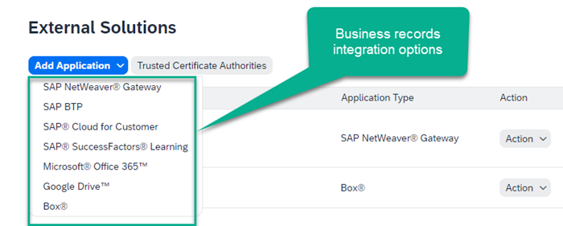
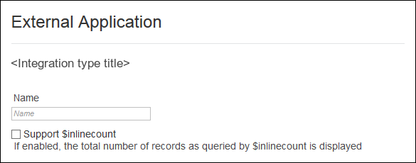
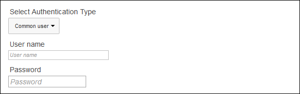
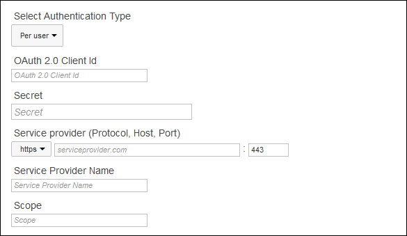

<!-- loio06248733ddd14ccbaaebdd92636133f4 -->

# Register an External Application in SAP Build Work Zone, advanced edition

Create an External Application entry to register your external application with SAP Build Work Zone, advanced edition. This procedure establishes a secure data connection between SAP Build Work Zone, advanced edition and your external business application.

1.  In the Admin Console, go to *External Integrations* \> *External Solutions* from the left navigation panel.
2.  Click *Add Application*.

      
      
    **Add an External Application**

3.  Select the external application type that you want to add from the drop-down menu:

    -   *SAP BTP*: to incorporate data from a cloud-based business application via the SAP BTP.
    -   *SAP NetWeaver Gateway*: to incorporate data from a on-premises business application via SAP NetWeaver Gateway.

      
      
    **External Application, first options**

    

    -   Enter a name for the external application. This name will appear in different screens of SAP Build Work Zone, advanced edition, therefore, use a meaningful name.
    -   **\[For NetWeaver and SAP BTP integrations only\]** Select the *Support $inlinecount* check box if you want to display the total number of records of a requested type.

        This is a total count of the type of records that are being displayed. There is a maximum of 10 or 20 items, depending on the type of resource being displayed. For more information, see the "Business Record Editor \(BRE\)" section in [OData Assumptions](http://help.sap.com/download/documentation/sapjam/developer/index.html#intguide/concepts/ODataAssumptions.html).

    Select the *Authentication Type*.

    For business record integrations, you should only use the *Common user* option for testing and development purposes. For production systems, you should use *Per user* as the *Authentication Type*.

      
      
    **External Application, common user authentication options**

    

    In *Common user* authentication mode, access from SAP Build Work Zone, advanced edition to the external data source will be made through an HTTP Basic authentication call using the provided user credentials. This is recommended only if you wish to expose all of the data in the data source to all the users in your company. In other words, ensure that all the data exposed through the application can be considered "public" within your company.

    -   *User name*: The user name of the generic user account that will be used to access the service on behalf of all users in the company.
    -   *Password*: The password of the generic user account that will be used to access the service on behalf of all of the users in the company.

      
      
    **External Application, per-user authentication options**

    

    In the *Per-User* authentication mode, SAP Build Work Zone, advanced edition authenticates the current user against the external application through the OAuth 2.0 SAML bearer assertion work flow.

    -   *OAuth 2.0 Client Id*: Your organization's client ID with your OAuth 2.0 SSO provider.
    -   *Secret*: Your organization's OAuth 2.0 SSO secret.
    -   *Service Provider*: The URL of your organization's OAuth 2.0 SSO provider, set in three parts: protocol, host, and port number.
    -   *Service Provider Name*: The name of your organization's OAuth 2.0 SSO provider.
    -   *Scope*: Your organization's company name. This can be found in the *Administration Console* \> *Overview* screen.

    When a user attempts to access the external data source, SAP Build Work Zone, advanced edition will first post a SAML assertion on the user's identity to the external object in exchange for an OAuth token for that user. If successful, SAP Build Work Zone, advanced edition will use this OAuth token for all subsequent data access on behalf of that user.

      
      
    **External application, type-specific options: NetWeaver Gateway**

    

    -   \(If relevant\), set the *NetWeaver Client Id*. This is the three-digit login parameter for your NetWeaver client.

    -   If you want to display SAP Build Work Zone, advanced edition content in the external application, select the *Select Trusted OAuth Client* option from the drop-down menu. This configuration provides the external application with authorized access to the SAP Build Work Zone, advanced edition API.
    -   Select *Enable global search for business records and related feed conversations* to make all business records from this application, and their related public feed comments, searchable from within SAP Build Work Zone, advanced edition.
    -   The *Administrative Area* drop-down menu allows you to select the area in which you want this SAML Trusted IDP configuration to be available. The default value is "Company", which will make it available to all workspaces and areas.
    -   Click *Save*.

> ### Note:  
> -   To display an external application's business records in SAP Build Work Zone, advanced edition, you must [Develop an OData annotations file to display business records](develop-an-odata-annotations-file-to-display-business-records-2332e84.md).
> -   To display SAP Build Work Zone, advanced edition features in an external application, you must develop the GUI components to display the data, and you must pull in the data using SAP Build Work Zone, advanced edition API calls.

