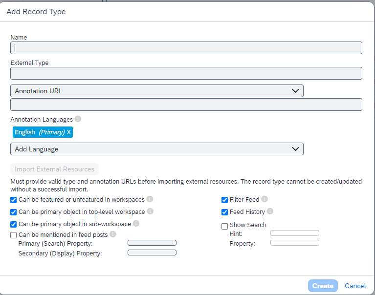
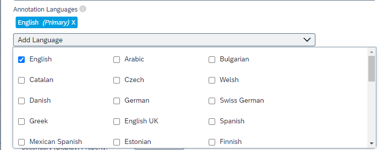

<!-- loiofb6a7c0efd71446ead976c8c99b99056 -->

# Register the business records in SAP Build Work Zone, advanced edition

Once you've completed the required configuration to access your external application from SAP Build Work Zone, advanced edition, you need to further configure it by adding the business objects \(the annotations files\), which are the specific sections of content that you want to access.

**To register business records in SAP Build Work Zone, advanced edition**:

1.  Open the *Administration Console* from under your avatar.
2.  In the *External Integrations* \> *External Solutions* section, click on *Action* beside the OData-based application for which you want to add objects, and select *Manage Record Types* from the context menu.

    The *Manage <company\_name\> Record Types* screen displays for that integrated application.

3.  Click *Add Record Type*.

    The *Add Record Type* dialog box is displayed.

      
      
    **Add Record Type page**

    

4.  In the *Name* field, enter a meaningful name for the business record that you want to add.
5.  Enter the *External Type* for the business record that you want to add.

    The *External Type* must be the URL to OData metadata EntityType of the business record type that you are adding.

6.  Enter the *Annotation URL* for the type of object that you want to add.

    The *Annotation URL* must be the URL to the OData annotations file that you developed in the preceding procedure, [Develop an OData annotations file to display business records](develop-an-odata-annotations-file-to-display-business-records-2332e84.md). The annotations file describes how the incoming data will be laid out in a graphical element of the UI.

    When you open the *Annotation URL* drop-down menu you can add an alternative option called *Inline XML*. This option provides a text box into which you, as an administrator, can paste an XML annotations file. This file provides an alternative mapping of the business record data into the business record UI elements - such as not showing the data for a particular column of information in a table of business records information.

    > ### Note:  
    > If you use the *Inline XML* option, you are restricted to displaying the external business records in English only.

7.  Set the *Annotation Languages*:

    -   To add a language, click *Add Language* and select the language that you want from the drop-down menu.
    -   To remove a language, click the "X" in that language's tab.
    -   To set a language as the Primary language, remove all other languages, or remove all languages and add the language that you want to be the primary language first.

      
      
    **Language options**

    

8.  Select *Import External Resources* to import the data using the URLs listed above.

    This allows you to validate the URLs shown in the *External Type* and the *Annotations URL* fields. The indicated resources are imported and a message is displayed indicating the success or failure of the import.

9.  Select *Can be featured or unfeatured in workspaces* to enable this option.
10. Select *Can be primary object in top-level workspace* to enable this option.
11. Select *Can be primary object in sub-workspace* to enable this option.
12. Select *Filter Feed* to enable users to add or remove feed entries of this object type.
13. Select *Feed History* to see the feed history independently of follows, which means:
    -   If disabled, the user will only see the subset of feed items that were routed to their home feed; that is, they will only see items which had a distribution list that included them, or items in which the user was at-mentioned.
    -   If enabled, and if authorization is successful, the user will see the full feed for the object, including items that would otherwise not be visible to them.

14. Select *Show Search* to enable keyword searching in the business data browser.

    When rendering a list of External Objects, SAP Build Work Zone, advanced edition may also show a "search" box. If this option is selected, you can also set:

    -   In the *Hint* field, you can enter a display string that tells the user what field the search is performed on.
    -   In the *Property* field, you can enter the actual OData property name that the search is performed on.

15. Select *Can be mentioned in feed posts* to enable this option. If this option is selected, you can also set:
    -   *Primary \(Search\) Property*: enter the OData property name that an at-mention look-up will search for.
    -   *Secondary \(Display\) Property*: enter the OData property name that an at-mention look-up will display.

16. Once you've configured the record to your satisfaction, click *Save*.

    You are returned to the *<External\_App\_Name\> Record Types* catalog, and the record type that you just added will be listed in the table.

> ### Note:  
> **Next:** 
> 
> You can now, optionally, [Configure a business record filter](configure-a-business-record-filter-fea324d.md) to narrow the range of data shown in a particular external application data object.
> 
> Additionally, you can now, optionally, [Configure a business record sort order](configure-a-business-record-sort-order-05e657e.md) to set the order in which the external data is arranged in a particular external application data object.
> 
> If you do not want or need to add Filters or Sort Fields to your External Application Objects, you can proceed to [Configuring access to business records in SAP Build Work Zone, advanced edition](configuring-access-to-business-records-in-sap-build-work-zone-advanced-edition-0f029d3.md) or [Manage "external objects" \(business records\) using the SAP Build Work Zone, advanced edition API](manage-external-objects-business-records-using-the-sap-build-work-zone-advanced-edition-a-808fe4c.md).

