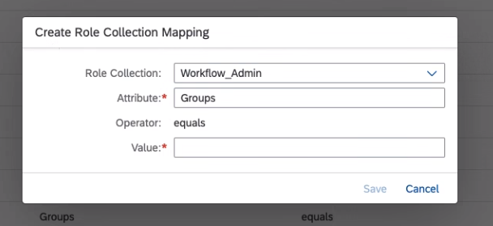

<!-- loio77be32c76314481eacb93ccf86daed92 -->

# Run the Booster

The SAP SuccessFactors Work Zone booster assists you by performing configuration steps automatically on your subaccount.

<a name="loio77be32c76314481eacb93ccf86daed92__section_dwc_1gy_jmb"/>

## Running the Booster

**Previous Step:** [Prerequisites](prerequisites-96b51b1.md)

To run the booster:

1.  In the SAP BTP cockpit, use the breadcrumbs to access your global account.
2.  In the side menu, open the *Boosters* screen and click the *Get Started with SAP SuccessFactors Work Zone* tile.
3.  SAP SuccessFactors Work Zone contains integration with SAP Build Process Automation service. SAP Build Process Automation is a citizen developer solution to adapt, improve, and innovate business processes with no-code workflow management and robotic process automation capabilities. If you are not planning to use SAP Build Process Automation, you can remove the service when you run the booster. If you decide later on that you do want to use it, see below instructions for how to add it.

<a name="loio77be32c76314481eacb93ccf86daed92__section_s5q_kwh_zqb"/>

## Manual Execution of the Booster

If you encounter technical issues in running the booster, here are the steps that the booster performs for you:

1.  Select a subaccount \(the one where you intend to use SAP SuccessFactors Work Zone\), and configure the following:
    1.  Enable Cloud Foundry and create a space.
    2.  Assign subaccount entitlements for all required services: SAP SuccessFactors Work Zone *standard* service plan and *standard \(Application\)* service plan, Workflow, and SAP Business Application Service.

2.  Subscribe to SAP SuccessFactors Work Zone *standard \(Application\)* service plan.
3.  Create an instance of the SAP SuccessFactors Work Zone *standard* service plan \(optional\):
    1.  Create a service instance. For more information, see [Creating Service Instances in Cloud Foundry](https://help.sap.com/viewer/09cc82baadc542a688176dce601398de/Cloud/en-US/6d6846def3c443aa9f83d127353147ce.html).
    2.  Create a service key. For more information, see [Creating Service Keys in Cloud Foundry](https://help.sap.com/viewer/09cc82baadc542a688176dce601398de/Cloud/en-US/6fcac08409db4b0f9ad55a6acd4d31c5.html).
    3.  Create a destination. This is required for the deployment of content packages and UI Integration cards. For more information, see [**Creating a Destination to the Content Repository**](https://help.sap.com/docs/WZ/7d3b9c7211ca4d7a9630b524205ee836/4a90162810014b9396dd0edd00b9bc78.html)

4.  Subscribe to SAP Business Application Studio service.
5.  Create a role collection for accessing XSUAA, which is required for setting a trust.
    1.  In the SAP BTP cockpit of your subaccount, go to *Security* \> *Role Collections*.
    2.  Click *New Role Collection*.
    3.  Specify a name such as **`XSUAA_Access_RoleCollection`**, and click *Save*.
    4.  Edit the new role collection, and in the *Roles* section, select the role name **`XSUAA_Access`** from the list.
    5.  Click *Save*.

6.  Map the following role collections to the relevant SAP Cloud Identity Services - Identity Authentication groups:

    In this step, you'll map the SAP SuccessFactors Work Zone default role collections to the SAP SuccessFactors Work Zone default user groups in the Identity Authentication service.

    1.  In the SAP BTP cockpit, go to *Security* \> *Trust Configuration*.
    2.  Click the *Active* trust configuration link.
    3.  Go to the *Role Collection Mappings* screen \(from the menu on the left\).
    4.  Add a new role collection mapping. In the dialog that opens, select a role collection and assign it to an Identity Authentication group \(see the table below\). In the *Attribute* field enter `Groups` :

        

        <table>
        <tr>
        <th valign="top">

        Identity Authentication Group

        
        </th>
        <th valign="top">

        Role Collection

        
        </th>
        <th valign="top">

        SAP SuccessFactors Work Zone Persona

        
        </th>
        </tr>
        <tr>
        <td valign="top">
        
        Workzone\_Admin

        
        </td>
        <td valign="top">
        
        HR\_Workzone\_Admin

        HR\_Workflow\_Admin

        HR\_Workflow\_End\_User

        \* your XSUAA role collection, such as `XSUAA_Access_RoleCollection` 

        HR\_Workzone\_Advanced\_Theming

        > ### Note:  
        > This role collection is required for any user who needs to publish themes from the UI theme designer , and edit the theme CSS file,

        
        </td>
        <td valign="top">
        
        Company Admin

        
        </td>
        </tr>
        <tr>
        <td valign="top">
        
        Workzone\_Area\_Admin

        
        </td>
        <td valign="top">
        
        HR\_Workzone\_Area\_Admin

        HR\_Workflow\_End\_User

        
        </td>
        <td valign="top">
        
        Area Admin

        
        </td>
        </tr>
        <tr>
        <td valign="top">
        
        Workzone\_Support\_Admin

        
        </td>
        <td valign="top">
        
        HR\_Workzone\_Admin

        HR\_Workflow\_End\_User

        
        </td>
        <td valign="top">
        
        Support Admin

        
        </td>
        </tr>
        <tr>
        <td valign="top">
        
        Workzone\_Page\_Content\_Admin

        
        </td>
        <td valign="top">
        
        HR\_Workzone\_End\_User

        HR\_Workflow\_End\_User

        
        </td>
        <td valign="top">
        
        Page Content Admin

        
        </td>
        </tr>
        <tr>
        <td valign="top">
        
        Workzone\_End\_User

        
        </td>
        <td valign="top">
        
        HR\_Workzone\_End\_User

        HR\_Workflow\_End\_User

        
        </td>
        <td valign="top">
        
        Full Access User

        
        </td>
        </tr>
        <tr>
        <td valign="top">
        
        Workzone\_User\_Type\_public

        
        </td>
        <td valign="top">
        
        HR\_Workzone\_External\_User

        
        </td>
        <td valign="top">
        
        External User

        
        </td>
        </tr>
        </table>
        
        > ### Note:  
        > -   To learn more about which roles are included in each role collection, click the role collection and view the list of roles.
        > -   The HR\_Workzone\_Admin role collection includes all the necessary admin roles for accessing the Site Manager screens, the UI Theme Designer \(excluding the `Publisher` and `CustomCssEditor` roles\), and Mobile Services.

7.  Launch the Configurator.

<a name="loio77be32c76314481eacb93ccf86daed92__section_bgr_fth_zqb"/>

## SAP Build Process Automation Service - Manual Subscription

-   If you run the booster with SAP Build Process Automation, you can't remove it.
-   If you run the booster without SAP Build Process Automation, you can add it later in the following ways:
    1.  Run the booster again. This time select to run it with the SAP Build Process Automation service.
    2.  Configure SAP Build Process Automation to work with SAP Build Work Zone, advanced edition. For more information, see [Configure SAP Build Process Automation](https://help.sap.com/docs/PROCESS_AUTOMATION/a331c4ef0a9d48a89c779fd449c022e7/3dbbe660fab54eeeb79c844a0de84103.html) 

