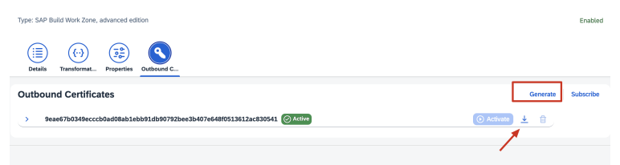
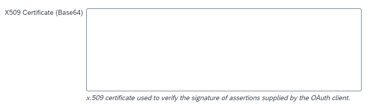

<!-- loio7202ced311534d25856aa6901d43fc1b -->

# Run the Configurator

This is the final step of onboarding to SAP Build Work Zone, advanced edition.


<a name="loio7202ced311534d25856aa6901d43fc1b__section_kym_zwp_5wb"/>

## Launch the Configurator Wizard

After completing all previous steps, follow the configurator wizard to complete the onboarding process. You can access the configurator directly from the booster, or you can access it from the Site Manager as follows:

-   In the SAP BTP cockpit, *Services* \> *Instances and Subscriptions*, click the SAP Build Work Zone, advanced edition link in the *Subscriptions* table to access the application.
-   Open the *Configurator* screen from the left-side menu.


<a name="loio7202ced311534d25856aa6901d43fc1b__section_x3b_ncg_3qb"/>

## Option 1: Create a new tenant


### Step 1: Create a Destination to SAP SuccessFactors \(Optional\)

If you choose to install the content package that contains HR Content from SAP SuccessFactors, you must set up a destination to SAP SuccessFactors first. In addition, some of the content in this package requires setting up SAP Build Process Automation when running the booster. For more information, see [Run the Booster](run-the-booster-4679f1c.md).

-   Select the SAP SuccessFactors API URL from the dropdown list.
-   Enter your company ID.
-   Enter API key.

    > ### Note:  
    > For a detailed explanation about how to obtain the API key, see [Create an OAuth Client in SAP SuccessFactors](https://help.sap.com/viewer/cca91383641e40ffbe03bdc78f00f681/Cloud/en-US/69130a77dd12431ca5e0c41c2d5fbecb.html)


### Step 2: Set Up Environment

In this step, a series of configuration steps takes place in your subaccount to allow connectivity and authentication of different components in SAP Build Work Zone, advanced edition.

Select the type of domain that you're using and enter the required details:

-   Default domain \(ondemand.com\): no additional input is required.
-   Custom domain: enter the following details: \(detailed instructions are listed here: [0002920494](https://me.sap.com/notes/0002920494)\)
    -   DWS custom domain
    -   Upload the certificate
    -   Upload the private key


Click *Trigger Setup*.


### Step 3: Configure the Identity Authentication service and the Identity Provisioning service

In this step, you'll need to manually configure the Identity Authentication service and the Identity Provisioning service to enable user authentication and user provisioning.

1.  **Create an application in Identity Authentication** 

    1.  Open the administration console for SAP Cloud Identity Services. To do so, in SAP BTP cockpit, go to *Security* \> *Trust Configuration*, click the link pointing to your active Identity Authentication and add `/admin` to the URL.
    2.  Go to *Applications & Resources* \> *Applications* and click *\+Add* to add a new application from type *SAP BTP Solution*. Provide a meaningful name such as SAP Build Work Zone, advanced edition. Select the protocol type `SAML 2.0`.
    3.  Open the *SAML 2.0 Configuration* editor of the application you've created, and paste the service provider metadata file that you’ve downloaded from the configurator. Save your changes. For more information, see [Create SAML 2.0 Application](https://help.sap.com/viewer/6d6d63354d1242d185ab4830fc04feb1/Cloud/en-US/fe3102ad92d94baa955ffa06b86d2cfa.html) 
    4.  Open the *Subject Name Identifier* editor of the application, and change the basic configuration attribute from `User ID` to `Global User ID`.

2.  **Configure the Identity Provisioning source and target systems**

    A source system is the connector used for reading entities \(users, groups, roles\). A target system is the connector used for writing \(provisioning\) entities. To learn more about this concept, see [Source Systems](https://help.sap.com/viewer/f48e822d6d484fa5ade7dda78b64d9f5/Cloud/en-US/58033bec92124ef2a7905b37d0f50704.html), [Target Systems](https://help.sap.com/viewer/f48e822d6d484fa5ade7dda78b64d9f5/Cloud/en-US/ab3f641552464c79b94d10b9205fd721.html)

    1.  In the administration console for SAP Cloud Identity Services, go to the *Administrators* tile and create a technical user \(of type System\) with a password and a generated client ID for authentication between the Identity Authentication service and the Identity Provisioning service. For more information, see [Add System as Administrator](https://help.sap.com/viewer/6d6d63354d1242d185ab4830fc04feb1/Cloud/en-US/bbbdbdd3899942ce874f3aae9ba9e21d.html#loiocefb742a36754b18bbe5c3503ac6d87c)

        > ### Note:  
        > When you configure a method of authentication \(step 6\), make sure to assign the roles *Manage Users* and *Manage Groups*.

    2.  Set up the Identity Authentication service as a source system. For more details, see [Identity Authentication](https://help.sap.com/viewer/f48e822d6d484fa5ade7dda78b64d9f5/Cloud/en-US/e4e25f1fae094c2a89ad62159e1cd230.html). Reminder: this is a suggested setup. You can choose the source system that matches your setup.


        <table>
        <tr>
        <th valign="top">

        Property Type
        
        </th>
        <th valign="top">

        Description & Value
        
        </th>
        </tr>
        <tr>
        <td valign="top">
        
        Mandatory Properties
        
        </td>
        <td valign="top">
        
        Use the properties default values taken from the following topic: [Identity Authentication](https://help.sap.com/viewer/f48e822d6d484fa5ade7dda78b64d9f5/Cloud/en-US/e4e25f1fae094c2a89ad62159e1cd230.html)

        For more information about each property, see [List of Properties](https://help.sap.com/viewer/f48e822d6d484fa5ade7dda78b64d9f5/Cloud/en-US/d6f3577f30ec4af98e734b0126a60e37.html)
        
        </td>
        </tr>
        <tr>
        <td valign="top">
        
        Additional Properties
        
        </td>
        <td valign="top">
        
        There are two versions of the Identity Authentication SCIM API. The default version is V2. This guide includes transformation code that matches the default version.

        If you prefer to use SCIM API version 1:

        -   Add the following property `ias.api.version`, with value 1.
        -   The transformation code samples provided in this guide will require some modifications.


        
        </td>
        </tr>
        </table>
        
    3.  Configure the transformation code of the source system. Transformations are used to map the user attributes from the data model of the source system to the data model of the target system, and the other way around. In this step, you'll replace the default transformation code \(displayed under the *Transformations* tab after saving its initial configuration\), with the transformation that matches SAP Build Work Zone, advanced edition.

        **Identity Authentication source system transformation \(v2\)**

        ```
        {
            "user":
            {
                "mappings": [
                {
                    "sourcePath": "$.id",
                    "targetVariable": "entityIdSourceSystem",
                    "targetPath": "$['urn:sap:cloud:scim:schemas:extension:custom:2.0:User']['userId']"
                },
                {
                    "sourcePath": "$['urn:ietf:params:scim:schemas:extension:sap:2.0:User']['userUuid']",
                    "targetPath": "$['urn:ietf:params:scim:schemas:extension:sap:2.0:User']['userUuid']"
                },
                {
                    "sourcePath": "$.schemas",
                    "preserveArrayWithSingleElement": true,
                    "targetPath": "$.schemas"
                },
                {
                    "sourcePath": "$.userName",
                    "targetPath": "$.userName",
                    "optional": true,
                    "correlationAttribute": true
                },
                {
                    "sourcePath": "$.name.givenName",
                    "targetPath": "$.name.givenName",
                    "optional": true
                },
                {
                    "sourcePath": "$.name.familyName",
                    "targetPath": "$.name.familyName",
                    "optional": true
                },
                {
                    "sourcePath": "$.name.honorificPrefix",
                    "targetPath": "$.name.honorificPrefix",
                    "optional": true
                },
                {
                    "sourcePath": "$.displayName",
                    "targetPath": "$.displayName",
                    "optional": true
                },
                {
                    "condition": "$.displayName EMPTY true",
                    "type": "remove",
                    "targetPath": "$.displayName"
                },
                {
                    "sourcePath": "$.userType",
                    "targetPath": "$.userType",
                    "optional": true
                },
                {
                    "sourcePath": "$.locale",
                    "targetPath": "$.locale",
                    "optional": true
                },
                {
                    "sourcePath": "$.timezone",
                    "targetPath": "$.timezone",
                    "optional": true
                },
                {
                    "sourcePath": "$.active",
                    "targetPath": "$.active"
                },
                {
                    "sourcePath": "$.emails[*].value",
                    "preserveArrayWithSingleElement": true,
                    "targetPath": "$.emails[?(@.value)]"
                },
                {
                    "sourcePath": "$.emails[?(@.primary== true)].value",
                    "correlationAttribute": true
                },
                {
                    "sourcePath": "$.phoneNumbers",
                    "targetPath": "$.phoneNumbers",
                    "preserveArrayWithSingleElement": true,
                    "optional": true
                },
                {
                    "sourcePath": "$.addresses",
                    "targetPath": "$.addresses",
                    "preserveArrayWithSingleElement": true,
                    "optional": true
                },
                {
                    "sourcePath": "$.groups",
                    "targetPath": "$.groups",
                    "preserveArrayWithSingleElement": true,
                    "optional": true
                },
                {
                    "sourcePath": "$['urn:sap:cloud:scim:schemas:extension:custom:2.0:User']",
                    "targetPath": "$['urn:sap:cloud:scim:schemas:extension:custom:2.0:User']",
                    "optional": true
                },
                {
                    "sourcePath": "$['urn:ietf:params:scim:schemas:extension:sap:2.0:User']['sourceSystem']",
                    "targetPath": "$['urn:ietf:params:scim:schemas:extension:sap:2.0:User']['sourceSystem']",
                    "optional": true
                },
                {
                    "sourcePath": "$['urn:ietf:params:scim:schemas:extension:sap:2.0:User']['sourceSystemId']",
                    "targetPath": "$['urn:ietf:params:scim:schemas:extension:sap:2.0:User']['sourceSystemId']",
                    "optional": true
                },
                {
                    "sourcePath": "$['urn:ietf:params:scim:schemas:extension:sap:2.0:User']['userId']",
                    "targetPath": "$['urn:ietf:params:scim:schemas:extension:sap:2.0:User']['userId']",
                    "optional": true
                },
                {
                    "sourcePath": "$['urn:ietf:params:scim:schemas:extension:enterprise:2.0:User']['division']",
                    "targetPath": "$['urn:ietf:params:scim:schemas:extension:enterprise:2.0:User']['division']",
                    "optional": true
                },
                {
                    "sourcePath": "$['urn:ietf:params:scim:schemas:extension:enterprise:2.0:User']['manager']['value']",
                    "targetPath": "$['urn:ietf:params:scim:schemas:extension:enterprise:2.0:User']['manager']['value']",
                    "optional": true
                },
                {
                    "sourcePath": "$['urn:ietf:params:scim:schemas:extension:enterprise:2.0:User']['manager']['displayName']",
                    "targetPath": "$['urn:ietf:params:scim:schemas:extension:enterprise:2.0:User']['manager']['displayName']",
                    "optional": true
                },
                {
                    "sourcePath": "$['urn:ietf:params:scim:schemas:extension:enterprise:2.0:User']['department']",
                    "targetPath": "$['urn:ietf:params:scim:schemas:extension:enterprise:2.0:User']['department']",
                    "optional": true
                },
                {
                    "sourcePath": "$['urn:ietf:params:scim:schemas:extension:enterprise:2.0:User']['organization']",
                    "targetPath": "$['urn:ietf:params:scim:schemas:extension:enterprise:2.0:User']['organization']",
                    "optional": true
                },
                {
                    "sourcePath": "$['urn:ietf:params:scim:schemas:extension:enterprise:2.0:User']['costCenter']",
                    "targetPath": "$['urn:ietf:params:scim:schemas:extension:enterprise:2.0:User']['costCenter']",
                    "optional": true
                },
                {
                    "sourcePath": "$['urn:ietf:params:scim:schemas:extension:enterprise:2.0:User']['employeeNumber']",
                    "targetPath": "$['urn:ietf:params:scim:schemas:extension:enterprise:2.0:User']['employeeNumber']",
                    "optional": true
                }]
            },
            "group":
            {
                "mappings": [
                {
                    "sourcePath": "$.id",
                    "targetVariable": "entityIdSourceSystem"
                },
                {
                    "sourcePath": "$['urn:sap:cloud:scim:schemas:extension:custom:2.0:Group']['name']",
                    "targetPath": "$['urn:sap:cloud:scim:schemas:extension:custom:2.0:Group']['name']"
                },
                {
                    "sourcePath": "$.displayName",
                    "targetPath": "$.displayName"
                },
                {
                    "sourcePath": "$.members",
                    "targetPath": "$.members",
                    "preserveArrayWithSingleElement": true,
                    "optional": true
                }]
            }
        }
        ```

    4.  Set up SAP Build Work Zone, advanced edition as a target system. For more details, see [SAP Build Work Zone, advanced edition](https://help.sap.com/viewer/f48e822d6d484fa5ade7dda78b64d9f5/Cloud/en-US/787502df6ce14225b0e7cf7821e785eb.html) 

        For improved logging and error investigation, please use the following values:


        <table>
        <tr>
        <th valign="top">

        Identity Provisioning Property Name
        
        </th>
        <th valign="top">

        Value
        
        </th>
        </tr>
        <tr>
        <td valign="top">
        
        Type
        
        </td>
        <td valign="top">
        
        HTTP
        
        </td>
        </tr>
        <tr>
        <td valign="top">
        
        URL
        
        </td>
        <td valign="top">
        
        Copy this value from the wizard - *Integration URL* field
        
        </td>
        </tr>
        <tr>
        <td valign="top">
        
        ProxyType
        
        </td>
        <td valign="top">
        
        Internet
        
        </td>
        </tr>
        <tr>
        <td valign="top">
        
        Authentication
        
        </td>
        <td valign="top">
        
        BasicAuthentication
        
        </td>
        </tr>
        <tr>
        <td valign="top">
        
        User
        
        </td>
        <td valign="top">
        
        Copy this value from the wizard - *OAuth Client Key* field
        
        </td>
        </tr>
        <tr>
        <td valign="top">
        
        Password
        
        </td>
        <td valign="top">
        
        Copy this value from the wizard - *OAuth Client Secret* field
        
        </td>
        </tr>
        <tr>
        <td valign="top">
        
        OAuth2TokenServiceURL
        
        </td>
        <td valign="top">
        
        Copy this value from the wizard - *Token Service URL* field
        
        </td>
        </tr>
        <tr>
        <td valign="top">
        
        ips.failed.request.retry.attempts
        
        </td>
        <td valign="top">
        
        3
        
        </td>
        </tr>
        <tr>
        <td valign="top">
        
        ips.failed.request.retry.attempts.interval
        
        </td>
        <td valign="top">
        
        60
        
        </td>
        </tr>
        <tr>
        <td valign="top">
        
        ips.delete.existedbefore.entities
        
        </td>
        <td valign="top">
        
        true
        
        </td>
        </tr>
        <tr>
        <td valign="top">
        
        ips.trace.failed.entity.content
        
        </td>
        <td valign="top">
        
        true
        
        </td>
        </tr>
        </table>
        
    5.  Configure the transformation code of the target system. Replace the default transformation code \(displayed under the *Transformations* tab after saving its initial configuration\), with the following.

        **SAP Build Work Zone, advanced edition target system transformation**

        ```
        {
            "user":
            {
                "mappings": [
                {
                    "sourceVariable": "entityIdTargetSystem",
                    "targetPath": "$.id"
                },
                {
                    "sourceVariable": "entityIdTargetSystem",
                    "targetPath": "$.id",
                    "scope": "deleteEntity"
                },
                {
                    "constant": false,
                    "targetPath": "$.active",
                    "scope": "deleteEntity"
                },
                {
                     "sourcePath": "$.active",
                     "targetPath": "$.active"
                 },
                {
                    "sourcePath": "$.userName",
                    "optional": true,
                    "targetPath": "$.userName"
                },
                {
                    "sourcePath": "$['urn:ietf:params:scim:schemas:extension:sap:2.0:User']['userUuid']",
                    "targetPath": "$.userName"
                },
                {
                    "sourcePath": "$['urn:ietf:params:scim:schemas:extension:sap:2.0:User']['userId']",
                    "targetPath": "$.externalId"
                },
                {
                    "sourcePath": "$['urn:ietf:params:scim:schemas:extension:sap:2.0:User']['userUuid']",
                    "targetPath": "$['urn:ietf:params:scim:schemas:extension:sap:2.0:User']['userUuid']"
                },
                {
                    "constant": "employee",
                    "targetPath": "$.userType"
                },
                {
                    "condition": "$.groups[?(@.display == 'Workzone_User_Type_public')] EMPTY false",
                    "constant": "public",
                    "targetPath": "$.userType"
                },
                {
                    "sourcePath": "$.name.givenName",
                    "targetPath": "$.name.givenName",
                    "optional": true
                },
                {
                    "sourcePath": "$.name.familyName",
                    "targetPath": "$.name.familyName",
                    "optional": true
                },
                {
                    "sourcePath": "$.name.honorificPrefix",
                    "targetPath": "$.name.honorificPrefix",
                    "optional": true
                },
                {
                    "sourcePath": "$.timezone",
                    "targetPath": "$.timezone",
                    "optional": true
                },
                {
                    "condition": "($.locale EMPTY false) && ($.addresses[?(@.type == 'work')].country EMPTY false)",
                    "sourcePath": "$.locale",
                    "targetPath": "$.locale",
                    "functions": [
                    {
                        "function": "toLowerCaseString"
                    },
                    {
                        "function": "concatString",
                        "suffix": "_"
                    },
                    {
                        "function": "concatString",
                        "suffix": "$.addresses[?(@.type == 'work')].country"
                    }]
                },
                {
                    "sourcePath": "$.emails[0].value",
                    "targetPath": "$.emails[0].value"
                },
                {
                    "condition": "$.emails[0].length() > 0",
                    "constant": true,
                    "targetPath": "$.emails[0].primary"
                },
                {
                    "sourcePath": "$.phoneNumbers",
                    "targetPath": "$.phoneNumbers",
                    "preserveArrayWithSingleElement": true,
                    "optional": true
                },
                {
                    "sourcePath": "$.addresses",
                    "targetPath": "$.addresses",
                    "preserveArrayWithSingleElement": true,
                    "optional": true
                },
                {
                    "condition": "$.['urn:sap:cloud:scim:schemas:extension:custom:2.0:User']['attributes'][?(@.name == 'customAttribute1')]['value'] EMPTY false",
                    "sourcePath": "$['urn:sap:cloud:scim:schemas:extension:custom:2.0:User']['attributes'][?(@.name == 'customAttribute1')]['value']",
                    "targetPath": "$['urn:sap:cloud:scim:schemas:extension:custom:2.0:JamCustomUser']['customAttribute1']['value']"
                },
                {
                    "condition": "$.['urn:sap:cloud:scim:schemas:extension:custom:2.0:User']['attributes'][?(@.name == 'customAttribute1')]['value'] EMPTY false",
                    "constant": "Custom 1",
                    "targetPath": "$['urn:sap:cloud:scim:schemas:extension:custom:2.0:JamCustomUser']['customAttribute1']['name']"
                },
                {
                    "condition": "$.['urn:sap:cloud:scim:schemas:extension:custom:2.0:User']['attributes'][?(@.name == 'customAttribute2')]['value'] EMPTY false",
                    "sourcePath": "$['urn:sap:cloud:scim:schemas:extension:custom:2.0:User']['attributes'][?(@.name == 'customAttribute2')]['value']",
                    "targetPath": "$['urn:sap:cloud:scim:schemas:extension:custom:2.0:JamCustomUser']['customAttribute2']['value']"
                },
                {
                    "condition": "$.['urn:sap:cloud:scim:schemas:extension:custom:2.0:User']['attributes'][?(@.name == 'customAttribute2')]['value'] EMPTY false",
                    "constant": "Custom 2",
                    "targetPath": "$['urn:sap:cloud:scim:schemas:extension:custom:2.0:JamCustomUser']['customAttribute2']['name']"
                },
                {
                    "condition": "$.['urn:sap:cloud:scim:schemas:extension:custom:2.0:User']['attributes'][?(@.name == 'customAttribute3')]['value'] EMPTY false",
                    "sourcePath": "$['urn:sap:cloud:scim:schemas:extension:custom:2.0:User']['attributes'][?(@.name == 'customAttribute3')]['value']",
                    "targetPath": "$['urn:sap:cloud:scim:schemas:extension:custom:2.0:JamCustomUser']['customAttribute3']['value']"
                },
                {
                    "condition": "$.['urn:sap:cloud:scim:schemas:extension:custom:2.0:User']['attributes'][?(@.name == 'customAttribute3')]['value'] EMPTY false",
                    "constant": "Custom 3",
                    "targetPath": "$['urn:sap:cloud:scim:schemas:extension:custom:2.0:JamCustomUser']['customAttribute3']['name']"
                },
                {
                    "condition": "$.['urn:sap:cloud:scim:schemas:extension:custom:2.0:User']['attributes'][?(@.name == 'customAttribute4')]['value'] EMPTY false",
                    "sourcePath": "$['urn:sap:cloud:scim:schemas:extension:custom:2.0:User']['attributes'][?(@.name == 'customAttribute4')]['value']",
                    "targetPath": "$['urn:sap:cloud:scim:schemas:extension:custom:2.0:JamCustomUser']['customAttribute4']['value']"
                },
                {
                    "condition": "$.['urn:sap:cloud:scim:schemas:extension:custom:2.0:User']['attributes'][?(@.name == 'customAttribute4')]['value'] EMPTY false",
                    "constant": "Custom 4",
                    "targetPath": "$['urn:sap:cloud:scim:schemas:extension:custom:2.0:JamCustomUser']['customAttribute4']['name']"
                },
                {
                    "condition": "$.['urn:sap:cloud:scim:schemas:extension:custom:2.0:User']['attributes'][?(@.name == 'customAttribute5')]['value'] EMPTY false",
                    "sourcePath": "$['urn:sap:cloud:scim:schemas:extension:custom:2.0:User']['attributes'][?(@.name == 'customAttribute5')]['value']",
                    "targetPath": "$['urn:sap:cloud:scim:schemas:extension:custom:2.0:JamCustomUser']['customAttribute5']['value']"
                },
                {
                    "condition": "$.['urn:sap:cloud:scim:schemas:extension:custom:2.0:User']['attributes'][?(@.name == 'customAttribute5')]['value'] EMPTY false",
                    "constant": "Custom 5",
                    "targetPath": "$['urn:sap:cloud:scim:schemas:extension:custom:2.0:JamCustomUser']['customAttribute5']['name']"
                },
                {
                    "sourcePath": "$.title",
                    "optional": true,
                    "targetPath": "$.title"
                },
                {
                    "condition": "$.groups[?(@.display == 'Workzone_Admin')] EMPTY false",
                    "constant": "Administrator",
                    "targetPath": "$.roles[0].value"
                },
                {
                    "condition": "$.addresses[?(@.type == 'work')].country EMPTY false",
                    "constant": true,
                    "targetPath": "$.addresses[1].primary"
                },
                {
                    "type": "remove",
                    "targetPath": "$.groups"
                },
                {
                    "sourcePath": "$['urn:ietf:params:scim:schemas:extension:enterprise:2.0:User']['department']",
                    "targetPath": "$['urn:ietf:params:scim:schemas:extension:enterprise:2.0:User']['department']",
                    "optional": true
                },
                {
                    "sourcePath": "$['urn:ietf:params:scim:schemas:extension:enterprise:2.0:User']['organization']",
                    "targetPath": "$['urn:ietf:params:scim:schemas:extension:enterprise:2.0:User']['organization']",
                    "optional": true
                },
                {
                    "sourcePath": "$['urn:ietf:params:scim:schemas:extension:enterprise:2.0:User']['costCenter']",
                    "targetPath": "$['urn:ietf:params:scim:schemas:extension:enterprise:2.0:User']['costCenter']",
                    "optional": true
                },
                {
                    "sourcePath": "$['urn:ietf:params:scim:schemas:extension:enterprise:2.0:User']['employeeNumber']",
                    "targetPath": "$['urn:ietf:params:scim:schemas:extension:enterprise:2.0:User']['employeeNumber']",
                    "optional": true
                },
                {
                    "sourcePath": "$['urn:ietf:params:scim:schemas:extension:enterprise:2.0:User']['division']",
                    "targetPath": "$['urn:ietf:params:scim:schemas:extension:enterprise:2.0:User']['division']",
                    "optional": true
                },
                {
                    "sourcePath": "$['urn:ietf:params:scim:schemas:extension:enterprise:2.0:User']['manager']['value']",
                    "targetPath": "$['urn:ietf:params:scim:schemas:extension:enterprise:2.0:User']['manager']['value']",
                    "optional": true,
                    "functions": [
                    {
                        "function": "resolveEntityIds"
                    }]
                },
                {
                    "sourcePath": "$['urn:ietf:params:scim:schemas:extension:enterprise:2.0:User']['manager']['displayName']",
                    "targetPath": "$['urn:ietf:params:scim:schemas:extension:enterprise:2.0:User']['manager']['displayName']",
                    "optional": true
                }]
            },
            "group":
            {
                "ignore": true,
                "mappings": [
                {
                    "sourceVariable": "entityIdTargetSystem",
                    "targetPath": "$.id"
                },
                {
                    "constant": "urn:ietf:params:scim:schemas:core:2.0:Group",
                    "targetPath": "$.schemas[0]"
                },
                {
                    "sourcePath": "$['urn:sap:cloud:scim:schemas:extension:custom:2.0:Group']['name']",
                    "targetPath": "$.displayName"
                },
                {
                    "sourcePath": "$.members[*].value",
                    "preserveArrayWithSingleElement": true,
                    "optional": true,
                    "targetPath": "$.members[?(@.value)]",
                    "functions": [
                    {
                        "type": "resolveEntityIds"
                    }]
                }]
            }
        }
        ```

        > ### Tip:  
        > 
        > <table>
        > <tr>
        > <th valign="top">
        > 
        > Section
        > 
        > </th>
        > <th valign="top">
        > 
        > Hint
        > 
        > </th>
        > </tr>
        > <tr>
        > <td valign="top">
        > 
        > ```
        > "sourcePath": "$.userName",
        >             "optional": true,
        >             "targetPath": "$.userName"
        > ```
        > 
        > 
        > 
        > </td>
        > <td valign="top">
        > 
        > When using the Login Name for userName value \(instead of userUuid\), remove optional=true and adjust the userIdSource property in the 'JAM' destination accordingly. For more information, see [Solution Architecture](solution-architecture-1fd9ea4.md).
        > 
        > </td>
        > </tr>
        > <tr>
        > <td valign="top">
        > 
        > ```
        > "condition": "..." ,
        >             "constant": "Custom X",
        >             "targetPath": " ... "
        > ```
        > 
        > 
        > 
        > </td>
        > <td valign="top">
        > 
        > Follow the same pattern for custom attributes 6-20 if required. SAP Build Work Zone, advanced edition supports up to 20 custom attributes.
        > 
        > </td>
        > </tr>
        > <tr>
        > <td valign="top">
        > 
        > ```
        > "condition": "$.groups[?(@.display == 'Workzone_Admin')] EMPTY false",
        >             "constant": "Administrator",
        >             "targetPath": "$.roles[0].value"
        > ```
        > 
        > 
        > 
        > </td>
        > <td valign="top">
        > 
        > Required to assign the 'Company Administrator' role in addition to the role collection.
        > 
        > Users that are assigned to the `Workzone_Admin` group in Identity Authentication are company administrators.
        > 
        > For more information, see [Assigning Company Administrators](assigning-company-administrators-ff793e6.md).
        > 
        > </td>
        > </tr>
        > <tr>
        > <td valign="top">
        > 
        > ```
        > "group":
        >     {
        >         "ignore": true,
        >         "mappings": [
        >         {
        >             ...
        >         },
        > ```
        > 
        > 
        > 
        > </td>
        > <td valign="top">
        > 
        > By default, the group mapping is inactive \(ignored\) but groups are supported. To start provisioning groups, either delete the statement "ignore": true, or set its value to false.
        > 
        > </td>
        > </tr>
        > </table>

        > ### Note:  
        > -   **User Types in SAP Build Work Zone, advanced edition:**
        >     -   employee = internal user
        >     -   public = external users
        >     -   By default, all users from the Identity Authentication service \(regardless of the Identity Authentication user type\) are created as internal users. Users that are in an Identity Authentication group with displayName `Workzone_User_Type_public`, are created as external users.
        > 
        > -   **Job Title**
        > 
        >     The job title is not provided as an attribute in the Identity Authentication Admin UI. If needed, the mapping for this field can be adjusted to read the value from another attribute.
        > 
        > -   **Company Administrators in SAP Build Work Zone, advanced edition**
        > 
        >     Users that are included in the target system condition – specifically their User ID - are assigned as company administrators.
        > 
        >     For more information, see [Assigning Company Administrators](assigning-company-administrators-ff793e6.md)

    6.  **\[Optional\]: Use X.509 Certificate-Based Authentication**

        To use an x.509 certificate-based authentication between the Identity Provisioning service and SAP Build Work Zone, advanced edition, configure the following steps:

        1.  In the SAP Build Work Zone, advanced edition target system *Properties* tab, make the following changes to the previously defined properties:


            <table>
            <tr>
            <th valign="top">

            Name
            
            </th>
            <th valign="top">

            Value
            
            </th>
            </tr>
            <tr>
            <td valign="top">
            
            `Authentication`
            
            </td>
            <td valign="top">
            
            `ClientCertificateAuthentication`
            
            </td>
            </tr>
            <tr>
            <td valign="top">
            
            `OAuth2TokenServiceURL`
            
            </td>
            <td valign="top">
            
            `https: /<company_uuid>.api-<region_host>.dws.workzone.ondemand.com/api/v2/auth/token`

            > ### Note:  
            > The `api-` prefix before `<region_host>` is necessary for using `ClientCertificateAuthentication` authentication.


            
            </td>
            </tr>
            <tr>
            <td valign="top">
            
            `client_id`
            
            </td>
            <td valign="top">
            
            Take this value from the *OAuth Client ID*.

            > ### Note:  
            > This value is different from the User property.


            
            </td>
            </tr>
            <tr>
            <td valign="top">
            
            `User`, `Password`
            
            </td>
            <td valign="top">
            
            In this authentication type, the properties `User` and `Password` are obsolete.
            
            </td>
            </tr>
            </table>
            
        2.  In the *Outbound Certificate* tab, click *Generate* to create a `.crt` file.

            

        3.  Open the SAP Build Work Zone, advanced edition Admin Console, *External Integrations* \> *OAuth Clients*. Edit the *Workzone API Client* oAuth client, and copy the content of the `.crt` file into the *X509 Certificate \(Base64\)* input field. Click *Save*.

            .


    7.  Trigger a **Read Job** in the source system. When done, check the job status and verify that the write action to the target system was executed successfully. For more information, see [Start and Stop Provisioning Jobs](https://help.sap.com/docs/cloud-identity-services/cloud-identity-services/start-and-stop-provisioning-jobs?version=Cloud) and [Monitor Provisioning Job Logs](https://help.sap.com/docs/cloud-identity-services/cloud-identity-services/monitor-provisioning-job-logs?version=Cloud).


### \[Before launching\] Configure trusted domain

Add the runtime domain \(default domain or custom domain\) as a trusted domain to Identity Authentication. Using the *Integration URL* information that is displayed in the wizard, complete the following procedure: [Configured Trusted Domain](https://help.sap.com/viewer/6d6d63354d1242d185ab4830fc04feb1/Cloud/en-US/08fa1fe816704d99a6bcab245158ebca.html).


### Step 4: Launch

Congratulations! You've just completed the onboarding process. Click the link to open SAP Build Work Zone, advanced edition


<a name="loio7202ced311534d25856aa6901d43fc1b__section_lzz_mcg_3qb"/>

## Option 2: Create a tenant based on an existing SAP Jam tenant


### Step 1: Prerequisites

Confirm that you've completed the migration steps from SAP Jam to your preferred domain \(ondemand.com or a custom domain\), and that you've created the necessary user groups and assigned them to role collections. For more information, see [Prerequisites](prerequisites-9e78b62.md)

Once you've confirmed the above, click the *Verify Active Identity Authentication* button to verify your settings are correct before you proceed.


### Step 2: Create a Destination to SAP SuccessFactors \(Optional\)

If you choose to install the content package that contains HR Content from SAP SuccessFactors, you must set up a destination to SAP SuccessFactors first. In addition, some of the content in this package requires setting up SAP Build Process Automation when running the booster. For more information, see: [Run the Booster](run-the-booster-4679f1c.md).

-   Select the SAP SuccessFactors API URL from the dropdown list.
-   Enter your company ID.
-   Enter API key.

    > ### Note:  
    > For a detailed explanation about how to obtain the API key, see [Create an OAuth Client in SAP SuccessFactors](https://help.sap.com/viewer/cca91383641e40ffbe03bdc78f00f681/Cloud/en-US/69130a77dd12431ca5e0c41c2d5fbecb.html)


### Step 3: Create a Destination to Digital Workplace Service

In this step, you'll enable connectivity between SAP BTP, Cloud Foundry Environment and Digital Workplace Service, which is one of the underlying components of SAP Build Work Zone, advanced edition.

1.  Select the type of domain you're using and enter the required details:
    -   Default domain \(ondemand.com\): enter the SAP Jam URL \(after the migration to ondemand.com\). The SAP Jam URL has the following convention: `https://[company ID in lower case].core[HCM/DWS data center number].workzone.ondemand.com`.
    -   Custom domain: enter the SAP Jam data center and the SAP Jam URL \(after the migration to custom domain\).

2.  Generate an OAuth client. As input, it's enough to enter the client name and an identifier URL \(can be any URL\). Once generated, add the key and secret information in the configurator. For more information see [OAuth Clients](oauth-clients-b3c804e.md).


### Step 4: Test Destination

In this step, you'll test the destination that you created in the previous step to make sure that the destination URL is publicly accessible.

If the connectivity test fails, verify that you have entered all the information correctly in the previous steps, and that the destinations exist in the cockpit under *Connectivity* \> *Destinations*.


### Step 5: Create Trusted IDP

In this step, you'll finalize the upgrade of your existing SAP Jam tenant by creating a SAML trusted IdP in SAP Jam, using your subaccount details.

Click the *Complete Integration* button.


### \[Before launching\]: Configure trusted domain

Add the runtime domain \(default domain or custom domain\) as a trusted domain to Identity Authentication. For more information, see [Configured Trusted Domain](https://help.sap.com/viewer/6d6d63354d1242d185ab4830fc04feb1/Cloud/en-US/08fa1fe816704d99a6bcab245158ebca.html).


### Step 6: Launch

Congratulations! You've just completed the onboarding process. Click the link to open SAP Build Work Zone, advanced edition.

