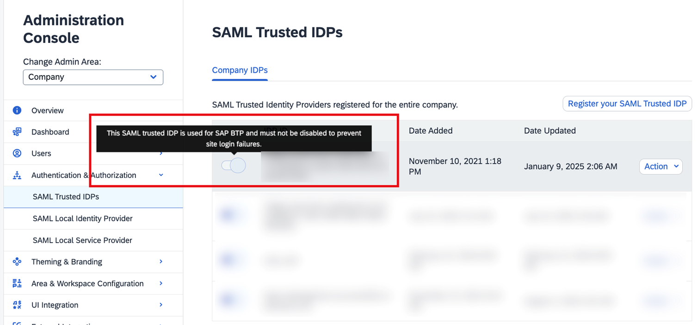
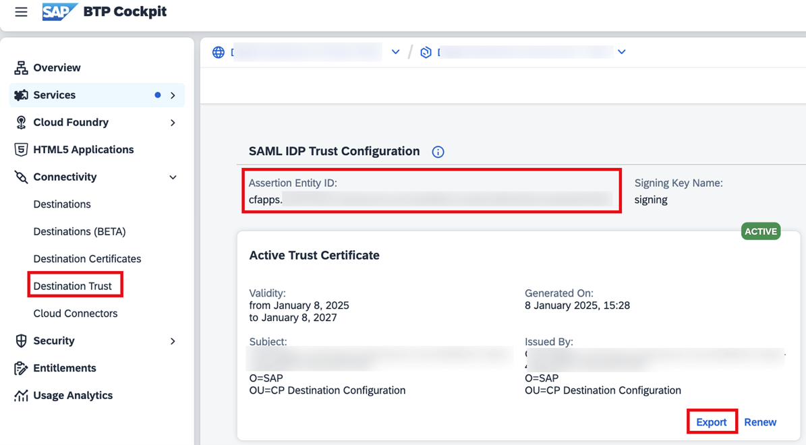

<!-- loioc2f81fd55cf5451c9c6c5e3c55760d0f -->

# SAML Trusted IdPs

Security Assertion Markup Language \(SAML\) enables single sign-on \(SSO\). When you register a trusted SAML identity provider \(IdP\), users are authenticated and stored in SAP Build Work Zone, advanced edition.

By registering an external application as a SAML trusted Identity Provider \(IdP\), you allow the application to access the SAP Build Work Zone, advanced edition user ID and authorization information. Users then see only the content they're authorized to view when SAP Build Work Zone, advanced edition features are integrated into an external application.

> ### Note:  
> The SAML trusted IdP settings apply only to the Digital Workplace Service \(DWS\) component of SAP Build Work Zone, advanced edition. For more information about the overall trust settings, see [User Authentication and Authorization](user-authentication-and-authorization-f04c185.md).

<a name="loioc2f81fd55cf5451c9c6c5e3c55760d0f__section_k5g_tk3_m2c"/>

## Managing SAML Trusted IdPs

You can find the list of the SAML trusted IdPs in the Administration Console, under *Authentication & Authorization* \> *SAML Trusted IdPs*.

Note that the first item in the list is the default trust that was created during onboarding to SAP Build Work Zone, advanced edition, and you can't change it.

You can perform the following actions on the SAML trusted IdPs:

<table>
<tr>
<th valign="top">

Action

</th>
<th valign="top">

More information

</th>
</tr>
<tr>
<td valign="top">

Enable or disable a SAML Trusted IDP.

</td>
<td valign="top">

Change the slider control in the left-most column of the row with the *SAML Trusted IDP*.

</td>
</tr>
<tr>
<td valign="top">

View the information for a SAML Trusted Identity Provider.

</td>
<td valign="top">

Click *Action* in the right-most column of the row with the *SAML Trusted IDP*, and then select*View* from the menu.

A page displays the configuration details of the selected SAML trusted IdP.

You can either modify the information by clicking *Edit* or return to the *SAML Trusted IDPs* page by clicking *Back*.

</td>
</tr>
<tr>
<td valign="top">

Edit a configured SAML Trusted IDP.

</td>
<td valign="top">

There are 2 ways to edit a SAML trusted IDP:

-   Click *Action* in the right-most column of the row with the *SAML Trusted IDP*, and then select *Edit* from the menu.

-   Click *View* from the same menu, to view the details of the relevant SAML Trusted IdP and then click *Edit* at the bottom of the details page.

*Save* the changes that you make.

</td>
</tr>
<tr>
<td valign="top">

Delete a SAML Trusted Identity Provider entry.

</td>
<td valign="top">

Click *Action* in the right-most column of the row with the *SAML Trusted IDP* that you want to delete, and then click *Delete* from the menu.

A confirmation dialog box appears. Click *Delete* to confirm and remove the selected SAML Trusted IdP record.

</td>
</tr>
</table>

<a name="loioc2f81fd55cf5451c9c6c5e3c55760d0f__section_kq3_nys_2dc"/>

## Registering a New SAML trusted IdP

1.  To add a SAML trusted IdP, click *Register your SAML Trusted IDP*.
2.  To fill in the trust settings you can either upload a metadata file or you can enter the values manually.

    A list of certificates that can be exported into a metadata file can be found in the SAP BTP cockpit, *Connectivity* \> *Destination Trust*:

    

    <table>
    <tr>
    <th valign="top">

    Setting
    
    </th>
    <th valign="top">

    Description
    
    </th>
    </tr>
    <tr>
    <td valign="top">
    
    *IdP ID*
    
    </td>
    <td valign="top">
    
    Enter the URL of your identity provider, or a name that indicates who the trusted SAML identity provider is, or the application name for which the trusted SAML identity provider is providing single sign-on services.
    
    </td>
    </tr>
    <tr>
    <td valign="top">
    
    *Single Sign-On URL*
    
    </td>
    <td valign="top">
    
    Enter the URL used for single sign-on \(SSO\) with the identity provider \(IdP\).
    
    </td>
    </tr>
    <tr>
    <td valign="top">
    
    *Single Log-Out URL*
    
    </td>
    <td valign="top">
    
    Enter the URL used for single log-out \(SLO\) with the identity provider \(IdP\).
    
    </td>
    </tr>
    <tr>
    <td valign="top">
    
    *Default Name ID Format*
    
    </td>
    <td valign="top">
    
    Enter which name ID format is to be used in an authentication request.
    
    </td>
    </tr>
    <tr>
    <td valign="top">
    
    *Default Name ID Policy SP Name Qualifier*
    
    </td>
    <td valign="top">
    
    Enter the default service provider \(SP\) name qualifier that is to be used in an authentication request.
    
    </td>
    </tr>
    <tr>
    <td valign="top">
    
    *X509 Certificate \(Base64\)*
    
    </td>
    <td valign="top">
    
    Enter the Transport Layer Security \(TLS\) public key certificate string for the client application's API access.
    
    </td>
    </tr>
    <tr>
    <td valign="top">
    
    *Passive X509 Certificate \(Base64\)*
    
    </td>
    <td valign="top">
    
    Enter the Transport Layer Security \(TLS\) public key certificate string for the client application's API access. The passive certificate acts as a backup certificate in case the active certificate has expired, to avoid system downtime. For more information see the section below *Using Active and Passive Certificates*.
    
    </td>
    </tr>
    <tr>
    <td valign="top">
    
    *Enabled* 
    
    </td>
    <td valign="top">
    
    \[Optional\] Specifies whether SAML Assertions are accepted from this identity provider. Select *Enabled* to make this trusted SAML identity provider available immediately.

    > ### Note:  
    > You can enable or disable the entry in the *SAML Trusted IDPs* page at any time.

    
    </td>
    </tr>
    <tr>
    <td valign="top">
    
    *External*
    
    </td>
    <td valign="top">
    
    Specifies whether this trusted SAML identity provider is used to authenticate external users.
    
    </td>
    </tr>
    <tr>
    <td valign="top">
    
    *Administrative Area*
    
    </td>
    <td valign="top">
    
    Select the area in which you want this SAML Trusted IdP configuration to be available. The default is *Company*, which makes it available to all workspaces and areas. Selecting a specific area limits the scope of the SAML Trusted IdP configuration and limits the management of that configuration to either area administrators who are responsible for that area or to company administrators.
    
    </td>
    </tr>
    <tr>
    <td valign="top">
    
    *Primary*
    
    </td>
    <td valign="top">
    
    The default IdP used for SSO redirect. There can only be one primary IdP in a company. This setting can't be changed by the admin.
    
    </td>
    </tr>
    <tr>
    <td valign="top">
    
    *Issuer namespace*
    
    </td>
    <td valign="top">
    
    There can be only one primary identity provider configured within your organization. This option is preset to *Company Specific*.
    
    </td>
    </tr>
    </table>
    
3.  Choose *Register*.

<a name="loioc2f81fd55cf5451c9c6c5e3c55760d0f__section_tky_j23_m2c"/>

## Renewing an Expired Certificate

When a certificate is about to be expired or already expired, the system sends a notification email with instructions how to renew the certificate. It is essential to take action in a timely manner, according to the instructions specified in the email.

To renew an expired certificate, open SAP BTP cockpit, *Connectivity* \> *Destination Trust* and click *Renew* on the expired certificate.

> ### Note:  
> It is not recommended to renew an active certificate directly. Consider using the rotate certificates feature \(see below\) if you want a zero-downtime procedure.

Export the certificate from the cockpit, and copy-paste its details to the *SAML Trusted IdPs* screen in the Administration Console. Verify that you are updating the correct trust by matching the *Assertion Entity ID* value in the cockpit with the *IdP ID* value in the Administration Console.

<a name="loioc2f81fd55cf5451c9c6c5e3c55760d0f__section_nxk_tys_2dc"/>

## Rotating Active and Passive Certificates

It is recommended to define a passive certificate in the SAP BTP cockpit that will serve as a backup certificate in case the active certificate has expired. When the active certificate is expired and no passive certificate is defined, the logon to the system will be blocked.

> ### Note:  
> -   New customers who have added the passive certificate before onboarding to SAP Build Work Zone, advanced edition, don't need to manually copy the passive certificate. The onboarding process will update all available certificates automatically.
> -   Defining a passive certificate is mandatory in case the active certificate is already expired.

For more information about handling certificates in SAP BTP cockpit, see [Set up Trust Between Systems](https://help.sap.com/docs/CP_CONNECTIVITY/cca91383641e40ffbe03bdc78f00f681/82dbecae3454493782d16a79e30f1a6d.html).

