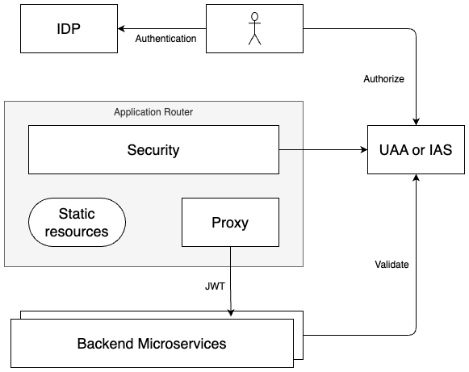
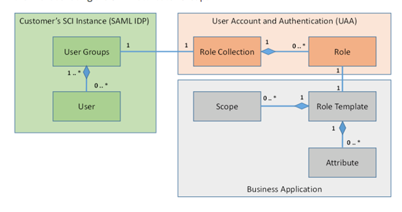

<!-- loiod7b1a89c9a0f46bd9b1e2b6ca70add66 -->

# SecurityGuide

This topic provides guidelines for administrators about securing SAP Build Work Zone, advanced edition.

When using SAP Build Work Zone, advanced edition, you must prevent unauthorized access to critical information, such as personal or sensitive data.

The following diagram depicts the architecture of the Application Router, which is integrated with SAP Build Work Zone, advanced edition from a security perspective:

> ### Note:  
> The following abbreviations are used in some of the diagrams:
> 
> -   XSUAA \(UAA\) - SAP Authorization and Trust Management service
> 
> -   IAS - SAP Cloud Identity Services - Identity Authentication

<a name="loiod7b1a89c9a0f46bd9b1e2b6ca70add66__section_bhr_3pb_kfb"/>

## Topics

-   [Identity and Access Management](security-guide-d7b1a89.md#loiod7b1a89c9a0f46bd9b1e2b6ca70add66__section_identity_access_management)
-   [Frontend Security](security-guide-d7b1a89.md#loiod7b1a89c9a0f46bd9b1e2b6ca70add66__section_frontend_security)
-   [Data Protection and Privacy](security-guide-d7b1a89.md#loiod7b1a89c9a0f46bd9b1e2b6ca70add66__section_DPP)
-   [Reporting Security Vulnerabilities](security-guide-d7b1a89.md#loiod7b1a89c9a0f46bd9b1e2b6ca70add66__section_security_txt)
-   [Auditing and Logging](security-guide-d7b1a89.md#loiod7b1a89c9a0f46bd9b1e2b6ca70add66__section_audit_logging)
-   [Network and Communication Security – Transport Layer Security \(TLS\)](security-guide-d7b1a89.md#loiod7b1a89c9a0f46bd9b1e2b6ca70add66__section_tls)
-   [Secure Delivery, Configuration and Change Management](security-guide-d7b1a89.md#loiod7b1a89c9a0f46bd9b1e2b6ca70add66__section_recommendations)
-   [Operational Security](security-guide-d7b1a89.md#loiod7b1a89c9a0f46bd9b1e2b6ca70add66__section_operational)

<a name="loiod7b1a89c9a0f46bd9b1e2b6ca70add66__section_identity_access_management"/>

## Identity and Access Management

### Authentication

User authentication processes in SAP Build Work Zone, advanced edition.

Administrators need to perform the following tasks:

-   Configure a trust between the customer's subaccount on SAP BTP and Identity Authentication using one of the following methods:
    -   Connect to Identity Authentication through SAP Authorization and Trust Management service \(XSUAA\), based on OpenID Connect protocol \(OIDC\). For more information, see [Establish Trust and Federation Between SAP Authorization and Trust Management Service and Identity Authentication](https://help.sap.com/docs/BTP/65de2977205c403bbc107264b8eccf4b/161f8f0cfac64c4fa2d973bc5f08a894.html).
    -   Recommended for subscriptions created prior to 20th March 2025: Connect directly to Identity Authentication from the Site Manager, *Settings* editor.

        > ### Note:  
        > New subscriptions created after 20th March 2025 are directly connected to Identity Authentication by default. Make sure that you have an OIDC-based trust between SAP Cloud Identity Services – Identity Authentication and SAP BTP.

-   If you are using a corporate IdP, you can use Identity Authentication as a proxy between the corporate IdP and your subaccount. For more information, see [Corporate Identity Providers](https://help.sap.com/docs/IDENTITY_AUTHENTICATION/6d6d63354d1242d185ab4830fc04feb1/19f3eca47db643b6aad448b5dc1075ad.html).

The following diagram shows the login flow to Identity Authentication:

1.  A user who logs in is directed to the approuter.

2.  The approuter gets the Identity Authentication token.

3.  The approuter gets the XSUAA token.

    As a result, it is possible to use either the Identity Authentication token or the XSUAA token to access the back-end systems.

The following diagram shows the login flow for SAP Authentication and Trust Management service \(XSUAA\):

1.  A user who logs in is directed to the approuter.

2.  The approuter logs in to XSUAA.

3.  The approuter gets the XSUAA token.

    As a result, it is possible to use the XSUAA token to access the Backend 1 system.

### Authorization

UAA is used as an OAuth2 authorization mechanism to grant access tokens to applications that request platform resources. The tokens are based on a JSON Web Token \(JWT\) and digitally signed by UAA. This enables users to be identified and verified so that they only access the resources for which they have the proper permissions.

Administrators need to perform the following tasks:

-   Role Management options:
    -   When using SAP BTP role mechanism, for every role that is created in the Content Manager a corresponding role collection is created in the cockpit. Administrators need to assign users to this role collection.
    -   When using Identity Provisioning, the users and their authorizations are provisioned from the IdP to the subaccount.

UAA is used for local roles and for content providers that do not use the SAP Cloud Identity Services - Identity Provisioning service to handle the provisioning of identities and their authorizations. For information about using the SAP Cloud Identity Services - Identity Provisioning service to provision identities and their authorizations, see [User Authentication and Authorization](user-authentication-and-authorization-f04c185.md).

### Connection to External Systems

The sessions of the SAP Build Work Zone, advanced edition are managed using cookies in SAP BTP. The SAP Build Work Zone, advanced edition supports CSRF prevention implemented by SAP or customer target systems, using a CSRF token that is read from the server, and used for subsequent write requests.

If you encounter issues with log-on or missing content for cross-domain browser integration scenarios, refer to SameSite cookie handling note, [3096310](https://me.sap.com/notes/3096310).

<a name="loiod7b1a89c9a0f46bd9b1e2b6ca70add66__section_frontend_security"/>

## Frontend Security

SAP Build Work Zone, advanced edition, enable users to be identified and takes proactive actions to prevent attacks on browsers by using the following measurements:

-   A Cross Site Request Forgery \(CSRF\) protection mechanism ensures that data stays secure at all times. All network requests that intend to modify data, require passing a CSRF token as a request header.
-   A click-jacking protection mechanism ensures that the SAP Build Work Zone, advanced edition is embedded only by Web pages with a trusted origin.

However, the SAP Build Work Zone, advanced edition doesn't check that the applications that the browser runs use the same protection mechanisms. Since applications run in an embedded mode, they may interfere with each other.

-   Content that is uploaded to the Site Manager, such as imported content, is scanned by a malware scanner. However, the SAP Fiori applications and HTML content inside widgets are not covered by SAP Build Work Zone, advanced edition, but are the responsibility of the owners of these applications and widget contents. Therefore, when adding content to a site, administrators must make sure that the content is secure.

    > ### Note:  
    > If the HTML content contains JavaScript, it will be executed at runtime.

### Session Security

The sessions of the SAP Build Work Zone, advanced edition are managed using cookies in SAP BTP. The SAP Build Work Zone, advanced edition supports CSRF prevention implemented by SAP or customer target systems, using a CSRF token that is read from the server, and used for subsequent write requests.

If you encounter issues with log-on or missing content for cross-domain browser integration scenarios, refer to SameSite cookie handling note, [3096310](https://me.sap.com/notes/3096310).

<a name="loiod7b1a89c9a0f46bd9b1e2b6ca70add66__section_DPP"/>

## Data Protection and Privacy

SAP Build Work Zone, advanced edition tracks modifications made to to sites in the Site Manager and personalization changes made in the runtime site. For instance, the user ID of the person who created or modified a site is recorded and shown on administration UI screens, such as the Site Directory. In the runtime site, the user can personalize the site, by changing the theme for example. To remove all their personalization data from the runtime site, the use can use the *Reset All Personalization* option, located under *User Actions* \> *Settings* \> *User Account*.

All incoming requests that can modify SAP Build Work Zone, advanced edition data are logged in the auditing log, to ensure that all configuration changes and security events are logged.

Some identity providers may have sensitive personal data incorporated with the user ID, such as a passport number. SAP Build Work Zone, advanced edition is identity provider-agnostic, so it doesn't have special treatment for these cases.

Administrators need to perform the following tasks:

-   Make sure that the identity provider in use doesn't expose sensitive personal data as part of the user IDs, such as a passport number.
-   A site template, widget, or other third-party SAP Fiori application, that is intended to run as part of the SAP Build Work Zone, advanced edition, and includes person-related data, must comply with the data protection rules of its target countries. This includes the usage of proper authentication, authorization, and encryption, such as SSO, and the usage of HTTPS, as well as properly securing and logging access to the person-related data.

<a name="loiod7b1a89c9a0f46bd9b1e2b6ca70add66__section_security_txt"/>

## Reporting Security Vulnerabilities

SAP Build Work Zone, advanced edition is compliant with the `security.txt` standard that allows to report security vulnerabilities easily. Each customer can access the `security.txt` file in the following directory: `/.well-known/security.txt`

For example: `https://<domain>/.well-known/security.txt`

In this file, you can find the URL for reporting the security vulnerabilities.

<a name="loiod7b1a89c9a0f46bd9b1e2b6ca70add66__section_audit_logging"/>

## Auditing and Logging

For more information, see [Auditing and Logging Information](auditing-and-logging-information-b1c760e.md).

<a name="loiod7b1a89c9a0f46bd9b1e2b6ca70add66__section_tls"/>

## Network and Communication Security – Transport Layer Security \(TLS\)

SAP BTP uses encrypted communication channels based on HTTPS/TLS, supporting TLS version 1.2 or higher.

Make sure you use HTTP clients \(such as web browsers\) that support TLS version 1.2 or higher for connecting to SAP BTP.

> ### Note:  
> You can optionally use TLS 1.3 in the Custom Domain Manager. This option allows the use of TLS 1.3 with applications running on SAP BTP. It's not allowed to use TLS 1.3, for example for the SAP BTP cockpit or SAP Cloud Identity Services. These services are still using TLS 1.2.
> 
> For more information, see [What Is Custom Domain?](https://help.sap.com/docs/custom-domain/custom-domain-manager/what-is-custom-domain).

<a name="loiod7b1a89c9a0f46bd9b1e2b6ca70add66__section_recommendations"/>

## Secure Delivery, Configuration and Change Management

We provide a list of recommendations for the configuration of our services. These recommendations help you to meet your compliance goals and secure your business.

For details, see [Security Recommendations](https://help.sap.com/docs/btp/sap-btp-security-recommendations-c8a9bb59fe624f0981efa0eff2497d7d/sap-btp-security-recommendations?&version=Cloud).

<a name="loiod7b1a89c9a0f46bd9b1e2b6ca70add66__section_operational"/>

## Operational Security

The SAP Build Work Zone, advanced edition is hosted by the SAP BTP, Cloud Foundry environment and all operational processes are in accordance with the relevant operational security guidance for SAP BTP, Cloud Foundry environment.

For more information, see [Security](https://help.sap.com/docs/btp/sap-business-technology-platform/btp-security).

**Related Information**  

[Personal Data and Privacy](personal-data-and-privacy-d6b35c5.md "")

[Using Security Headers](using-security-headers-da26650.md "Improve the security of your sites by adding HTTP security headers to protect against clickjacking, cross-site scripting, XSS, and other attacks.")

[Security Guidelines for Content Providers](security-guidelines-for-content-providers-37ea9ee.md "This topic covers special security considerations for SAP Build Work Zone, advanced edition content providers.")

[Auditing and Logging Information](auditing-and-logging-information-b1c760e.md "Here you can find a list of the security events that are logged by this service.")

