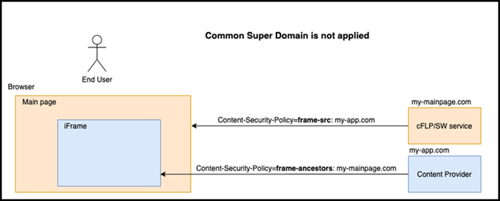

<!-- loio37ea9ee991914b439338e47e6c99d119 -->

# Security Guidelines for Content Providers

This topic covers special security considerations for SAP Build Work Zone, advanced edition content providers.

<a name="loio37ea9ee991914b439338e47e6c99d119__section_cbg_45b_grb"/>

## Overview

Content provider application UIs in SAP Build Work Zone, advanced edition, are rendered through iFrames. The shell header and the application UI are decoupled from each other and each can point to a different domain.

If the 2 frames each point to different domains, it can lead to issues with the browser and cookie policies. Persistent cookies may be blocked by the browser that can threaten cookie-based applications. These issues can affect single-sign-on \(SSO\), resulting in the user being constantly interrupted with authentication requests.

<a name="loio37ea9ee991914b439338e47e6c99d119__section_gll_p5b_grb"/>

## Guidelines to solve the problem

Make sure that the following guidelines are in place:

<table>
<tr>
<th valign="top">

No.

</th>
<th valign="top">

Guideline

</th>
<th valign="top">

More Information

</th>
</tr>
<tr>
<td valign="top">

1

</td>
<td valign="top">

Ensure that there's a common super domain

</td>
<td valign="top">

All integrated components should belong to the same common super domain.

For example, `ondemand.com`.

> ### Note:  
> If you open the application in a new browser tab, it's not necessary to use a common super domain.

</td>
</tr>
<tr>
<td valign="top">

2

</td>
<td valign="top">

Ensure that the same IdP is used for all integrated content providers.

</td>
<td valign="top">

In order to have SSO, all content providers that are integrated into SAP Build Work Zone, advanced edition, should use the same IdP as SAP Build Work Zone, advanced edition \(either with the Identity Authentication service as a proxy, or direct IdP\).

</td>
</tr>
<tr>
<td valign="top">

3

</td>
<td valign="top">

Make the IdP login page frameable.

</td>
<td valign="top">

IdPs initiate a session in the browser using a redirect method. This means that a login page is rendered on the end user browser to create a user session.

By default, some IdPs like Azure Identity Manager return a login page with header: `X-Frame-Options=DENY` and therefore this page can't be rendered within an iFrame.

In order to display the login page in an iFrame, follow these guidelines:

-   The `X-Frame-Options` header should be either:

    -   Cancelled – in this case you remove the entire header.

    -   Edited – in this case you replace the value – to see which values you can use see, [X-Frame-Options](https://developer.mozilla.org/en-US/docs/Web/HTTP/Headers/X-Frame-Options).

    -   Replaced by an appropriate `Content-Security-Policy` header.

    -   Switch to the Identity Authentication service or Identity Authentication service as a proxy mode – in this case the `X-Frame-options` don't exist.

-   Implement a single-use token to avoid having to log in from every iFrame.

For XSUAA-based applications, when using application integration with a standalone appRouter and XSUAA, the appRouter redirects to XSUAA for session initiation and the login page is rendered within the iFrame.

By default, the XSUAA login page is returned with the `X-Frame-Option=DENY` header that prevents the login page from being rendered within an iFrame.

To allow XSUAA login page to be rendered in additional origins, follow the instructions in this topic:

[Security Considerations for the SAP Authorization and Trust Management Service](https://help.sap.com/viewer/65de2977205c403bbc107264b8eccf4b/Cloud/en-US/f117cab6b92d438cb2a0b5204713994b.html).

</td>
</tr>
<tr>
<td valign="top">

4

</td>
<td valign="top">

Configure frameable logout pages.

</td>
<td valign="top">

To make custom logout pages work with iFrames do the following configurations:

-   **For the Identity Authentication service:**

    When using the Identity Authentication service authentication for a custom logout landing page, you need to add it to the trusted domains of the Identity Authentication service, otherwise pages won't be rendered in the UI. You can do this as follows:

    1.  Open the Identity Authentication admin environment.

        For example, `https://dwp.accounts400.ondemand.com/admin`

    2.  Navigate to *Applications & Resources* \> *Tenant Settings* \> *Trusted Domain*.

    3.  Add trusted domains.

        For example,`cfapps.sap.hana.ondemand.com`.

    4.  *Save*.

-   **For XSUAA**:

    As the XSUAA service and the SAP Build Work Zone, advanced edition are deployed on the same environment, no additional configuration is needed.

</td>
</tr>
<tr>
<td valign="top">

5

</td>
<td valign="top">

Configure the `Content-Security-Policy` \(CSP\) header.

</td>
<td valign="top">

For content provider apps to be loaded properly in an iFrame, the `Content-Security-Property` \(CSP\) header should be configured in the relative service.

SAP provides default CSP values that should cover most custom use cases, but if the default value isn't sufficient, you can override the default values.

The most important directives in the CSP header are the `frame-src`and the `frame- ancestors`.

-   The`frame-src` directive specifies valid sources for nested browsing contexts loading using elements such as `<frame>` and `<iframe>`.

-   The `frame-ancestors` directive specifies valid parents that may embed a page using`<frame>`,`<iframe>`, `<object>`, `<embed>`, or `<applet>`.

For successful integration of the CSP `frame-ancestors`' directive, the header should include the SAP Build Work Zone, advanced edition domain.

For more details about the `Content-Security-Policy` syntax, see [Content-Security-Policy \(CSP\).](https://developer.mozilla.org/en-US/docs/Web/HTTP/CSP):

</td>
</tr>
</table>

<a name="loio37ea9ee991914b439338e47e6c99d119__section_spd_gph_grb"/>

## Examples

