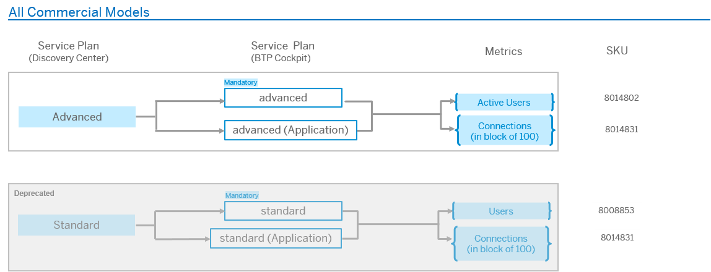

<!-- loio0b00752b4dec4752bece9d99f0168520 -->

# Service Plans and Metering

This page explains the relationship between the service plans in the SAP Discovery Center and those in the SAP BTP cockpit, and provides information to help you understand how SAP Build Work Zone, advanced edition and SAP SuccessFactors Work Zone are billed.

<a name="loio0b00752b4dec4752bece9d99f0168520__section_c12_zjx_hgb"/>

## Service Overview

The following commercial models are available:

<table>
<tr>
<th valign="top">

Product

</th>
<th valign="top">

Commercial Model

</th>
<th valign="top">

Description

</th>
</tr>
<tr>
<td valign="top">

SAP Build Work Zone, advanced edition 

</td>
<td valign="top">

Consumption-based

</td>
<td valign="top">

You are entitled to activate SAP Build Work Zone, advanced edition.

You prepay for cloud credits, which are then balanced against the consumption of SAP Build Work Zone, advanced edition.

</td>
</tr>
<tr>
<td valign="top">

SAP SuccessFactors Work Zone 

</td>
<td valign="top">

Subscription-based

</td>
<td valign="top">

You are entitled to use SAP SuccessFactors Work Zone.

You prepay a fixed price for the duration of the subscription period, according to the number of licenses that you purchase.

</td>
</tr>
</table>

> ### Note:  
> In China region, SAP Build Work Zone, advanced edition, which is based on the subscription commercial model, isn’t supported. You can only onboard to SAP SuccessFactors Work Zone.

For more information, see [Commercial Models](https://help.sap.com/docs/btp/sap-business-technology-platform/commercial-models?version=Cloud).

To facilitate your understanding of the service plan information in the [Discovery Center](https://discovery-center.cloud.sap/serviceCatalog/sap-build-work-zone-advanced-edition?region=all) and the way it relates to the information in the SAP BTP cockpit, please review the diagram below:

In all commercial models, the service plan 'advanced \(Application\)' refers to the graphical interface of the service, whereas the 'advanced' plan refers to the instance of the service, which can also be accessed through API.

<a name="loio0b00752b4dec4752bece9d99f0168520__section_fzq_gqd_kgb"/>

## Metrics

The following table describes the metrics used to monitor and charge usage for SAP Build Work Zone, advanced edition. Note that you pay either for Active Users or for Connections, but not for both for a specific user.

<table>
<tr>
<th valign="top">

Metric

</th>
<th valign="top">

Description

</th>
</tr>
<tr>
<td valign="top">

**Active Users**

</td>
<td valign="top">

An 'active user' is an authenticated, internal, and unique individual who accessed SAP Build Work Zone, advanced edition at any time during a calendar month.

Active users are metered uniquely at the global account level based on each user’s Universally Unique Identifier \(UUID\). Each distinct UUID that logs in to the service \(across relevant subaccounts\) during a given month is counted as one active user.

> ### Note:  
> For SAP SuccessFactors Work Zone, the **Users** metric is used.

</td>
</tr>
<tr>
<td valign="top">

**Connections**

</td>
<td valign="top">

A 'connection' is an individual user session to a customer’s site. Within a single connection the user can browse an unlimited number of pages belonging to that site.

A user's 'connection' \(session\) is active until one of the following occurs:

-   The user logs off from the site.

-   The user closes the web browser.

-   The 'connection' \(session\) times out due to user inactivity. The timeout duration is 15 minutes by default and can be configured to a maximum of 30 minutes. For more information, see [Site Settings](site-settings-ca74965.md).

</td>
</tr>
</table>

> ### Note:  
> Make sure that every authenticated user who is external to your organization is assigned to the `Workzone_User_Type_public` Identity Authentication user group that corresponds to the `Workzone_External_User` role collection on SAP BTP. For more information, see [Prerequisites](prerequisites-9e78b62.md) and [About Roles Types](about-roles-types-f38de6b.md).
> 
> The metrics are metered separately, depending on the user’s role assignment. An Active User \(or User\) is reported unless the user is assigned to the external role and then a Connection is reported.

> ### Note:  
> If the Global User ID is identical across Identity Authentication tenants, the User will be counted once.

<a name="loio0b00752b4dec4752bece9d99f0168520__section_jwy_m5n_lgb"/>

## Monitoring

Usage monitoring is done via the SAP BTP cockpit.

For more information, see [Monitoring Usage and Consumption Costs](https://help.sap.com/viewer/65de2977205c403bbc107264b8eccf4b/Cloud/en-US/de6f0db8919f4e6f97e54bc4ddaf2ab8.html).

<a name="loio0b00752b4dec4752bece9d99f0168520__section_crb_qfs_3dc"/>

## Supplemental Terms & Conditions

For more information, see [SAP Business Technology Platform Service Description Guide and Agreement](https://www.sap.com/about/trust-center/agreements/cloud/cloud-services.html?sort=latest_desc).

<a name="loio0b00752b4dec4752bece9d99f0168520__section_mfn_1cv_pmb"/>

## Included Services - SAP Build Work Zone, advanced edition

The SAP Build Work Zone, advanced edition license includes the following services:

<table>
<tr>
<th valign="top">

Services

</th>
</tr>
<tr>
<td valign="top">

SAP Build Work Zone, advanced edition 

</td>
</tr>
<tr>
<td valign="top">

UI theme designer

For more information, see [UI theme designer](https://help.sap.com/viewer/product/UI_THEME_DESIGNER/Cloud/en-US).

</td>
</tr>
<tr>
<td valign="top">

HTML5 Applications managed by SAP

For more information, see [Developing HTML5 Applications and Extensions](https://help.sap.com/docs/WZ_STD/8c8e1958338140699bd4811b37b82ece/c1b9d6facfc942e3bca664ae06387e9b.html).

</td>
</tr>
<tr>
<td valign="top">

SAP Mobile Services \(runtime\), which enables using the Joule Work mobile app

> ### Note:  
> Some SAP Mobile Services capabilities are not available in the license of the version that is bundled with SAP Build Work Zone, advanced edition. For example:
> 
> -   Integration with SAP Cloud ALM \(Application Lifecycle Management\).
> 
> -   Offline support.
> 
> -   SAP Mobile Development Kit.
> 
> -   SAP BTP SDK for iOS.
> 
> -   SAP BTP SDK for Android.
> 
> 
> To leverage these capabilities, a dedicated license for SAP Mobile Services is required. For further details, please contact your SAP account representative.

For more information, see [SAP Mobile Services Documentation](https://help.sap.com/doc/f53c64b93e5140918d676b927a3cd65b/Cloud/en-US/docs-en/index.html).

</td>
</tr>
<tr>
<td valign="top">

SAP Cloud Identity Services:

-   Identity Authentication service \(IAS\).

    For more information, see [SAP Cloud Identity Services - Identity Authentication](https://help.sap.com/docs/IDENTITY_AUTHENTICATION).

-   Identity Provisioning service \(IPS\).

    For more information, see [SAP Cloud Identity Services - Identity Provisioning](https://help.sap.com/docs/IDENTITY_PROVISIONING).

</td>
</tr>
<tr>
<td valign="top">

SAP Task Center

The following service plan must be used: `all-tasks`.

The following is included - up to 20 tasks \(2 blocks of 10 records\) stored in the SAP Task Center task cache for each active user, and for each block of 100 SAP Build Work Zone, advanced edition connections on the global account level.

For more information, see [Service Plans and Metering \(SAP Task Center\)](https://help.sap.com/docs/task-center/sap-task-center/service-plans-and-metering?&version=Cloud).

</td>
</tr>
</table>

> ### Note:  
> These services are restricted to authenticated users.

<a name="loio0b00752b4dec4752bece9d99f0168520__section_lbc_4dy_2wb"/>

## Included Services - SAP SuccessFactors Work Zone

The SAP SuccessFactors Work Zone license includes the following services:

<table>
<tr>
<th valign="top">

Services

</th>
</tr>
<tr>
<td valign="top">

SAP SuccessFactors Work Zone 

</td>
</tr>
<tr>
<td valign="top">

UI theme designer

For more information, see [UI theme designer](https://help.sap.com/viewer/product/UI_THEME_DESIGNER/Cloud/en-US).

</td>
</tr>
<tr>
<td valign="top">

HTML5 Applications managed by SAP

For more information, see [Developing HTML5 Applications and Extensions](https://help.sap.com/docs/WZ_STD/8c8e1958338140699bd4811b37b82ece/c1b9d6facfc942e3bca664ae06387e9b.html).

</td>
</tr>
<tr>
<td valign="top">

SAP Mobile Services \(runtime\), which enables using the Joule Work mobile app

> ### Note:  
> Some SAP Mobile Services capabilities are not available in the license of the version that is bundled with SAP SuccessFactors Work Zone. For example:
> 
> -   Integration with SAP Cloud ALM \(Application Lifecycle Management\).
> 
> -   Offline support.
> 
> -   SAP Mobile Development Kit.
> 
> -   SAP BTP SDK for iOS.
> 
> -   SAP BTP SDK for Android.
> 
> 
> To leverage these capabilities, a dedicated license for SAP Mobile Services is required. For further details, please contact your SAP account representative.

For more information, see [SAP Mobile Services Documentation](https://help.sap.com/doc/f53c64b93e5140918d676b927a3cd65b/Cloud/en-US/docs-en/index.html).

</td>
</tr>
<tr>
<td valign="top">

SAP Cloud Identity Services:

-   Identity Authentication service \(IAS\).

    For more information, see [SAP Cloud Identity Services - Identity Authentication](https://help.sap.com/docs/IDENTITY_AUTHENTICATION).

-   Identity Provisioning service \(IPS\).

    For more information, see [SAP Cloud Identity Services - Identity Provisioning](https://help.sap.com/docs/IDENTITY_PROVISIONING).

</td>
</tr>
<tr>
<td valign="top">

SAP Task Center

The following service plan must be used: `all-tasks`.

The following is included - up to 20 tasks \(2 blocks of 10 records\) stored in the SAP Task Center task cache for each active user, and for each block of 100 SAP SuccessFactors Work Zone connections on the global account level.

For more information, see [Service Plans and Metering \(SAP Task Center\)](https://help.sap.com/docs/task-center/sap-task-center/service-plans-and-metering?&version=Cloud).

</td>
</tr>
<tr>
<td valign="top">

A license bundle of the following SAP BTP services, with a limited number of users:

-   SAP Business Application Studio

-   SAP Build Process Automation

-   SAP Custom Domain

</td>
</tr>
</table>

> ### Note:  
> These services are restricted to authenticated users.

## Service Plans

The following table explains which service plans are required for different use cases:

<table>
<tr>
<th valign="top">

Technical Name

</th>
<th valign="top">

Plan Name

</th>
<th valign="top">

Use Case

</th>
<th valign="top">

Type

</th>
</tr>
<tr>
<td valign="top">

SAPWorkZone

</td>
<td valign="top">

advanced \(Application\)

</td>
<td valign="top">

A plan that is required to build sites that serve as a unified point of access to cloud and on-premise applications, as well as workspaces and other collaboration tools.

> ### Note:  
> This plan is not available for older subscriptions and they use the **standard \(Application\)** plan instead.

</td>
<td valign="top">

Subscription

</td>
</tr>
<tr>
<td valign="top">

SAPWorkZone

</td>
<td valign="top">

standard \(Application\)

</td>
<td valign="top">

A plan that is required to build sites that serve as a unified point of access to cloud and on-premise applications, as well as workspaces and other collaboration tools.

</td>
<td valign="top">

Subscription

</td>
</tr>
<tr>
<td valign="top">

SAPWorkZone

</td>
<td valign="top">

build-default \(Application\)

</td>
<td valign="top">

A package that comprises of low-code and pro-code offerings, including the SAP Build Work Zone, advanced edition capabilities. For more information, see:

-   [What Is SAP Build?](https://help.sap.com/docs/SAP_BUILD/411a94a7191243e0a99c9af3a061cee9/8c42f0f94a5d482c85e325d7ea78bf2b.html)
-   [Switching to the build-default Service Plan](switching-to-the-build-default-service-plan-a797661.md)
-   [Service Plans and Metering](https://help.sap.com/docs/SAP_BUILD/411a94a7191243e0a99c9af3a061cee9/a90ad466d2024e6fb2c2c063af47e659.html)

> ### Note:  
> If you subscribe to this plan, don't subscribe to the standard /advanced\(Application\) in parallel.

> ### Note:  
> This service plan is not available in the China region.

</td>
<td valign="top">

Subscription

</td>
</tr>
<tr>
<td valign="top">

build-workzone-advanced

</td>
<td valign="top">

advanced

</td>
<td valign="top">

A plan that is required to integrate SAP Build Work Zone, advanced edition APIs with other services, such as the SAP Cloud Transport Management service, Identity Services, etc.

> ### Note:  
> This plan is not available for older instances and they use the **standard** plan instead.

</td>
<td valign="top">

Service instance + key

</td>
</tr>
<tr>
<td valign="top">

build-workzone-advanced

</td>
<td valign="top">

standard

</td>
<td valign="top">

A plan that is required to integrate SAP Build Work Zone, advanced edition APIs with other services, such as the SAP Cloud Transport Management service, Identity Services, etc.

</td>
<td valign="top">

Service instance + key

</td>
</tr>
<tr>
<td valign="top">

build-workzone-advanced

</td>
<td valign="top">

build-default

</td>
<td valign="top">

A package that comprises of low-code and pro-code offerings, including the SAP Build Work Zone, advanced edition capabilities. This plan is required for API integration. For more information, see:

-   [What Is SAP Build?](https://help.sap.com/docs/SAP_BUILD/411a94a7191243e0a99c9af3a061cee9/8c42f0f94a5d482c85e325d7ea78bf2b.html)
-   [Switching to the build-default Service Plan](switching-to-the-build-default-service-plan-a797661.md)
-   [Service Plans and Metering](https://help.sap.com/docs/SAP_BUILD/411a94a7191243e0a99c9af3a061cee9/a90ad466d2024e6fb2c2c063af47e659.html)

> ### Note:  
> This service plan is not available in the China region.

</td>
<td valign="top">

Service instance + key

</td>
</tr>
<tr>
<td valign="top">

SAPWorkZoneHR

</td>
<td valign="top">

standard \(Application\)

</td>
<td valign="top">

A plan that is required to build sites that serve as a unified point of access to cloud and on-premise applications, as well as workspaces and other collaboration tools. This plan is required for SAP SuccessFactors Work Zone.

</td>
<td valign="top">

Subscription

</td>
</tr>
<tr>
<td valign="top">

sap-workzonehr

</td>
<td valign="top">

standard

</td>
<td valign="top">

A plan that is required to integrate SAP SuccessFactors Work Zone APIs with other services, such as the SAP Cloud Transport Management service, Identity Services, etc.

</td>
<td valign="top">

Service instance + key

</td>
</tr>
</table>

<a name="loio0b00752b4dec4752bece9d99f0168520__section_xwk_fv4_hdc"/>

## Glossary

[Commercial Information Glossary](https://help.sap.com/docs/help/5d771150f8f547c6bc604c7d674cf30d/7014f9db099148f1897c1bda5db21f39.html)

