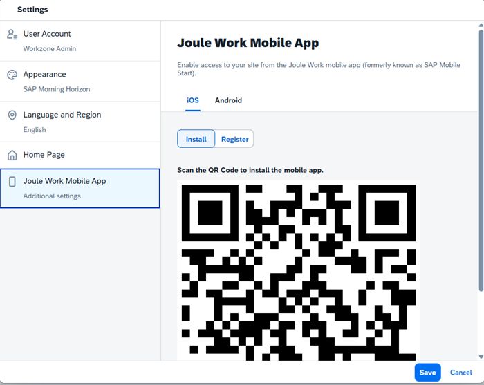

<!-- loio3257133da80c466292abf2749334f0a7 -->

<link rel="stylesheet" type="text/css" href="css/sap-icons.css"/>

# Setting Up the Joule Work Mobile App

In this topic, we explain how to set up the Joule Work mobile app on SAP Build Work Zone, advanced edition and SAP SuccessFactors Work Zone.

<a name="loio3257133da80c466292abf2749334f0a7__section_tjq_21l_tqb"/>

## Overall Process

The overall process of setting up and using the Joule Work mobile app with , SAP Build Work Zone, advanced edition is as follows:

****

<table>
<tr>
<th valign="top">

Step Description

</th>
<th valign="top">

Persona

</th>
<th valign="top">

More Information

</th>
</tr>
<tr>
<td valign="top">

**Step 1:**

Make sure that all system prerequisites have been done \(those that are relevant for your scenario\).

</td>
<td valign="top">

Administrator

</td>
<td valign="top">

For more information, see the Joule Work mobile app documentation: [System Prerequisites](https://help.sap.com/docs/mobile-start/mobile-start-administration-guide/system-prerequisites).

</td>
</tr>
<tr>
<td valign="top">

**Step 2:**

Enable the *Joule Work Mobile App* setting.

</td>
<td valign="top">

Administrator

</td>
<td valign="top">

The administrator enables the the Joule Work mobile app for a specific site as follows:

1.  From the Site Directory, click :gear:on the site's tile.

2.  In the *Site Settings* screen, at the top right of the screen, click *Edit*.

3.  Under *User Capabilities*, enable *Joule Work Mobile App* by switching the toggle button to *Yes*.

    > ### Note:  
    > The toggle button is enabled by default for new sites. For existing sites, the setting is disabled by default and you'll need to manually toggle it to *Yes*.

</td>
</tr>
<tr>
<td valign="top">

**Step 3:**

Install the Joule Work mobile app.

</td>
<td valign="top">

End User

</td>
<td valign="top">

The end user installs and registers the Joule Work mobile app as follows:

1.  In the site, under your avatar, go to *Settings* \> *Joule Work Mobile App*.

2.  Select either the *iOS* or the *Android* tab depending on your operating system.

3.  Click *Install*.

    The QR code for installation is shown.

    

4.  Open the camera app \(or QR code scanner\) on your smartphone and scan the QR code to get a download link for the Joule Work mobile app from the App Store.

5.  Click *Register* and scan the QR code.

</td>
</tr>
<tr>
<td valign="top">

**Step 4:**

Manually integrate the native iOS or Android apps in the site.

</td>
<td valign="top">

Administrator

</td>
<td valign="top">

The administrator configures the native iOS apps or the native Android apps in the app editor located in the Site Manager.

For more information, see [Native iOS and Android Apps](native-ios-and-android-apps-7946c9a.md).

> ### Note:  
> You must also assign the app to a group and to the same role that is assigned to the site.
> 
> For more information, see:
> 
> -   [Assign Apps to a Group](https://help.sap.com/docs/build-work-zone-advanced-edition/sap-build-work-zone-advanced-edition/assign-apps-to-group-and-to-catalog-c65c7af36d4e40dabca667089de62595).
> 
> -   [Assign Content to a Role](https://help.sap.com/docs/build-work-zone-advanced-edition/sap-build-work-zone-advanced-edition/assign-apps-to-group-and-to-catalog-c65c7af36d4e40dabca667089de62595).

</td>
</tr>
<tr>
<td valign="top">

**Step 5:**

Use the Joule Work mobile app to access your native apps.

</td>
<td valign="top">

End User

</td>
<td valign="top">

Once the Joule Work mobile app is installed on the user's mobile device, the user can open it and use it.

For more information about how to use the Joule Work mobile app see the [**Joule Work Mobile App – User Guide**](https://help.sap.com/docs/joule-work-mobile/user-guide-sap-build-work-zone-setup/overview).

</td>
</tr>
</table>

<a name="loio3257133da80c466292abf2749334f0a7__section_stt_jvb_y2c"/>

## Expose SAP Analytics Cloud KPIs as tiles in the Joule Work Mobile App

The SAP Analytics Cloud KPIs can be exposed in the Joule Work mobile app as tiles \(numeric point charts\) that include a KPI, coloring, and a trend indicator. These tiles can also be added as widgets to the iOS Home Screen and monitored in the Apple Watch and Wear OS apps. All native widget capabilities are supported in the Joule Work mobile app.

For more information, see [Exposing SAP Analytics Cloud KPIs in the Joule Work Mobile App](exposing-sap-analytics-cloud-kpis-in-the-joule-work-mobile-app-59f79cf.md).

<a name="loio3257133da80c466292abf2749334f0a7__section_d5q_bqb_w2c"/>

## Benefits that the Joule Work mobile app provides for SAP Build Work Zone, advanced edition users

-   Support for push notifications across iOS & Android.

-   Support for Mobile Device Management \(MDM\) handling.

-   Support for native iOS & Android features \(for example, widgets, watch, Spotlight search, and more\).

-   Support for in-app branding using UI Theme Designer.

