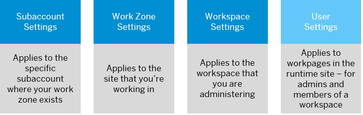

<!-- loio669120aab86f48d594ddc69b45eba6a1 -->

# Settings for Admins and Users

There are various configurable settings that affect the behaviors and visual aspects of the different areas of SAP Build Work Zone, advanced edition.

Some settings can affect a specific subaccount, a specific site, or even a specific workspace. And there are also settings that users of a site can personalize to suite the way they work.

