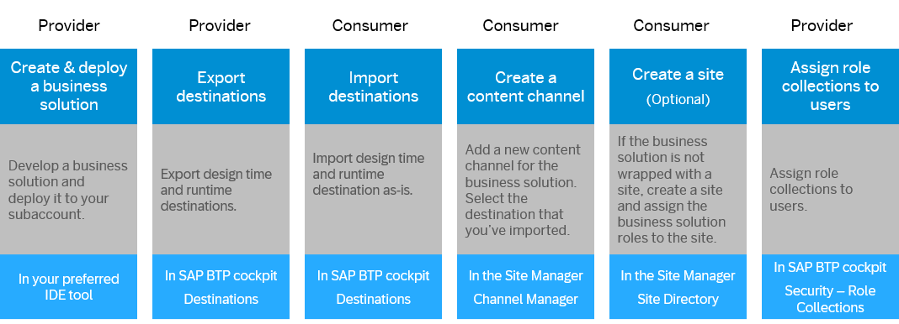

<!-- loioc4fb0376ba0a4ee78f203f83de7e2614 -->

<link rel="stylesheet" type="text/css" href="css/sap-icons.css"/>

# Single-Tenant Business Solution

Consume a business solution across subaccounts that belong to the same company using destinations.


## Overview

In this scenario, you as the provider of an HTML5 business solution, develop and deploy a business solution to your subaccount, and make it available for consumption from a different subaccount that belongs to the same company as you.

The consumers of your business solution, configure destinations that point to your subaccount, and hence run the business solution remotely from your subaccount.

**When to use this scenario:** Choose this scenario when you and your consumers belong to the same company, and there is no security concern about sharing destination details across subaccounts.


## Prerequisites

-   Both provider and consumer subaccounts have a subscription to SAP Build Work Zone.
-   Both provider and consumer subaccounts use the same Identity Authentication tenant.
-   You have developed an MTA project.


<a name="loioc4fb0376ba0a4ee78f203f83de7e2614__section_xgm_mwz_zfc"/>

## Overall Flow




<a name="loioc4fb0376ba0a4ee78f203f83de7e2614__section_uf4_hxz_wfc"/>

## Procedure


### Step 1: Modify the MTA - Add a CDM file and configure destinations

1.  **Add a CDM file:**

    The `cdm.json` file contains the site design time definitions. In this file you define the roles, groups, spaces & pages, and in most cases the site itself. By default, the MTA doesn't include this file, therefore your first step would be to create this file and manually define it.

    Defining the CDM manually might be error prone for large content providers, however, currently, this is the only available option. For more information about how to build this file, see [About the Common Data Model](about-the-common-data-model-c961060.md).

    1.  In the MTA project folder, create a folder named `workzone` and add a `cdm.json` in it.
    2.  Define the business content as needed. You can refer to the sample project that contains an app, a group, a catalog, and a role: [Manage Products sample project](https://github.com/SAP-samples/build-workzone-integration/tree/main/standard/html5-content-provider-sample/ManageProducts).
    3.  Add a script that will copy the `cdm.json` from the `workzone` folder to the `resources` folder at build time:

        ```
        build-parameters:
          before-all:
            - builder: custom
              commands:
                - # Other commands if needed..
                - cp workzone/cdm.json app/resources/cdm.json
        ```

        The `HTML5 app deployer module` deploys what's in the `resources` folder to the HTML5 repo: `target-path: resources/`.

        Then, the CDM content will be consumed by the design-time destination.


2.  **Define design-time and runtime destinations:**

    Define design-time and runtime destinations in the `mta.yaml`. A design-time destination is required to define the location from which to fetch the CDM content. The runtime destination is required to obtain the resources needed to run the app at runtime.

    When you deploy the app, the destinations are created automatically in the cockpit of the subaccount.

    -   **Design-Time Destination**

        The design-time destination points to the location of the stored CDM in the HTML5 repo. The design-time destination has the following format. Please replace the values with your own project's credentials.

        ```
        # CDM design time destination configuration ############
                    - Name: manageproductscdm-dt
                 	ServiceInstanceName: manageproductscdm-html5-app-runtime-service
                 	ServiceKeyName: manageproductscdm-html5-app-runtime-key
                 	URL: https://html5-apps-repo-rt.${default-domain}/applications/cdm/manageproductscdm
        ```

        The destination URL consists of the following sections:

        -   `html5-apps-repo-rt` - the HTML5 repo runtime instance.
        -   `manageproductscdm` - end point, the SAP cloud service. This is the same service that is configured in the `sap.cloud` section of the `manifest.json` of the apps.

        > ### Note:  
        > If you're using extension landscapes, manually change the URL to the service key of the html5-apps-repo app-runtime service instance.

    -   **Runtime Destination**

        If you want to allow consumer subaccounts to run the business solution on your subaccount via destinations and trust, define the runtime destination as follows:

        ```
        # CDM runtime destination configuration ############
        ...
        destinations:
        	- Authentication: NoAuthentication
        	Name: manageproductscdm-rt
        	ProxyType: Internet
        	Type: HTTP
        	CEP.HTML5contentprovider: true
        	CEP.idpOrigin: 'overwriteIdpOrigin'
        	URL: https://SUBDOMAIN.${default-domain} 
        
        ```

        -   **URL**: This is the runtime URL of SAP Build Work Zone, advanced edition, and is pointing to the Approuter URL. Please replace the URL value with the runtime URL of your subaccount. In this flow, the consumer will have to use your subdomain.
        -   **CEP.HTML5contentprovider**: This is a mandatory parameter that identifies this runtime destination as the one related to the HTML5 business solution that serves as a content provider.
        -   **CEP.idpOrigin**: Enter your IdP origin value. This will force the destination to work with the provided idpOrigin. If not provided, it will use the IdP that was used for logging in to the site.

            > ### Note:  
            > If you are using multiple IdPs and the Identity Authentication service for user authentication, if the user logs in with `sap_idp` parameter \(dynamic IdP\), the information about the IdP is not saved in the session. Therefore, the navigation to the application might not use the correct IdP, and the authentication request might fail.


        > ### Note:  
        > If you're using a custom domain:
        > 
        > -   In the URL of the runtime destination use the custom domain URL and not the default domain URL.
        > -   Make sure that both the provider subaccount and the consumer subaccount are using the same Common Super Domain.


3.  **Optional: Include cards in the project**

    For more information, see [Cards in Business Solutions](cards-in-business-solutions-a765b4c.md).

4.  **Optional: Add support to dynamic tiles**

    If the site contains dynamic tiles \(that display data from backend systems\), add the following configuration:

    1.  Add dependency to the provider subaccount in the Identity Authentication admin console. For more information, see [Configure Integration Between Applications](https://help.sap.com/docs/IDENTITY_AUTHENTICATION/6d6d63354d1242d185ab4830fc04feb1/9ad7e8052d054e83adf10aff1bdae1bf.html).
    2.  Add the following parameters to the runtime destination:

        ```
        # CDM runtime destination configuration ############
        ...
        destinations:
        	...
                HTML5.DynamicDestination: true
                HTML5.IASDependencyName = <dependency name for ias application> 
                URL.headers.x-html5contentprovider-acrosssubaccounts: true
        	...
        
        ```


5.  **Optional change: Async loading**

    The consumer subaccount can't influence the loading mode of the apps from the consumer Site Settings screen. By default, all apps are loaded in an async mode \(value is `true`\). To overwrite the default setting, you can set this value to `false` in the `manifest.json` file as follows:

    ```
     "sap.platform.cf": {
            "sapAsyncLoading": false
        }
    ```

    For more information about async loading, see [Site Settings](site-settings-ca74965.md).

6.  **Build and deploy the MTA:**

    Install dependencies and build the MTA:

    ```
    npm install
    mbt build --mtar <project name>.mtar
    
    ```

    Log in to your space and deploy the mtar:

    ```
    cf login -o <your organization> -s <your space> --sso
    cf deploy mta_archives/<project name>.mtar
    
    ```

    After deployment, the design-time and runtime destinations are created automatically in your subaccount based on the definitions in the `mta.yaml`. Your business solution is now ready to be consumed by the consumer subaccount.


### Step 2: Export & Import Destinations

1.  Export the destinations of your business solution. In the SAP BTP cockpit, navigate to *Connectivity* \> *Destinations*.

2.  Select the design-time destination of the business solution and export it using the <span class="SAP-icons-V5"></span>\(Export\) icon.

    For more information, [Export Destinations](https://help.sap.com/docs/connectivity/sap-btp-connectivity-cf/export-destinations?&version=Cloud).

    > ### Note:  
    > The value of the *Client Secret* property can't be exported but you can get it as follows:
    > 
    > 1.  In the cockpit, navigate to *Services* \> *Instances and Subscriptions* and go to the *Instances* tab.
    > 
    > 2.  In the *Service* filter, select *HTML5 Application Repository Service*, and select the service instance in the table.
    > 
    > 3.  Click *View Credentials* at the top right corner of the screen.
    > 
    > 4.  From the *Credentials* file that opens, copy the value of the `clientsecret` and keep it for later.

3.  Select the runtime destination of the business solution and export it too.

4.  Next step is done by the consumers of your business solution. In the SAP BTP cockpit of the **consumer** subaccount, navigate to *Connectivity* \> *Destinations*.

5.  Import the design-time destination. Add the *Client Secret* details you previously saved.

    For more information, see [Import Destinations](https://help.sap.com/docs/connectivity/sap-btp-connectivity-cf/import-destinations?&version=Cloud).

6.  Import the runtime destination.


If you're running into issues with exporting/importing the destinations, you can create them manually by copying the details from the provider subaccount into the consumer subaccount *Destinations* screen.


### Step 3: Create a Content Channel

On the consumer subaccount, create a content channel for the business solution.

1.  In the Channel Manager, click *New*.

2.  In the *New Content Provider* dialog box, specify a title for the provider.

    > ### Note:  
    > The provider ID is identical to the provider title by default, but the administrator can change it. The ID can contain up to 20 alphanumeric characters, dots, or underscores, and it must be unique within a subaccount.
    > 
    > The provider ID is used as a prefix \(preceded by the ~ sign\) for the ID of the roles you add to the Content Manager.

3.  Select the design-time destination and \(default\) runtime destination that you imported/created in the previous section. As for the runtime destination for dynamic data, leave the default value, which is the default runtime destination.

4.  Select the *Content Scope* to determine the content that will be federated - roles and related content or apps only.

5.  Other settings should not be changed from their default state:

    -   *Automatically add all content items to subaccount* - enabled.

        When this option is enabled, all the content items that are associated with the business solution are added to the subaccount.

        **When updating a business solution, the new content items are updated automatically**. Following an update, the report reflects the changes done as a result of the update.

        > ### Note:  
        > If necessary, it is also possible to use the :arrows_clockwise: action in the Channel Manager to fetch the updated content.

    -   *Use the Identity Provisioning service to provision user authorizations* - disabled

    -   *Include group and catalog assignments to role* - disabled


6.  Upon saving, a new row is added to the *Content Channels* table, with the status “Creating…”. When the content provider is ready, the status changes to “Created” and the content is visible in the Content Explorer.

    Click the *Report* link to see the number of roles, apps, groups, catalogs, spaces, pages, and URL templates that are included in the content provider.


### Step 4: Assign Roles to the Site \(as needed\)

Business solutions may or may not include a site entity. If the business solution contains a site, the site is exposed in the Site Directory and all the business solution roles that were defined in the CDM are automatically assigned to it.

However, if the business solution doesn't contain a site, it is necessary to create a site and assign the roles of the business solution to this site. The same is true if you want to include the business solution apps in additional sites, and not only the site that came with it. For more information, see, [Assign Roles to Your Site](assign-roles-to-your-site-7afe670.md).


### Step 5: Assign Users to Role Collections

Upon deployment, for every role in the business solution, a role collection is created in SAP BTP cockpit, and the next step is to assign the role collection to the end users.

1.  In the SAP BTP cockpit of your subaccount, go to *Security* \> *Role Collections*.

2.  Find the relevant role collection and click the arrow on the far right.

3.  Click *Edit* and in the *Users* section, search for the users of the consumers you want to assign to the role collection.

4.  *Save*.


### Step 6: Configure Trusted Domains in Provider Subaccount

To allow consumers access the business solution remotely and run it on your subaccount, you need to configure trust between the subaccount domains. To do this, add all the consumer subaccounts as trusted domains to your subaccount:

1.  In the SAP BTP cockpit of your subaccount, navigate to *Security* \> *Settings*.

2.  In the *Trusted Domains* tab, click *Add* to add the URLs of the consumer subaccounts using the following format:

    `https://<subdomain>.workzone.cfapps.<data center>.hana.ondemand.com`

    > ### Note:  
    > If you're using a custom domain:
    > 
    > -   In the URL of the consumer subaccount use the custom domain URL and not the default domain URL.
    > -   Make sure that both the provider subaccount and the consumer subaccount are using the same common super domain.

    > ### Note:  
    > It may take up to 7 minutes until the trust takes effect in the provider subaccount.


### \(Optional\) Assign Users to Role Collections \(Scopes\)

If your business solution contains authorization scopes to limit the access of the apps to the backend systems, deploying the business solution to the your subaccount automatically creates role collections in the SAP BTP cockpit that correspond to these scopes.

You need to assign the users from the consumer subaccount to these role collections on the provider subaccount.

1.  In the SAP BTP cockpit of the provider subaccount, navigate to *Security* \> *Role Collections*.

2.  Select a role collection and under *Users*, assign the users from the consumer subaccount.

    Repeat this step for the rest of the role collections.

    For more information, see [Assign Users to Role Collections](https://help.sap.com/docs/btp/sap-business-technology-platform/assign-users-to-role-collections?&version=Cloud).


**Result**

Your business solution is now available to end users in the consumer subaccount. Users access it through the site in the Site Directory, and the application runs on your subaccount.

