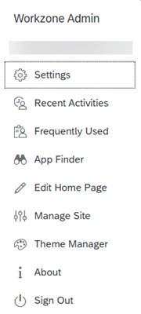
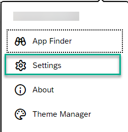
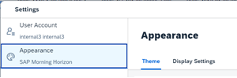
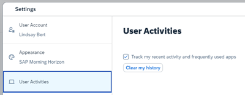
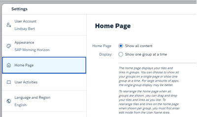

<!-- loioca74965e07604ecaab10fe20ca879c55 -->

<link rel="stylesheet" type="text/css" href="css/sap-icons.css"/>

# Site Settings

In the *Site Settings* screen, administrators can view and configure the settings of a specific site.

<a name="loioca74965e07604ecaab10fe20ca879c55__section_kcs_3d1_h3b"/>

## Overview

Most settings that you as an administrator configure will determine what an end user can and cannot do in a site.

Under a user's avatar, the User Actions dropdown menu displays options that allows users quick access to many screens or tools that will help them to personalize their site according to how they work. Depending on some of the settings that you configure on this screen, the User Actions menu options may not be the same for different users.

In SAP Build Work Zone, advanced edition, many of the settings affect the *Applications* page of your site. This page is located in the site menu by default and displays all the business apps that users have permissions to access.

> ### Note:  
> The end user can choose to reset specific personalization settings at any time, by selecting the following option from the User Actions menu: *Settings* \> *User Account* \> *Reset All Personalization*. This includes site settings \(for example, theme, language, user activities, and home page content\). Note that this action is irreversible.

Here's an example of a user actions menu - depending on the settings that you configure, this menu could look different to the screen capture below.

Let's look at the settings in more detail so that you understand what affect your configuration has on the end user.

<a name="loioca74965e07604ecaab10fe20ca879c55__section_j2r_jn5_c1c"/>

## Where do I configure the Site Settings?

You can access the *Site Settings* as follows:

1.  From the Administration Console, under *External Integrations*, click *Business Content*.

2.  Click *Content Manager*.

3.  From the side navigation panel, click :globe_with_meridians:to open the *Site Directory*.

4.  On the site tile, click :gear:to open the *Site Settings* screen.

<a name="loioca74965e07604ecaab10fe20ca879c55__section_amf_425_g3b"/>

## General Settings

> ### Note:  
> Not all settings are editable. Especially in this section there are some that are simply there for you to see and to provide you with the information. For example, you can see the site ID, the URL, and when the site was created, but you can't edit this information.

<table>
<tr>
<th valign="top">

Setting

</th>
<th valign="top">

More Information

</th>
</tr>
<tr>
<td valign="top">

*Name*

</td>
<td valign="top">

Name of your site. If you want to change the name of your site, this is where you can do it.

</td>
</tr>
<tr>
<td valign="top">

*Description*

</td>
<td valign="top">

More information about your site.

</td>
</tr>
<tr>
<td valign="top">

*ID*

</td>
<td valign="top">

Unique site ID.

</td>
</tr>
<tr>
<td valign="top">

*URL*

</td>
<td valign="top">

This opens the runtime version of the site in a new window.

</td>
</tr>
<tr>
<td valign="top">

*Site Alias*

</td>
<td valign="top">

If you've configured a site alias, you'll see the details here.

To edit the site alias, go to the *Site Directory*, and click  on the site's tile. Then select *Manage Site Alias*.

</td>
</tr>
<tr>
<td valign="top">

*Created*

</td>
<td valign="top">

Date when the site was created.

</td>
</tr>
<tr>
<td valign="top">

*Created By*

</td>
<td valign="top">

Name of the person who created the site.

</td>
</tr>
<tr>
<td valign="top">

*Last Modified*

</td>
<td valign="top">

Date when the site was last edited.

</td>
</tr>
<tr>
<td valign="top">

*Last Modified By*

</td>
<td valign="top">

Name of the person who last edited the site.

</td>
</tr>
</table>

## Site Branding

For more information, about the new shell bar, see [Overview of Theming and Branding](overview-of-theming-and-branding-c9299d9.md) and check out the section about Site Branding.

<a name="loioca74965e07604ecaab10fe20ca879c55__section_djb_g4q_mmb"/>

## Browser Settings

<table>
<tr>
<th valign="top">

Setting

</th>
<th valign="top">

More Information

</th>
</tr>
<tr>
<td valign="top">

*Optimized Site Loading*

</td>
<td valign="top">

Enables the caching of a site in the browser cache, to expedite the site loading.

By default, this site setting is set to false.

> ### Note:  
> When using this option, any change to the destinations used by the site, requires the admin to edit and save the site settings.

> ### Note:  
> When a content provider is set to *Use the Identity Provisioning service to provision user authorization*, the *Optimized Site Loading* setting is not supported.

</td>
</tr>
<tr>
<td valign="top">

*Asynchronous Module Loading*

</td>
<td valign="top">

When using asynchronous loading, the browser loads the site and apps that include SAPUI5 modules in parallel. This loading mode is much faster than synchronous loading \(default\), where the site and its content are loaded sequentially.

Asynchronous loading is recommended for faster and more secure site loading and we strongly encourage you to use this feature.

> ### Note:  
> As of May 16th 2024, asynchronous loading will be enabled by default for new sites.
> 
> To ensure the proper rendering of your custom apps and plugins, make sure to test your custom components in asynchronous mode to see if any adaptations need to be made and make sure they're not using 'unsafe-eval' and 'unsafe-inline' directives.
> 
> For more information about asynchronous loading, see [SAPUI5 documentation](https://ui5.sap.com/#/topic/676b636446c94eada183b1218a824717).

-   Selecting *Yes* enables asynchronous \(parallel\) loading.

-   Selecting *No* enables synchronous \(sequential\) loading.

</td>
</tr>
<tr>
<td valign="top">

*Browser Feature Access*

</td>
<td valign="top">

-   *Yes* enables applications to access and use browser features, such as camera and geo location.

-   *No* blocks application access to browser features.

</td>
</tr>
</table>

<a name="loioca74965e07604ecaab10fe20ca879c55__section_cyf_z5x_vnb"/>

## Session Timeout

> ### Note:  
> It is not possible to disable/turn off the session timeout functionality. Session timeout is mandatory both from security perspective and commercialization perspective. For more information, see [SAP Note: 3190746](https://me.sap.com/notes/3190746/E).

<table>
<tr>
<th valign="top">

Setting

</th>
<th valign="top">

More Information

</th>
</tr>
<tr>
<td valign="top">

*Log out all sessions on timeout*

</td>
<td valign="top">

-   *Yes* ensures that users are automatically logged out on session timeout. \(Default\)

-   *No* means that users are not automatically logged out on session timeout.

</td>
</tr>
<tr>
<td valign="top">

*Session Duration \(Minutes\)*

</td>
<td valign="top">

Defines the time that a session remains open when no actions are performed by the user. The default duration is 20 minutes. The maximum value is 30 minutes.

</td>
</tr>
<tr>
<td valign="top">

*Alert Before Timeout \(Minutes\)*

</td>
<td valign="top">

Defines how much time before the session times out to alert the user. For example, if the session duration is 20 minutes and the alert is 3 minutes, the user receives an alert after 17 minutes.

</td>
</tr>
</table>

<a name="loioca74965e07604ecaab10fe20ca879c55__section_m3x_db1_h3b"/>

## User Capabilities

<table>
<tr>
<th valign="top">

Setting

</th>
<th valign="top">

More Information

</th>
</tr>
<tr>
<td valign="top">

*Personalization*

</td>
<td valign="top">

> ### Note:  
> This setting is only available when using *Groups* and *Spaces and Pages* view modes.

-   *Yes* displays the *App Finder* and enables editing the *Home* page from the User Actions menu.

    > ### Note:  
    > The *Edit Home Page* entry in the User Actions menu is only visible when the *Applications* page in the site is in focus. This *Home Page* should not be confused with the company Home page for SAP Build Work Zone, advanced edition. This setting is referring to the *Home Page* for the *Applications* page that displays apps in groups.

-   *No* removes these options from the user actions menu.

</td>
</tr>
<tr>
<td valign="top">

 

</td>
<td valign="top">

> ### Note:  
> This setting is only available when using *Spaces and Pages - New Experience* view mode.

-   *Yes* means that users will see the *My Space* option in the *User Menu* \> *Settings* screen. With this option they can choose whether to show or hide their personalized My Space entry in the site header.

-   *No* means that users won't see the *My Space* option in the *User Menu* \> *Settings* screen.

</td>
</tr>
<tr>
<td valign="top">

*Theme Selection*

</td>
<td valign="top">

-   *Yes* enables an end user to select a different theme by clicking *Settings* under the User Actions menu and opening the *Appearance* screen.

    

    

-   *No* disables the theme selection.

</td>
</tr>
<tr>
<td valign="top">

*Language Selection*

</td>
<td valign="top">

-   *Yes* enables an end user to select a different language for the site in the *Language & Region* screen that users access from the *Settings* dialog box in the User Actions menu.

    > ### Note:  
    > The languages that are available to the end user, are those that you select \(see setting in the row below\).

-   *No* disables language selection by end users.

</td>
</tr>
<tr>
<td valign="top">

*Select languages to make them available for user selection*

</td>
<td valign="top">

This is where you can activate the languages that the end user can select from the *Language & Region* screen in the *Settings* dialog box.

> ### Note:  
> Make sure that for every language \(or locale\) you select, that a corresponding translation file exists for all content items \(such as groups, roles, and apps\) in the *Applications* page of your site.

> ### Remember:  
> Each language that you select increases the number of content items in the site. The number of content items in your site shouldn't exceed 20,000 in total. The total number is calculated by multiplying the number of content items by the number of languages you selected plus one \(fallback locale\).
> 
> Content items include apps, roles, catalogs, groups, spaces, and pages depending on what view mode you're using for your site.

</td>
</tr>
<tr>
<td valign="top">

*Joule Work Mobile App*

</td>
<td valign="top">

The Joule Work mobile app is a native mobile application for all SAP users.

-   *Yes* enables users to install and register the mobile app at runtime.

-   *No* means that users won't see this option in the User Settings screen.

For more information, see [Setting Up the Joule Work Mobile App](setting-up-the-joule-work-mobile-app-3257133.md).

</td>
</tr>
<tr>
<td valign="top">

*Enterprise Search*

</td>
<td valign="top">

-   *Yes* enables you to search for all apps that you have permissions to access \(S/4HANA apps and local apps\). Searching for home pages, people, workspaces and more is not available.

-   *No* enables you to only search for content such as workspaces and workpages, home pages, people and more. This content doesn't include applications assigned to your roles.

> ### Note:  
> There are additional settings that you will need to do to integrate with Enterprise Search. For more information, see [Integration with Enterprise Search](integration-with-enterprise-search-c96d636.md).

</td>
</tr>
<tr>
<td valign="top">

*Recent and Frequent Activities*

</td>
<td valign="top">

-   *Yes* displays the *Recent Activity* and *Frequently Used* options in the user actions menu. This gives the end user direct access to this information.

    > ### Note:  
    > If end users prefer not to track these activities, they can open *Settings* under the User Actions menu and on the *User Activities* screen, they can switch off this functionality.

    

-   *No* removes these options from the user actions menu.

</td>
</tr>
<tr>
<td valign="top">

*Group Display Mode*

</td>
<td valign="top">

This setting affects the *Applications* page of your site when your business apps are displayed in groups.

-   *Yes* enables an end user to choose whether to show all groups at once or show one group at a time. To do this, they must open the *Settings* dialog box from the User Actions menu, and select *Home Page*.

-   *No* removes this option.

    

</td>
</tr>
</table>

<a name="loioca74965e07604ecaab10fe20ca879c55__section_nxs_dh3_5pb"/>

## Services

<table>
<tr>
<th valign="top">

Setting

</th>
<th valign="top">

More Information

</th>
</tr>
<tr>
<td valign="top">

*Built-In Support*

</td>
<td valign="top">

Enables you to find the relevant support channel or information that you need from within your site.

-   *Yes* enables Built-In Support and you'll see a headset icon in the header bar of your site.

-   *No* disables this functionality.

For more information, see [Integration with Built-In-Support](integration-with-built-in-support-53c7162.md).

</td>
</tr>
<tr>
<td valign="top">

*Statistical Data Collection*

</td>
<td valign="top">

This setting enables the collection of application usage, user actions, and performance metrics. This data is collected and transferred to SAP Cloud ALM.

*Yes* enables the collection of this data.

*No* disables the collection of this data.

For more information, see [Enabling Statistical Data Collection](enabling-statistical-data-collection-c51168e.md).

</td>
</tr>
<tr>
<td valign="top">

*Key User Adaptation*

</td>
<td valign="top">

Key User Adaptation allows users to make changes at runtime to the user interface of apps from the HTML5 content repository directly in the *Applications* page of their site without having to write new code.

*Yes* allows key users to adapt the UI of HTML5 apps at runtime.

*No* disables this feature.

> ### Note:  
> For new sites, this feature is enabled by default.

> ### Note:  
> Requirements that must be in place to use Key User Adaptation are:
> 
> -   The app must be enabled for key user adaptation.
> 
> -   The app must be running on a desktop or laptop.
> 
> -   The user is assigned to the `FlexKeyUser` role. If you need to assign a user to this role, do it in the SAP BTP cockpit *Security* \> *Role Collection* screen.

**Result**:

The end user will see an *Adapt UI* entry in the dropdown list of actions in the User Actions menu and they can modify the UI of their app.

For more information, see:

-   [Adapting the UI of Different App Types](adapting-the-ui-of-different-app-types-734e3fb.md)
-   [What is UI5 Flexibility for Key Users?](https://help.sap.com/docs/ui5-flexibility-for-key-users/ui5-flexibility-for-key-users/what-is-ui5-flexibility-for-key-users?version=Cloud)

-   [Adapting SAP Fiori UIs at Runtime - Key User Adaptation](https://help.sap.com/docs/ui5-flexibility-for-key-users/ui5-flexibility-for-key-users/adapting-sap-fiori-uis-at-runtime-key-user-adaptation?version=Cloud)

</td>
</tr>
<tr>
<td valign="top">

*SAP Companion*

</td>
<td valign="top">

SAP Companion is a tool that provides in-app help.

-   *Yes* enables in-app help from the  icon in the header.

    > ### Note:  
    > To retrieve the help content, make sure to configure the necessary parameters.

-   *No* disables the feature and the  icon won't appear in the header.

For more information, see [Activating SAP Companion Content](activating-sap-companion-content-8f77268.md).

</td>
</tr>
</table>

<a name="loioca74965e07604ecaab10fe20ca879c55__section_xfv_3b1_h3b"/>

## Display

Here you can determine various display options such as:

-   Different layouts

-   Whether a feature is displayed on the runtime screen

-   Whether a feature is displayed in the site header or the User Actions menu

<table>
<tr>
<th valign="top">

Setting

</th>
<th valign="top">

More Information

</th>
</tr>
<tr>
<td valign="top">

*View Mode*

</td>
<td valign="top">

Select which view mode you are using in your site:

> ### Note:  
> Remember that the view mode also depends on how your content has been modeled - as groups, or as spaces and pages.

-   *Groups* - Displays only groups with their apps. Spaces, pages, sections and their apps are not displayed at all.

-   *Spaces and Pages* - Displays spaces with pages that are federated from various content providers. You can't manually create these spaces and pages. Any apps that were modeled in groups are displayed in a dedicated space called *Home Page* that is added to the beginning of the navigation bar. If there are no apps assigned to groups, the *Home Page* space is not displayed.

-   *Spaces and Pages - New Experience* - Displays spaces and pages from content providers \(as in the above view\), as well as spaces and pages that originate from content packages. You can also create spaces and pages manually.

    The new experience pages can contain cards and app tiles.

    > ### Note:  
    > In this mode, groups are hidden and apps from these groups can be accessed from the App Finder.

> ### Note:  
> When using *Spaces and Pages* view mode, page sections are sorted in the same order as they are on the content provider side.
> 
> Groups that appear in the *Home Page* space, are sorted alphabetically.

</td>
</tr>
<tr>
<td valign="top">

*Show Source System Name on Tiles*

</td>
<td valign="top">

> ### Note:  
> This feature is not available when using the *Groups* view mode in the setting above.
> 
> You can control showing or hiding the source system information on static or dynamic app tiles. The information provided is the destination property \(`sap-provider-label`\) or the content provider ID when no value is defined. For more information, see [Configure Destinations \(On Premise\)](configure-destinations-on-premise-f337b80.md).

</td>
</tr>
<tr>
<td valign="top">

*Tile Size*

</td>
<td valign="top">

Tile Size is only applicable to the *Applications* page in your site. The apps on this page are represented by tiles and you can set the size of the tile.

Options are:

-   *Responsive* - tile size is set to regular, unless the screen width gets smaller than 375 px \(for example on small mobile devices\). In this case, the size of the tiles is set to small.

-   *Small* - tile size is fixed to small regardless of the available screen width.

</td>
</tr>
<tr>
<td valign="top">

*Preview SAPUI5 Latest Version*

</td>
<td valign="top">

Enable this option on non-productive sites to test the latest SAPUI5 version before it becomes the active version on all sites.

-   *Yes* - the site is set to use the latest SAPUI5 version when available.

-   *No* - the site is using the default SAPUI5 version.

For more information, see [Previewing the Latest SAPUI5 Version](previewing-the-latest-sapui5-version-8f12493.md).

</td>
</tr>
</table>

<table>
<tr>
<th valign="top">

Setting

</th>
<th valign="top">

More Information

</th>
</tr>
<tr>
<td valign="top">

*Show/Hide Groups/Sections*

</td>
<td valign="top">

-   *Yes* displays a *Hide/Show* button on the *Applications* page when you click *Edit Home Page* from the User Actions menu.

-   *No* hides this button.

</td>
</tr>
<tr>
<td valign="top">

*Show My Inbox*

</td>
<td valign="top">

-   Yes displays the :inbox_tray: \(My Inbox icon\) in the site header.

-   No, hides this icon.

> ### Note:  
> If you aren't using the SAP Workflow service, the My Inbox icon won't be displayed in the site header.

</td>
</tr>
<tr>
<td valign="top">

*Show/Hide Notifications*

</td>
<td valign="top">

-   Yes, displays the :bell: \(Notifications icon\) in the site header.

-   No, hides this icon.

</td>
</tr>
<tr>
<td valign="top">

*All My Apps*

</td>
<td valign="top">

-   *Yes* displays the *All My Apps* navigation option in the site header. Users can quickly access all apps assigned to their role.

-   *No* hides this option.

</td>
</tr>
<tr>
<td valign="top">

*App Finder*

</td>
<td valign="top">

Determines whether quick access to the *App Finder* appears in the User Actions menu or in the site header.

</td>
</tr>
<tr>
<td valign="top">

*Edit Home Page*

</td>
<td valign="top">

Determines whether quick access to the *Edit Home Page* entry appears in the User Actions menu or the site header.

> ### Note:  
> When the end user clicks this option, the *Home Page* immediately opens in edit mode.

</td>
</tr>
<tr>
<td valign="top">

*Settings*

</td>
<td valign="top">

Determines whether quick access to the *Settings* screen appears in the User Actions menu or the site header.

</td>
</tr>
</table>

