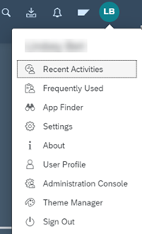
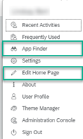
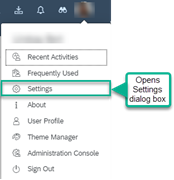
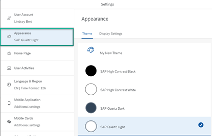
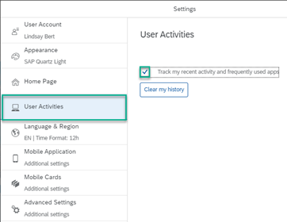
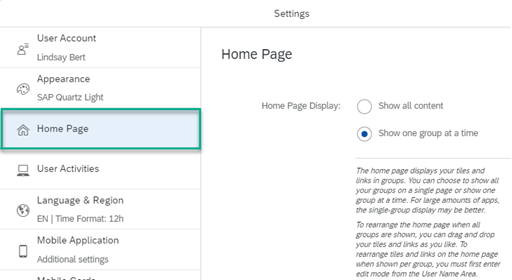
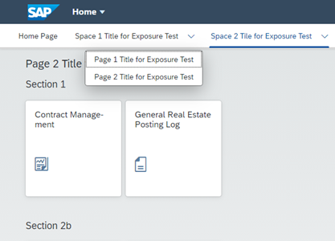

<!-- loioe2bfc3d7e2694e189fb4cde61a347361 -->

<link rel="stylesheet" type="text/css" href="css/sap-icons.css"/>

# Site Settings

You can configure many settings for the sites that you administer.

Many of these settings affect the *Applications* page of your site that displays all the business apps that you have permissions to access.

<a name="loioe2bfc3d7e2694e189fb4cde61a347361__section_k3b_ygz_csb"/>

## Access Site Settings

You can access the *Site Settings* screen in one of the following ways:

-   Open the Site Directory using this link: `https://[subaccount_specific].dt.workzone.cfapps.sap.hana.ondemand.com/sites#Site-Directory`. Then on the site tile, click :gear:to open the *Site Settings* screen.
-   If you've already accessed your site, do the following:

    1.  From the Administration Console, under *External Integrations*, click *Business Content*.

    2.  Click *Content Manager*.

    3.  From the side navigation panel, click :globe_with_meridians:to open the *Site Directory*.

    4.  On the site tile, click :gear:to open the *Site Settings* screen.

From the *Site Settings* screen you can configure the following:

<a name="loioe2bfc3d7e2694e189fb4cde61a347361__section_txy_sfz_hnb"/>

## General

These settings give you general information about the specific site, who created it, and when. From this area, you can do the following:

-   Edit the name and description.

-   Click the URL to open the runtime site.

> ### Note:  
> To edit the site alias, you need to return to the *Site Directory*, click  ,, and select *Manage Site Alias* from the menu.

<a name="loioe2bfc3d7e2694e189fb4cde61a347361__section_mgt_jds_csb"/>

## Browser Settings

<table>
<tr>
<th valign="top">

Setting

</th>
<th valign="top">

More Information

</th>
</tr>
<tr>
<td valign="top">

*Optimized Site Loading*

</td>
<td valign="top">

Enables the caching of a site in the browser cache, to expedite its loading.

By default, this setting is set to false.

> ### Note:  
> When using this option, any change to the destinations used by the site, requires the admin to edit and save the site settings.

</td>
</tr>
<tr>
<td valign="top">

*Asynchronous Module Loading*

</td>
<td valign="top">

When using asynchronous loading, the browser loads the site and apps that include SAPUI5 modules in parallel. This loading mode is much faster than synchronous loading \(default\), where the site and its content are loaded sequentially

> ### Note:  
> Asynchronous loading is recommended for faster and more secure site loading and we strongly encourage you to use this feature.
> 
> However to ensure the proper rendering of your custom apps and plugins, make sure to test your custom components in asynchronous mode to see if any adaptations need to be made and make sure they're not using 'unsafe-eval' and 'unsafe-inline' directives.
> 
> For more information about asynchronous loading, see the [SAPUI5 Documentation.](https://ui5.sap.com/#/topic/676b636446c94eada183b1218a824717)

-   Selecting *Yes* enables asynchronous \(parallel\) loading.

-   Selecting *No* enables synchronous \(sequential\) loading.

</td>
</tr>
<tr>
<td valign="top">

*Browser Feature Access*

</td>
<td valign="top">

-   *Yes* enables applications to access and use browser features, such as camera and geo location.

-   *No* blocks application access to browser features.

</td>
</tr>
</table>

<a name="loioe2bfc3d7e2694e189fb4cde61a347361__section_axp_nds_csb"/>

## Session Timeout

In this area, you can configure session timeout as well as the duration of the timeout.

<table>
<tr>
<th valign="top">

Setting

</th>
<th valign="top">

More Information

</th>
</tr>
<tr>
<td valign="top">

*Log out all sessions on timeout*

</td>
<td valign="top">

-   *Yes* ensures that users are automatically logged out after session duration has timed out. \(Default\)

-   *No* means that users aren't automatically logged out after session duration has timed out.

</td>
</tr>
<tr>
<td valign="top">

*Session Duration \(Minutes\)*

</td>
<td valign="top">

Defines the time that a session remains open when no actions are performed by the user.

> ### Note:  
> Default is 15 minutes. Maximum is 30 minutes.

</td>
</tr>
<tr>
<td valign="top">

*Alert Before Timeout \(Minutes\)*

</td>
<td valign="top">

Defines how much time before the session times out to alert the user. For example, if the session duration is 15 minutes and the alert is 3 minutes, the user receives an alert after 12 minutes.

</td>
</tr>
</table>

<a name="loioe2bfc3d7e2694e189fb4cde61a347361__section_lj4_rds_csb"/>

## User Capabilities

These settings manage user access to tools and screens from the User Actions menu \(located under the user's avatar\). The User Actions menu offers a range of user-specific services that help you determine what users can or cannot personalize in their site. This is what a typical User Actions menu looks like depending on your configuration.

User capabilities that you can define:

<table>
<tr>
<th valign="top">

Setting

</th>
<th valign="top">

More Information

</th>
</tr>
<tr>
<td valign="top">

*Personalization*

</td>
<td valign="top">

-   *Yes* displays the *App Finder* and *Edit Home Page*options in the User Actions menu as follows:

    

    This helps users to:

    -   Directly access the *App Finder enables end users to access Web Assistant on-screen help.* tool where they can browse through catalogs and find any apps that they have permissions to use and add them to their site.
    -   *Edit Home Page* is an applications home page that displays groups of app tiles representing your business apps. From this page, users can add and remove apps in existing groups and create new groups.

        > ### Note:  
        > The *Edit Home Page* entry in the User Actions menu is only visible when the *Applications* page in the site is in focus.

-   *No* removes these two options from the User Actions menu.

</td>
</tr>
<tr>
<td valign="top">

*Theme Selection*

</td>
<td valign="top">

-   *Yes* enables an end user to select a different theme in the *Appearance* screen that the user can access from the *Settings* dialog box that they open from the User Actions menu as follows:

    

    From the *Settings* enables end users to access screen, open the *Appearance* screen:

    

-   *No* disables the theme selection.

</td>
</tr>
<tr>
<td valign="top">

*Language Selection*

</td>
<td valign="top">

-   *Yes* enables an end user to select a different language for the site in the *Language & Region* screen in the *Settings* dialog box.

    > ### Note:  
    > The languages that are available to the end user are those that you as administrator select \(see setting below\). You can select up to 10 languages.

-   *No* disables the language selection.

</td>
</tr>
<tr>
<td valign="top">

*Select languages to make them available for end users*

</td>
<td valign="top">

This is where you can activate the languages that the end user can select from the *Language & Region* screen in the *Settings* dialog box. You can select up to 10 languages from the list of all supported languages.

> ### Note:  
> Make sure that for every language \(or locale\) you select, that a corresponding translation file exists for all content items \(such as groups, roles, and apps\) in the *Applications* page of your site.

</td>
</tr>
<tr>
<td valign="top">

*Enterprise Search*

</td>
<td valign="top">

-   *Yes* enables you to search for all apps that you have permissions to access \(S/4HANA apps and local apps\). Searching for home pages, people, workspaces and more is not available.

-   *No* enables you to only search for content such as workspaces and workpages, home pages, people and more. This content doesn't include applications assigned to your roles.

For more information, see [Enabling Enterprise Search](enabling-enterprise-search-4937d0c.md).

</td>
</tr>
<tr>
<td valign="top">

*Recent and Frequent Activities*

</td>
<td valign="top">

-   *Yes* displays the *Recent Activity* and *Frequently Used* options in the User Actions menu.

    > ### Note:  
    > If end users prefer not to track these activities, they can access the *Settings* dialog box from the User Actions menu to open the *User Activities* screen where they can switch off this functionality:
    > 
    > .

-   *No* removes these options from the User Actions menu and removes the *User Activities* screen from the *Settings* dialog box.

</td>
</tr>
<tr>
<td valign="top">

*Group Display Mode*

</td>
<td valign="top">

This setting affects the *Applications* page of your site when your business apps are displayed in groups.

*Yes* enables an end user to choose whether to show all groups at once or show one group at a time. To do this, they must open the *Settings* dialog box in the User Actions menu and select the *Home Page*.

-   *No* removes this option.

</td>
</tr>
</table>

<a name="loioe2bfc3d7e2694e189fb4cde61a347361__section_atg_f2s_csb"/>

## Services

<table>
<tr>
<th valign="top">

Setting

</th>
<th valign="top">

More Information

</th>
</tr>
<tr>
<td valign="top">

*SAP Companion*

</td>
<td valign="top">

SAP Companion is a tool that provides in-app help.

-   *Yes* enables in-app help from the  icon in the header.

    > ### Note:  
    > To retrieve the help content, make sure to configure the necessary parameters.

    .

-   *No* disables the feature and the  icon won't appear in the header.

For more information, see [Activating SAP Companion Content](activating-sap-companion-content-8f77268.md).

</td>
</tr>
<tr>
<td valign="top">

*Key User Adaptation*

</td>
<td valign="top">

Key User Adaptation allows users to make changes at runtime to the user interface of apps from the HTML5 content repository directly in the *Applications* page of their site without having to write new code.

*Yes* allows key users to adapt the UI of HTML5 apps at runtime.

*No* disables this feature.

> ### Note:  
> Requirements that must be in place to use Key User Adaptation are:
> 
> -   The app must be enabled for key user adaptation.
> 
> -   The app must be running on a desktop or laptop.
> 
> -   The user is assigned to the `FlexKeyUser` role. If you need to assign a user to this role, do it in the SAP BTP cockpit *Security* \> *Role Collections* screen.

**Result**:

The end user will see an *Adapt UI* entry in the dropdown list of actions in the User Actions menu and they can modify the UI of their app.

</td>
</tr>
</table>

<a name="loioe2bfc3d7e2694e189fb4cde61a347361__section_xf3_j2s_csb"/>

## Display

Here you can determine various display options such as:

-   Different layouts

-   Whether a feature is displayed on the runtime screen at all.

-   Whether a feature is displayed in the shell header or the User Actions menu.

<table>
<tr>
<th valign="top">

Setting

</th>
<th valign="top">

More Information

</th>
</tr>
<tr>
<td valign="top">

*View Mode*

</td>
<td valign="top">

Select how to display apps in the *Applications* page of your site:

-   *Groups* - Displays only groups with their apps. Spaces, pages, sections, and their apps are not displayed at all.

-   *Pages and Spaces* - Displays spaces with pages, sections, and their apps. Any apps that are assigned to groups, are displayed in a specific space called *Home Page*.

    > ### Note:  
    > -   Pages and spaces are relevant only for content that was integrated from the SAP S/4HANA \(on premise\) remote content provider and was modeled using pages and spaces.
    > -   If there are no apps assigned to groups, the *Home Page* space won't be displayed.

    > ### Note:  
    > For federated content \(content from specific providers\), when using the *Pages and Spaces* view mode for the site, page sections are sorted in the same order as they are on the content provider side. Groups that appear in the *Home Page* space, are sorted alphabetically.

The following screenshot demonstrates a site with both spaces, pages, and sections, as well as the Home Page space.

</td>
</tr>
<tr>
<td valign="top">

*Show Source System Name on Tiles*

</td>
<td valign="top">

> ### Note:  
> This feature is only available if you've switched to *Spaces and Pages* view mode in the setting above.
> 
> You can control showing or hiding the source system information on app tiles. The information provided is the destination property \(`sap-provider-label`\) or the content provider ID when no value is defined.

</td>
</tr>
<tr>
<td valign="top">

*Tile Size*

</td>
<td valign="top">

*Tile Size* is only applicable to the *Applications* page in your site. The apps on this page are represented by tiles and you can set the tile size as follows:

-   **Responsive**: Tile size is set to regular, unless the screen width gets smaller than 375 px \(for example on small mobile devices\), in which case the size of the tiles is set to small.

-   **Small**: Tile size is fixed to small regardless of the available screen width.

</td>
</tr>
<tr>
<td valign="top">

*Show/Hide Groups/Sections*

</td>
<td valign="top">

-   *Yes* displays a *Hide/Show* button on the *Applications* page when you click *Edit Home Page* from the User Actions menu.

-   *No* hides this button.

</td>
</tr>
<tr>
<td valign="top">

*Show/Hide My Inbox*

</td>
<td valign="top">

-   Yes displays the :inbox_tray: \(My Inbox icon\) in the site header.

-   No, hides this icon.

> ### Note:  
> If you aren't using the SAP Workflow service, the My Inbox icon won't be displayed in the site header.

</td>
</tr>
<tr>
<td valign="top">

*Show/Hide Notifications*

</td>
<td valign="top">

-   Yes, displays the :bell: \(Notifications icon\) in the site header.

-   No, hides this icon.

</td>
</tr>
<tr>
<td valign="top">

*All My Apps*

</td>
<td valign="top">

-   *Yes* displays the All My Apps navigation option in the site header. Users can quickly access all apps assigned to their role.

-   *No* hides this option.

</td>
</tr>
<tr>
<td valign="top">

*App Finder*

</td>
<td valign="top">

Determines whether quick access to the *App Finder* appears in the User Actions menu or in the site header.

</td>
</tr>
<tr>
<td valign="top">

*Edit Home Page*

</td>
<td valign="top">

Determines whether quick access to *Edit Home Page* appears in the User Actions menu or the site header.

</td>
</tr>
<tr>
<td valign="top">

*Settings*

</td>
<td valign="top">

Determines whether quick access to the user *Settings* screen appears in the User Actions menu or the site header.

</td>
</tr>
</table>

