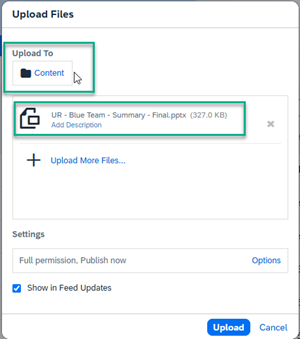
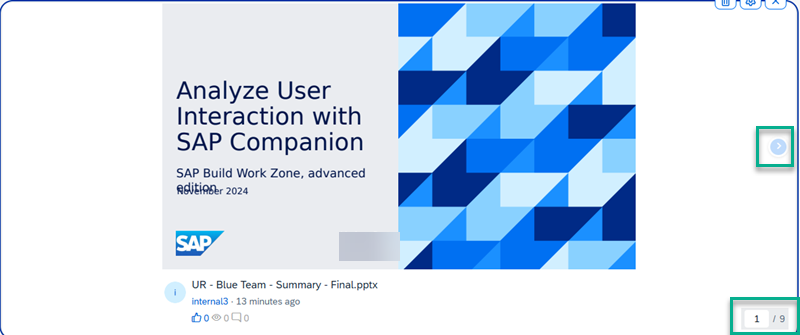

<!-- loio48400dcf4dbe4ebc8ada1da784e78581 -->

<link rel="stylesheet" type="text/css" href="css/sap-icons.css"/>

# Slideshow Widget

Use this widget to create a slideshow from a presentation that you created from the workspace*Content* list.

You can create a slideshow by uploading a presentation \(Microsoft PowerPoint format\) or a PDF file to your workspace *Content* list. Workspace members can then preview the slideshow of your presentation within the widget by jumping to specific pages or browsing from slide to slide before they engage further with it by viewing in a light box view and posting comments.

<a name="loio48400dcf4dbe4ebc8ada1da784e78581__section_w5g_mqv_12c"/>

## Example of a slideshow widget

> ### Note:  
> To enter a title for the slideshow widget, after you select the slideshow, hover your cursor to the right of the widget and click the :gear:

