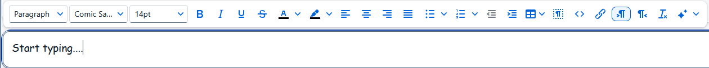
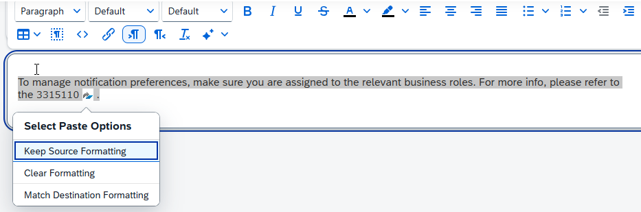

<!-- loio1ff0e71b0e10485cabff3445887cf2f1 -->

<link rel="stylesheet" type="text/css" href="css/sap-icons.css"/>

# Text Widget

Use the *Text* widget to add texts to your workpage including lists, simple tables, and URL links.

The *Text* widget includes a rich text editor tool bar that you can use to select fonts, colors, spell checks, and other commonly used features while you're writing your content. Simply click in the text box and start typing.

It also includes an AI option to generate text within the widget. In addition you can also refine the text within the widget as well as in input fields and text areas. This includes changing the tone of the text, adjusting its length, and fixing spelling and grammar.

To use the AI funtionality, click the  icon to open the AI Writing Assistant and enter your prompt. Based on your prompt, AI will generate text that you can fine tune afterwards.

You can also use the different paste options when pasting text with complexed formatting such as text with a link from an external application.

