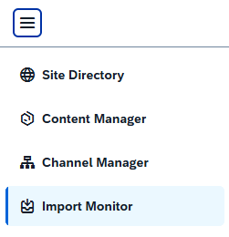

<!-- loio0443a41380994137ad26421aeb7a09ef -->

# Tracking the Progress of Your Imports

Track the progress of your imports in the Import Monitor.

You initiate an import of a transport ZIP file in the Site Directory or in the Content Manager. The import process can take some time. To enable you to continue working during the import process, you can use the Import Monitor to track its progress. You access the Import Monitor from the side panel of the Site Manager: 

> ### Note:  
> While an import is in progress, it is not recommended to start another import or to update content in the Content Manager or in the Channel Manager, to avoid interfering with the current import process.

The Import Monitor lists the imports performed in a specific subaccount, including one of the following statuses - *Processing…*, *Completed*, *Partial Import*, *Failed*, *Cancelled*.

The *Info* column provides an option to open a *Report* that contains the details of the import. The following table describes the contents of a report according to the input status:

<table>
<tr>
<th valign="top">

Import Status

</th>
<th valign="top">

Contents of the Report

</th>
</tr>
<tr>
<td valign="top">

Completed

</td>
<td valign="top">

Lists the affected sites.

</td>
</tr>
<tr>
<td valign="top">

Partial Import

</td>
<td valign="top">

Describes the cause of the partial import.

</td>
</tr>
<tr>
<td valign="top">

Failed

</td>
<td valign="top">

Describes the cause of the failure.

</td>
</tr>
</table>

The *Action* column enables you to *Cancel* an import that is still in process, or to *Retry* an import that is partial, that has failed, or was cancelled.

> ### Note:  
> The option to cancel an import that’s in process is available for a limited period of time. Afterwards, it is no longer possible to cancel the import.

The list displays the imports made in the last 14 days.

