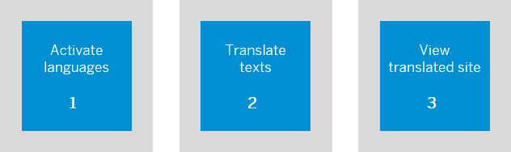

<!-- loio23a32f3e9fdc4de69d69e35fbfdda9eb -->

<link rel="stylesheet" type="text/css" href="css/sap-icons.css"/>

# Translate Your Site

Administrators can use the translation mechanism to enable end users to view their sites in selected languages.

The process is as follows:

1.  Activate languages for your end user.

2.  In the editors of the manually created content items, translate the texts to the desired languages.

    > ### Note:  
    > When federated content items have translations, you can only view them in the relevant editors. For example, federated HTML5 apps.

3.  View the site in the translated language.

Here's more information on how to do these steps:

<a name="loio23a32f3e9fdc4de69d69e35fbfdda9eb__section_pbn_qkj_rhb"/>

## Activate languages

If the end user wants to see translated texts in a language other than the source language that the site was built with, you need to activate the language. This enables them to select the language in their runtime site.

> ### Note:  
> You can activate more than one language from the list of supported languages.

Activate languages as follows:

1.  Access the *Settings* screen from the side navigation panel of the Site Manager.

2.  Click *Edit*.

3.  Under *User Capabilities*, go to the setting *Select languages to make them available for end users*.

4.  In the dropdown list of languages, select the languages that you want to make available for the end user to choose from.

5.  *Save* your settings.

The languages that you selected are now available for selection by end users in the *Settings* of the runtime site.

<a name="loio23a32f3e9fdc4de69d69e35fbfdda9eb__section_ijv_1lj_rhb"/>

## Translate the texts

The following table describes how to translate the texts in the editors:

<table>
<tr>
<th valign="top">

What can I translate?

</th>
<th valign="top">

How to translate

</th>
</tr>
<tr>
<td valign="top">

Content Manager editors - app, catalog, group, and role editors

</td>
<td valign="top">

1.  Open the *Translation* tab of the editor. The source texts appear on the left.

2.  Click *Edit*.

3.  Select a language from the *Translate To* field.

    If the source texts have already been translated, you'll see the translated texts on the right.

    If the texts haven't yet been translated, you'll see ghost texts in the translated text fields.

4.  Translate the ghost texts into the language you selected by typing in the texts.

5.  *Save*.

</td>
</tr>
</table>

<a name="loio23a32f3e9fdc4de69d69e35fbfdda9eb__section_z23_b4p_1jb"/>

## View the translated site

1.  Click  \(Go to site\) to open the runtime site.

2.  Click *Settings* in the User Actions dropdown menu at the top right of the runtime screen.

3.  Click *Language & Region* from the side panel and change the language that you want to use for the site.

    > ### Note:  
    > The languages in this list are those that you activated above.

4.  Click *Save*.

    You’re now viewing the site in the language that you selected.

