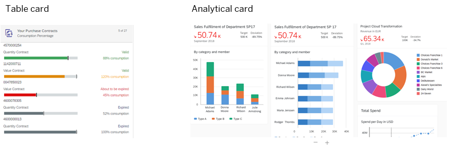

<!-- loio0bf9adc001e446d7b458aa26f2066c95 -->

# UI Integration Cards

SAP UI integration cards allow you to show application content from different sources side by side without the user having to switch screens. They contain a certain set of information from an app or page that's presented to users in a specific context.

<a name="loio0bf9adc001e446d7b458aa26f2066c95__section_lqm_m2g_pnb"/>

## Introduction

UI integration cards display concise pieces of information and application content in a limited-sized container that users can easily embed into their workpages.

> ### Note:  
> All cards can be consumed on mobile or desktop devices.

You can use cards to group information, link to more details, present a summary, and much more. As a result, your users get all the information they need on a single screen. Cards can represent an entire app or page or only specific information from the app or page. They can also display multiple apps \(such as a link card with links to various apps\).

Each card is designed in a different style and contains various content formats depending on the card type that you choose. Examples of card types are list cards, analytical cards, table cards, object cards, just to name a few.

For more information about the different card types, see [Card Explorer for UI Integration Cards.](https://ui5.sap.com/test-resources/sap/ui/integration/demokit/cardExplorer/webapp/index.html) 

**Some examples of how cards look at runtime:**

<a name="loio0bf9adc001e446d7b458aa26f2066c95__section_xkk_xrn_psb"/>

## How cards can interact with each other

Card developers can add parameters to UI integration cards that enable them to interact with each other on the same workpage. Once a user selects an available parameter, all other cards that are designed to respond to the page context, will respond and update accordingly.

For more information, see:

-   Developer Guide: [Interaction Between Cards](https://help.sap.com/viewer/7d3b9c7211ca4d7a9630b524205ee836/Cloud/en-US/2af7015bc37346f9973d88256385f01f.html).

-   User Guide: [Interaction Between UI Integration Cards](https://help.sap.com/viewer/fec5ca6e3229418f84a932c745cbe985/Cloud/en-US/e3dd5cc172034d4eb5f7812ce7bb5c5e.html).

<a name="loio0bf9adc001e446d7b458aa26f2066c95__section_s2y_zvb_lrb"/>

## More information about integration cards

<table>
<tr>
<th valign="top">

Information

</th>
<th valign="top">

Link

</th>
</tr>
<tr>
<td valign="top">

How to develop UI integration cards

Learn how to set up a development environment and get started with developing various types of integration cards.

</td>
<td valign="top">

[UI Integration Cards](https://help.sap.com/viewer/7d3b9c7211ca4d7a9630b524205ee836/Cloud/en-US/b266652943de456da4dd9382a16f5b7e.html).

</td>
</tr>
<tr>
<td valign="top">

How to integrate the cards into your site.

Learn how to add UI integration cards to workpages in your site.

</td>
<td valign="top">

[Integrating Cards into a Site](integrating-cards-into-a-site-b65c218.md).

</td>
</tr>
<tr>
<td valign="top">

How to manage UI integration cards

Learn how to manage your UI integration cards and define where they can be accessed from within your site.

</td>
<td valign="top">

[Managing Cards](managing-cards-afe7433.md).

</td>
</tr>
</table>

