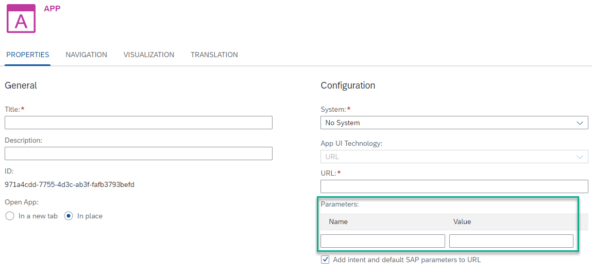

<!-- loio3254887b31744967b780a5ee367b2802 -->

<link rel="stylesheet" type="text/css" href="css/sap-icons.css"/>

# URL and Dynamic URL Apps

The properties required to configure a URL app and a Dynamic URL app.

## App Properties

<table>
<tr>
<th valign="top">

System

</th>
<th valign="top">

Property

</th>
<th valign="top">

Description

</th>
</tr>
<tr>
<td valign="top">

No System

Should be chosen for URL app

</td>
<td valign="top">

`URL` 

</td>
<td valign="top">

-   Enter a valid **URL** that starts with `http(s)://www` and points to the app.

-   Allowed characters: `a-z, A-Z, 0-9, -, _, ~, :, %, #, @, \, $, &, ‘, ‘,’, ;, =`

-   The URL should not contain any parameters. Add the parameters to the *Parameters* table.

> ### Note:  
> To open a URL in-place \(not in a new tab or new window\), it must be possible to open it in an iFrame.

</td>
</tr>
<tr>
<td valign="top">

Selected destination from the list

Should be chosen for Dynamic URL app

</td>
<td valign="top">

`Relative Path to App` 

</td>
<td valign="top">

-   Enter a valid **relative path** that starts with a forward slash \(`/`\) and points to the app, taking into consideration that the *System* \(destination\) contains the domain.

-   Allowed characters: `a-z, A-Z, 0-9, -, _, ~, :, %, #, @, \, $, &, ‘, ‘,’, ;, =`

-   The relative path should not contain any parameters. Add the parameters to the *Parameters* table.

> ### Note:  
> When the destination \(System\) in the cockpit has the property `sap-platform=ABAP`, if the destination URL does not include a path, then `/sap/bc/` is automatically added at the beginning of the relative path.

</td>
</tr>
</table>

> ### Note:  
> Apps that open in-place \(not in a new tab or new window\) run within an iFrame. To enable SSO \(single sign on\) and SLO \(single log out\), without compromising browser security by allowing third-party cookies, you must use a common super domain for all integrated parties – the site, the IdP, and the integrated applications. A common super domain includes all subdomains belonging to the same second level domain. This approach supports SAP-hosted domains like `*.ondemand.com`.

<a name="loio3254887b31744967b780a5ee367b2802__section_xy4_1tx_yhb"/>

## Defining Parameters \(Optional\)

You can also add parameters to the URL app. These parameters are optional and will have a direct effect on the app at runtime. To define these parameters, use the *Parameters* table. Enter the *Name* and *Value* of each **parameter** that you need to pass to the app:

-   Every time you enter a parameter name and value, a new pair of empty fields is added automatically.

-   Use  \(Delete\) to delete a parameter.

> ### Note:  
> When using the keyboard to navigate between the parameter rows and fields, the following keys apply:
> 
> -   First use the F2 key to place focus on a row, and then use the up/down arrow keys to move between the rows.
> 
> -   Once you reach the row you want to edit, use the TAB key to focus on the *Name* field and then again to move to the *Value* field.

## Adding Intent and Default SAP Parameters to URL

The *Add intent and default SAP parameters to URL* option, which is selected by default, enables defining whether the intent \(and its parameters\) and SAP parameters, such as `sap-ushell`, `sap-locale`, and `sap-theme`, will be concatenated to the URL that is generated. This option is useful when using a URL or a Dynamic URL to integrate an application that requires to be launched with these values.

Administrators can deselect this option to integrate applications for which it is not necessary to concatenate these values.

<a name="loio3254887b31744967b780a5ee367b2802__section_pzg_vvw_c4b"/>

## Using Intent Parameters as URL Parameters in Dynamic URLs

The *Using Intent Parameters as URL Parameters* option, which is not selected by default, enables defining whether the intent parameters will be used as URL parameters. Selecting this option is useful when using a Dynamic URL to integrate an application that requires to be launched with dynamic parameters and values.

<a name="loio3254887b31744967b780a5ee367b2802__section_qxs_tmj_zqb"/>

## Defining Deep Links in Dynamic URLs

Deep links are used to configure a relative path for the Dynamic URL applications by passing a predefined parameter in the application configuration.

1.  In the Content Manager, open the Dynamic URL app for editing.
2.  In the *Properties* tab, select a system from the list.
3.  Set a relative path to app. \(Optional\)
4.  In the *Navigation* tab, in the intent parameter table, add the parameter `sap-deep-link`, and define a value. The value depends on the relative path that was specified in the *Properties* tab. If the relative path ends with a "/", the value should not start with a "/". If the relative path doesn't end with "/", the value should start with a "/".

**Example:**

If the navigation intent and parameters are as follows:

-   Semantic Object: Semantic
-   Action: Action
-   Parameters \(name/default value\): sap-deep-link = /deep/link/to/app

Then the generated URL is :<System destination\><Relative path\><sap-deep-link\>\#Semantic-action

**Related Information**  

[Configure Apps](configure-apps-4ba745b.md "Add a local app to your subaccount by manually configuring its properties in the dedicated editors.")

