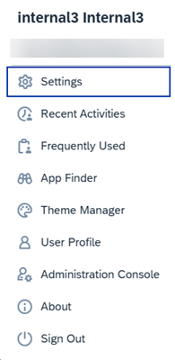

<!-- loioefe7d6d5cb664f81b8ee8d97a587687c -->

<link rel="stylesheet" type="text/css" href="css/sap-icons.css"/>

# User Actions Menu

The User Actions menu offers you various options to customize your working environment.

To open the User Actions menu, click your initials or profile photo in the top right of the header bar.

A typical User Actions menu would look like this depending on configurations set by your administrator:

> ### Note:  
> The *Administration Console* is only visible if you have admin permissions.

Here are more details about the features you can access from the User Actions menu:

<table>
<tr>
<th valign="top">

Feature

</th>
<th valign="top">

Description

</th>
</tr>
<tr>
<td valign="top">

*Settings*



</td>
<td valign="top">

A central area where you can view and maintain the settings for your working environment.

For more information, see

[Managing Your Settings](managing-your-settings-a5f08cc.md).

</td>
</tr>
<tr>
<td valign="top">

*Recent Activities*



</td>
<td valign="top">

If enabled by your administrator, you will be able to access a list of items that you've searched for and worked with recently.

> ### Note:  
> If you’ve disabled the user activity tracking, this menu item isn’t shown.
> 
> To enable or disable this feature, see [User Settings](https://help.sap.com/docs/build-work-zone-advanced-edition/sap-build-work-zone-advanced-edition/user-settings), and in the table, go to *User Activities*.

</td>
</tr>
<tr>
<td valign="top">

*Frequently Used*



</td>
<td valign="top">

If enabled by your administrator, you will be able to access a list of the apps you've searched for and used most frequently over the last 30 days. An app must be used at least twice to appear in the list.

> ### Note:  
> If you’ve disabled the user activity tracking, this menu item isn’t shown.
> 
> To enable or disable this feature, see [User Settings](https://help.sap.com/docs/build-work-zone-advanced-edition/sap-build-work-zone-advanced-edition/user-settings), and in the table, go to *User Activities*.

</td>
</tr>
<tr>
<td valign="top">

*App Finder*



</td>
<td valign="top">

Enables you to directly open the App Finder - a convenient tool to help you find the apps that you have permissions to use. The apps appear in categories \(catalogs\) and can be directly added to your site.

For more information, see [How to Use the App Finder](how-to-use-the-app-finder-477a2ba.md).

</td>
</tr>
<tr>
<td valign="top">

*Theme Manager*



</td>
<td valign="top">

Get direct access to the Theme Manager where you can manage the themes for your site.

</td>
</tr>
<tr>
<td valign="top">

*User Profile*



</td>
<td valign="top">

Manage your user profile.

For more information, see [How to Set Up Your User Profile](https://help.sap.com/docs/build-work-zone-advanced-edition/sap-build-work-zone-advanced-edition/user-profile).

</td>
</tr>
<tr>
<td valign="top">

*Administration Console*



</td>
<td valign="top">

If you're a company administrator, you can directly access the Administration Console, which is a tool to do all administrative tasks that affect the site.

For more information, see [About the Adminisration Console](https://help.sap.com/docs/build-work-zone-advanced-edition/sap-build-work-zone-advanced-edition/about-administration-console).

</td>
</tr>
<tr>
<td valign="top">

*Alias Account Switcher*



</td>
<td valign="top">

You will only see this entry in the User Actions menu if you're assigned to one or more user alias accounts. You can then easily switch between your alias accounts or you can go back to your primary user account.

For more information, see [Switching Between User Alias Accounts](https://help.sap.com/docs/build-work-zone-advanced-edition/sap-build-work-zone-advanced-edition/switching-between-user-alias-accounts).

</td>
</tr>
<tr>
<td valign="top">

*About*



</td>
<td valign="top">

Get information about the application, environment, the site's theme, and more.

</td>
</tr>
</table>

