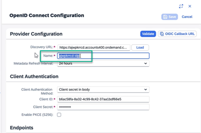

<!-- loiof04c185d689846908fb11d9a228392a2 -->

# User Authentication and Authorization

Information about different user authentication, provisioning and authorization options in SAP Build Work Zone, advanced edition.

The onboarding guide describes a basic end-to-end flow for setting up SAP Build Work Zone, advanced edition, using Identity Authentication and Identity Provisioning. However, other setup options are supported, based on your own environment requirements.

<a name="loiof04c185d689846908fb11d9a228392a2__section_kwg_mpg_5pb"/>

## User Authentication

By default, the connection to Identity Authentication is through SAP Authorization and Trust Management service. It is required to create a trust between Identity Authentication and this service using the OpenID Connect \(OIDC\) protocol. For more information, see [Establish Trust and Federation Between SAP Authorization and Trust Management Service and Identity Authentication](https://help.sap.com/docs/btp/sap-business-technology-platform/establish-trust-and-federation-between-uaa-and-identity-authentication).

> ### Note:  
> As of 31.12.2024, SAML trust configurations are deprecated for user-interactive authentication in customer-owned accounts regardless of the specific identity provider.

For subscriptions created prior to 20th March, 2025, it is also required to switch to direct connection with Identity Authentication. For more information, see [Post Booster Configuration](post-booster-configuration-e567b51.md). Subscriptions created after this date are connected to Identity Authentication directly by default.

### Optional: Define IdP Login

When logging in to a site, the authentication process always uses Identity Authentication, whether it is used as the primary IdP or as a proxy towards another IdP. For more information about using Identity Authentication as a proxy, see [Corporate Identity Providers](https://help.sap.com/viewer/6d6d63354d1242d185ab4830fc04feb1/Cloud/en-US/19f3eca47db643b6aad448b5dc1075ad.html)

During the onboarding process, you must have a single active trust configuration with Identity Authentication in the subaccount. Adding multiple trust configurations can cause a failure in the onboarding process. However, after the onboarding is complete, you can add multiple IdPs, and define which IdP will appear in the login screen \(dynamic IdP\).

To do this, add the `sap_idp` query parameter to the request with the value of the IdP Origin Key.

For example: `https://[app-domain]/sites?sap_idp=sap.custom`.

Then, in the Cloud Identity Services admin console, go to *Identity Providers* \> *Corporate Identity Providers*, and add an IdP with a display name that is equal to the value of the `sap_idp` query parameter.

For more information, see [Configure Trust with OpenID Connect Corporate Identity Provider](https://help.sap.com/docs/cloud-identity-services/cloud-identity-services/corp-idp-configure-trust-with-openid-connect-corporate-identity-provider?version=Cloud).

<a name="loiof04c185d689846908fb11d9a228392a2__section_hyg_f4g_5pb"/>

## User Provisioning

It is mandatory to use the Identity Provisioning service to provision users and their authorizations. The source system varies, depending on your environment setup and preferences, while the target system should always be SAP Build Work Zone, advanced edition. For more information about Identity Provisioning supported source systems, see [Source Systems](https://help.sap.com/docs/cloud-identity-services/cloud-identity-services/source-systems).

**Optional setup:** You can use Identity Provisioning to provision authorizations required for accessing business content from remote content providers. In this case, you need to set up the SAP Build Work Zone, standard edition connector in your Identity Provisioning tenant, in addition to the SAP Build Work Zone, advanced edition mandatory connector. For more information, see [Post Booster Configuration](post-booster-configuration-e567b51.md) \(Connect to Identity Provisioning section, step 5\) .

<a name="loiof04c185d689846908fb11d9a228392a2__section_wh4_pqg_5pb"/>

## User Authorization

To be able to access SAP Build Work Zone, advanced edition, users must be assigned the relevant roles collections in the SAP BTP cockpit.

You can assign users to role collections in one of the following ways:

-   Using assertion attribute mapping \(e.g. “Groups”\), from the Identity Authentication to SAP BTP cockpit. For more information, see [Prerequisites](prerequisites-9e78b62.md).
-   Manually assign user to role collections in the SAP BTP cockpit. For more information, see [Assigning Role Collections](https://help.sap.com/viewer/65de2977205c403bbc107264b8eccf4b/Cloud/en-US/9e1bf57130ef466e8017eab298b40e5e.html).
-   Using an API-based assignment of users \(e.g. via an Identity Provisioning target system\). For more information, see [Access Administration Using APIs of the SAP Authorization and Trust Management Service](https://help.sap.com/viewer/65de2977205c403bbc107264b8eccf4b/Cloud/en-US/dcb3bfd09c4b465e9d6f599485c5b6de.html).

> ### Note:  
> The default onboarding flow lists specific user group names that are mapped to role collections in SAP BTP cockpit. Same mapping is done by the SAP Build Work Zone, advanced edition booster, which relies on those exact user groups names from Identity Authentication. If you wish to configure this differently, you can use different group names and manually map them to the role collections in SAP BTP cockpit. User groups can either be manually created in Identity Authentication or come from a corporate IdP.

<a name="loiof04c185d689846908fb11d9a228392a2__section_tgv_zrg_5pb"/>

## Exception! - External Users Self-Registration

If you plan to allow external users self-registration via workspace invitations, you **must** use Identity Authentication.

In the self-registration scenario the following conditions should be met:

-   Users are created via self-registration in the Identity Authentication service.
-   The Identity Authentication service is used as the primary IdP.
-   Role collection is mapped based on an Identity Authentication attribute \(user type `public`\).
-   The Identity Provisioning service provisions user\(s\) directly from the Identity Authentication service as source system.

**Related Information**  

[Solution Architecture](solution-architecture-1fd9ea4.md "Information about SAP Build Work Zone, advanced edition architecture, as well as hostname patterns, trust setup, and authentication flows.")

[Using the SCIM API](using-the-scim-api-6bd5237.md "This topic provides the information you need about working with the SCIM API.")

[Assigning Company Administrators](assigning-company-administrators-ff793e6.md "You can manage the company administrator assignment using the SCIM API.")

[Managing Custom Profile Attributes](managing-custom-profile-attributes-796e3d9.md "Information about using custom attributes in the user profile.")

