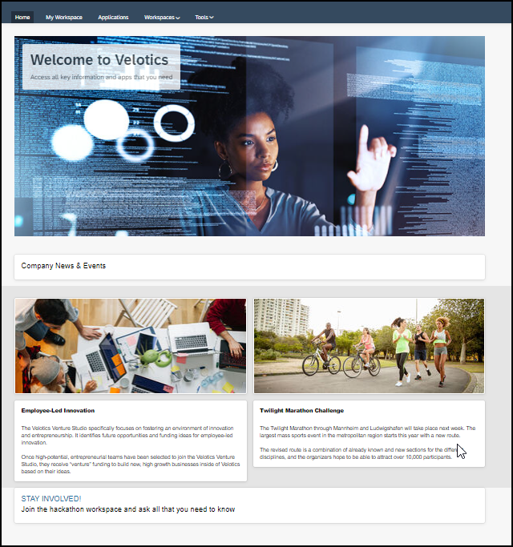
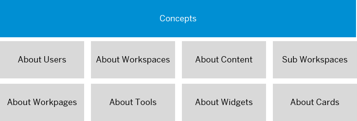
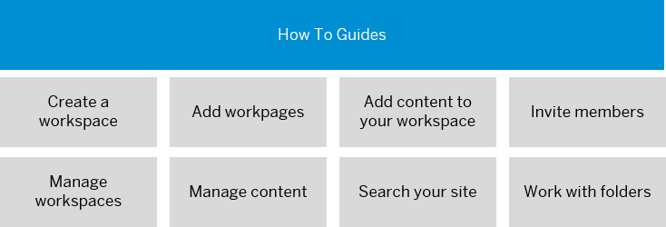

<!-- loioa3565236d34d463f97e3edd3bf943e0e -->

# User Guide

This guide provides you, the end user, with information on how to optimally use SAP Build Work Zone, advanced edition to build and design home pages, workpages, and workspaces in your site.

Here's a typical home page but there are so many more options that you can do to build an impressive site for your users:

This user guide is intended for SAP Build Work Zone, advanced edition users with the following roles:

-   End users
-   Page designers
-   Workspace administrators

<a name="loioa3565236d34d463f97e3edd3bf943e0e__section_vxj_2s3_qlb"/>

## Quick Access to More Information

The following diagrams help you to navigate quickly to some of the main topics you'll want to learn about - but there's much more that you can learn about and do in your site .

