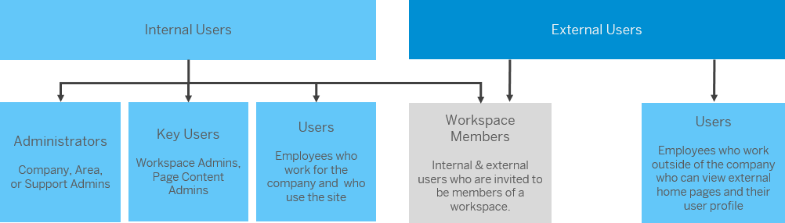

<!-- loio3173953b8f1e4aed8063fa7c628a7621 -->

# Users

SAP Build Work Zone, advanced edition personas are made up of internal and external users.

Internal users are users who work in the company. They can be administrators with different privileges, or key users who are designated to add content or create workspaces, or end users who simply use the site to do their daily work and are members of the workspaces that they've been invited to.

External users are those users who are not employed by the company. They can become a member of a specific workspace that they've been invited to and they can also access external home pages and their user profiles.

This diagram gives you a high-level view of how these personas are structured:

<a name="loio3173953b8f1e4aed8063fa7c628a7621__section_s2k_sbc_xrb"/>

## More Information

-   For more information about external users, see [External Users - Overview](external-users-overview-4378212.md)

-   For more information about internal users, see [Internal Users](internal-users-888ef2f.md)

-   For more information about administrators, see [Administrators](administrators-63a91fb.md).

-   For more information about end users, see [Users](https://help.sap.com/docs/WZ/b03c84105ff74f809631e494bd612e83/3173953b8f1e4aed8063fa7c628a7621.html).

