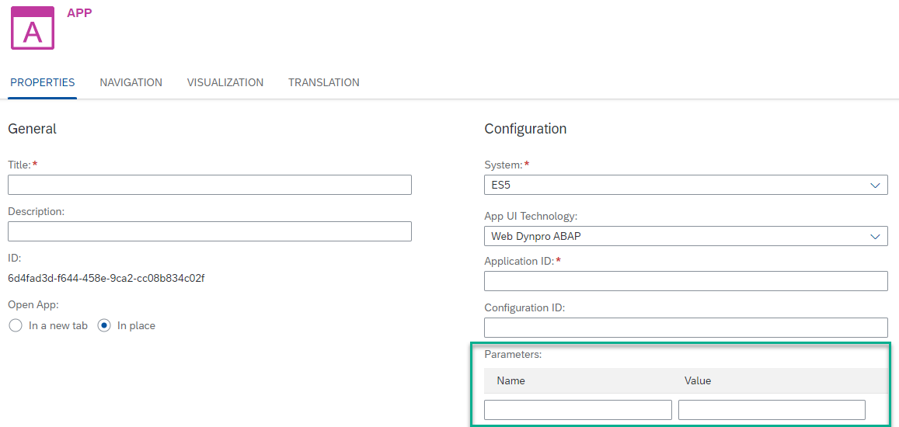

<!-- loio35a2b711aed448dd93b8e0112d662922 -->

<link rel="stylesheet" type="text/css" href="css/sap-icons.css"/>

# Web Dynpro ABAP Apps

The specific properties required to configure a Web Dynpro ABAP app.

<a name="loio35a2b711aed448dd93b8e0112d662922__section_rnv_tfy_yhb"/>

## Property Descriptions

<table>
<tr>
<th valign="top">

Property

</th>
<th valign="top">

Type

</th>
<th valign="top">

Description

</th>
</tr>
<tr>
<td valign="top">

<code><b>Application ID</b></code> 

</td>
<td valign="top">

**Mandatory** 

</td>
<td valign="top">

Enter the *Application ID* of the Web Dynpro ABAP application.

</td>
</tr>
<tr>
<td valign="top">

<code><b>Configuration ID</b></code> 

</td>
<td valign="top">

Optional

</td>
<td valign="top">

Enter the *Configuration ID* that runs with the Web Dynpro ABAP application ID.

</td>
</tr>
</table>

<a name="loio35a2b711aed448dd93b8e0112d662922__section_k44_fsy_yhb"/>

## Obtaining the Property Values

To obtain the property values of a custom-developed Web Dynpro ABAP app, refer to your ABAP stack.

For Web Dynpro ABAP apps provided by SAP, obtain the values of the properties using the [SAP Fiori apps reference library](https://fioriappslibrary.hana.ondemand.com/).

**Procedure**

1.  In the SAP Fiori apps reference library, filter the list of applications using *Web Dynpro* as the *Application Type*.

2.  In the list of apps, click on the app you would like to configure.

3.  In the details pane of the app, click the *IMPLEMENTATION INFORMATION* tab.

4.  Open the *Configuration* section, and under *Technical Configuration*, you can find the following values: *WebDynpro Application*\(ID\) and *WebDynpro Configuration* \(ID\).

> ### Note:  
> Under *Target Mapping\(s\)*, you can also find the *Sematic Object* and *Semantic Action* values for this app.

<a name="loio35a2b711aed448dd93b8e0112d662922__section_xy4_1tx_yhb"/>

## Defining Parameters \(Optional\)

You can also add parameters to the URL for an Web Dynpro ABAP app. These parameters are optional and will have a direct effect on the app at runtime. To define these parameters, use the *Parameters* table. Enter the *Name* and *Value* of each **parameter** that you need to pass to the app:

-   Every time you enter a parameter name and value, a new pair of empty fields is added automatically.

-   Use  \(Delete\) to delete a parameter.

> ### Note:  
> When using the keyboard to navigate between the parameter rows and fields, the following keys apply:
> 
> -   First use the F2 key to place focus on a row, and then use the up/down arrow keys to move between the rows.
> 
> -   Once you reach the row you want to edit, use the TAB key to focus on the *Name* field and then again to move to the *Value* field.

**Related Information**  

[Manual Integration of Apps](manual-integration-of-apps-ddb655a.md "Learn how to integrate apps manually.")

[Configure Apps](configure-apps-4ba745b.md "Add a local app to your subaccount by manually configuring its properties in the dedicated editors.")

