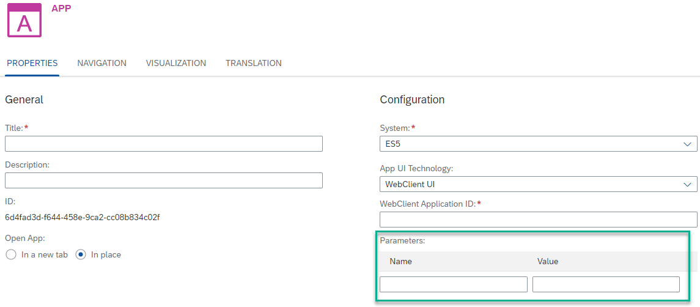

<!-- loio7255021210b4465a902ff0c00aa102cc -->

<link rel="stylesheet" type="text/css" href="css/sap-icons.css"/>

# WebClient UI Apps

The specific properties required to configure a WebClient UI app.

<a name="loio7255021210b4465a902ff0c00aa102cc__section_rnv_tfy_yhb"/>

## Property Description

<table>
<tr>
<th valign="top">

Property

</th>
<th valign="top">

Description

</th>
</tr>
<tr>
<td valign="top">

<code><b>WebClient Application ID</b></code> 

</td>
<td valign="top">

Enter the `Application ID` of the WebClient UI application.

</td>
</tr>
</table>

<a name="loio7255021210b4465a902ff0c00aa102cc__section_lnw_bgy_yhb"/>

## Locating the Property Value

To locate the value of the `WebClient Application ID` for your WebClient application, use the [SAP Fiori apps reference library](https://fioriappslibrary.hana.ondemand.com/).

**Procedure**

1.  In the SAP Fiori apps reference library, filter the list of SAP S/4HANA apps by *UI Technology* and then select *Web Client UI*.

2.  In the list of apps, click on the app you would like to configure.

3.  In the details pane of the app, click the *IMPLEMENTATION INFORMATION* tab.

4.  Open the *Configuration* section, and under *Configuration* \> *Technical Configuration*, you can find the value of the *Web Client UI Application* \(ID\).

> ### Note:  
> Under *Target Mapping\(s\)*, you can also find the *Sematic Object* and *Semantic Action* values for this app.

<a name="loio7255021210b4465a902ff0c00aa102cc__section_xy4_1tx_yhb"/>

## Defining Parameters \(Optional\)

You can also add parameters to the URL for an WebClient UI app. These parameters are optional and will have a direct effect on the app at runtime. To define these parameters, use the *Parameters* table. Enter the *Name* and *Value* of each **parameter** that you need to pass to the app:

-   Every time you enter a parameter name and value, a new pair of empty fields is added automatically.

-   Use  \(Delete\) to delete a parameter.

> ### Note:  
> When using the keyboard to navigate between the parameter rows and fields, the following keys apply:
> 
> -   First use the F2 key to place focus on a row, and then use the up/down arrow keys to move between the rows.
> 
> -   Once you reach the row you want to edit, use the TAB key to focus on the *Name* field and then again to move to the *Value* field.

**Related Information**  

[Manual Integration of Apps](manual-integration-of-apps-ddb655a.md "Learn how to integrate apps manually.")

[Configure Apps](configure-apps-4ba745b.md "Add a local app to your subaccount by manually configuring its properties in the dedicated editors.")

