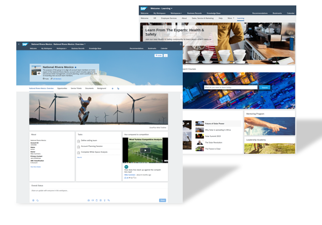
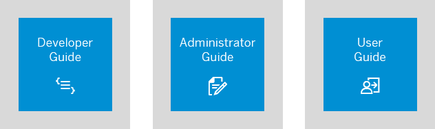
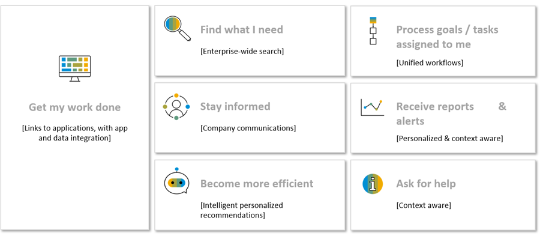

<!-- loio5c0103b130de411fb2a4b5416e36d767 -->

# What Is SAP Build Work Zone, advanced edition?

Use SAP Build Work Zone, advanced edition for building digital workplace solutions to increase user productivity and engagement. SAP Build Work Zone, advanced edition centralizes access to relevant business applications, processes, information, and communication in a unified entry point that users can access from any device.

You can create an outstanding user experience for business application users that intelligently surfaces application content and simplifies business processes to drive employee engagement, focus, and productivity. It's easy to use and administer, and helps people access the information they need.

> ### Note:  
> SAP SuccessFactors Work Zone is a solution available through SAP SuccessFactors and offers a prepackaged experience specifically to address the needs of HR organizations based on SAP Build Work Zone, advanced edition. The SAP SuccessFactors Work Zone solution is a superset of SAP Build Work Zone, advanced edition plus additional functionality such as workflow and mobile services.
> 
> -   For more information about HR-specific content provided by SAP SuccessFactors, see [SAP SuccessFactors Work Zone Content](https://help.sap.com/viewer/04877e17a5da4908a6fea94949e160b5/Cloud/en-US)
> -   For more information about migration and implementation considerations, see [Implementation Design Principle](https://d.dam.sap.com/a/3nZVVDd)

<a name="loio5c0103b130de411fb2a4b5416e36d767__section_dft_tnp_jlb"/>

## Quick Access to More Information

Click the relevant guide to open it:

<a name="loio5c0103b130de411fb2a4b5416e36d767__section_y1w_jr4_zkb"/>

## Key Capabilities

Here are some of the key capabilities and features that you can enjoy:

<table>
<tr>
<th valign="top">

Key Capability

</th>
<th valign="top">

More Information

</th>
</tr>
<tr>
<td valign="top">

Simple, modern, and consistent user interface that provides a unified intelligent work experience.

</td>
<td valign="top">

Create a dynamic, modern, and personalized user experience, using tools that require minimum coding.

</td>
</tr>
<tr>
<td valign="top">

Harmonized access to business applications and third-party content

</td>
<td valign="top">

Access information and processes from SAP and third-party business applications with diverse content types such as tasks, workflows, and web content seamlessly integrated into a single workspace.

</td>
</tr>
<tr>
<td valign="top">

Sharing and interacting with your teams and colleagues

</td>
<td valign="top">

Administrators and users can benefit from a wide range of options to share information and interact with each other. For example, blogs, multimedia, surveys, polls, wiki pages, events, knowledge base articles, tasks, and feeds.

</td>
</tr>
<tr>
<td valign="top">

Secure access

</td>
<td valign="top">

Use role-based navigation and convenient single or no-password access to content across SAP Build Work Zone, advanced edition via Single Sign-On \(SSO\).

</td>
</tr>
<tr>
<td valign="top">

Integrating on-premise and cloud apps 

</td>
<td valign="top">

 SAP Build Work Zone, advanced edition can integrate with cloud, hybrid, and on-premise enterprise applications and services.

</td>
</tr>
<tr>
<td valign="top">

Extend SAP Build Work Zone, advanced edition 

</td>
<td valign="top">

Extend SAP Build Work Zone, advanced edition according to your business needs with SAP BTP services. Add chat bots with conversational AI, provide easy-to-follow guided experiences with workflows, and more.

</td>
</tr>
<tr>
<td valign="top">

Access anywhere on multiple channels

</td>
<td valign="top">

Quick access via desktop and mobile devices to information regardless of where the user is located; in an office or on the road.

SAP Build Work Zone, advanced edition is accessible via web browser, a dedicated mobile app, and mobile devices with a responsive web UI.

</td>
</tr>
<tr>
<td valign="top">

Support of Multi-Tenancy concept

</td>
<td valign="top">

If you’ve developed a multi-tenant application and want your consumers to use the SAP Build Work Zone, advanced edition capabilities in the application, see:

-   [Getting Started](https://help.sap.com/viewer/b03c84105ff74f809631e494bd612e83/Cloud/en-US/627b9e36a3da430199133c6ca0db45d8.html "Step-by-step guides for onboarding to SAP Build Work Zone, advanced edition and SAP SuccessFactors Work Zone.") :arrow_upper_right:
-   [**Developing Multitenant Applications in the Cloud Foundry Environment**](https://help.sap.com/docs/BTP/65de2977205c403bbc107264b8eccf4b/5e8a2b74e4f2442b8257c850ed912f48.html)

</td>
</tr>
</table>

