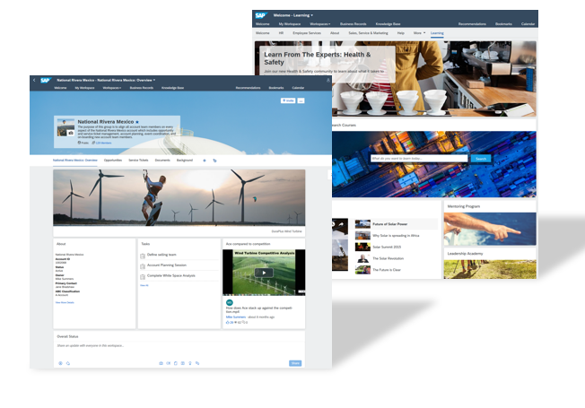
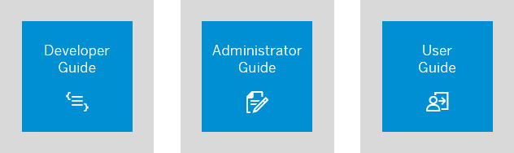

<!-- loio5c0103b130de411fb2a4b5416e36d767 -->

# What Is SAP Build Work Zone, advanced edition?

Create workspace experiences with integrated business apps and processes.

SAP Build Work Zone, advanced edition lets you build digital workspace solutions to increase user productivity and engagement. It centralizes access to relevant business applications, processes, information, and communication in a unified entry point that your users can access from any device.

<a name="loio5c0103b130de411fb2a4b5416e36d767__section_fyy_vc1_krb"/>

## Environment

This service is available in the Cloud Foundry environment.

<a name="loio5c0103b130de411fb2a4b5416e36d767__section_w3b_r2w_m1c"/>

## Features

<dl>
<dt><b>

Consistent work experience 

</b></dt>
<dd>

Create a dynamic, modern, and personalized user experience, using tools that require minimum coding.

</dd><dt><b>

Harmonized access to apps and content 

</b></dt>
<dd>

Access information and processes from SAP and third-party business applications with diverse content types such as tasks, workflows, and web content seamlessly integrated into a single workspace.

</dd><dt><b>

Extend the service 

</b></dt>
<dd>

Extend SAP Build Work Zone, advanced edition to your business needs with SAP BTP services. Provide easy-to-follow guided experiences with workflows, and more.

</dd><dt><b>

Role-based access to content 

</b></dt>
<dd>

Use role-based navigation and single-sign-on to access content across SAP Build Work Zone, advanced edition.

</dd><dt><b>

Anytime, anywhere access to information 

</b></dt>
<dd>

Quick access via desktop and mobile devices to information regardless of where the user is located; in an office or on the road.

</dd><dt><b>

Interacting with teams and colleagues 

</b></dt>
<dd>

Administrators and users can benefit from a wide range of options to share information and interact with each other. For example, blogs, multimedia, surveys, polls, wiki pages, events, knowledge base articles, tasks, and feeds.

</dd><dt><b>

Integrating on-premise and cloud apps  

</b></dt>
<dd>

The cloud-based framework allows you to use your on-premise and cloud applications with a new modern experience.

</dd><dt><b>

Benefit from multitenancy support 

</b></dt>
<dd>

Use this service in tenant-aware \(multitenant\) applications. Run them on a shared compute unit that can be used by multiple consumers \(tenants\).

</dd>
</dl>

<a name="loio5c0103b130de411fb2a4b5416e36d767__section_s5v_y33_fdc"/>

## Multitenancy Support

This service supports multitenancy. It can be used in tenant-aware applications.

## Progressive Exposure Model

To ensure stability and minimize risk, the various cloud landscapes are updated in waves following a progressive exposure model. Therefore, for some regions, the described feature or concept is released a few days earlier or later than the specified date. To learn more about the release resources and schedules, see [Release Navigator - SAP Build Work Zone](https://readiness-at-scale.enable-now.cloud.sap/pub/20230621_ras/index.html?show=book!BO_EC8330B09B97CDBE#slide!SL_BB1248752EA119B).

<a name="loio5c0103b130de411fb2a4b5416e36d767__section_nkc_s2w_m1c"/>

## SAP SuccessFactors Work Zone

SAP SuccessFactors Work Zone is a solution available through SAP SuccessFactors and offers a prepackaged experience specifically to address the needs of HR organizations based on SAP Build Work Zone, advanced edition. The SAP SuccessFactors Work Zone solution is a superset of SAP Build Work Zone, advanced edition plus additional functionality such as workflow and mobile services.

-   For more information about HR-specific content provided by SAP SuccessFactors, see [SAP SuccessFactors Work Zone Content](https://help.sap.com/viewer/04877e17a5da4908a6fea94949e160b5/Cloud/en-US)
-   For more information about migration and implementation considerations, see [Implementation Design Principle](https://d.dam.sap.com/a/3nZVVDd)

<a name="loio5c0103b130de411fb2a4b5416e36d767__section_dft_tnp_jlb"/>

## Quick Access to More Information

Click the relevant guide to open it:

