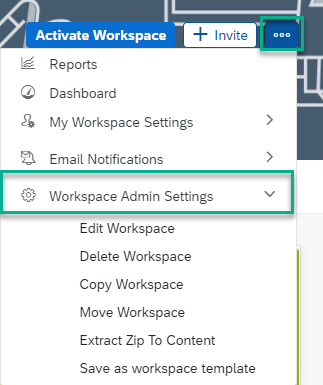

<!-- loioc7cc20cafae04298bc70749c94ff0b6d -->

<link rel="stylesheet" type="text/css" href="css/sap-icons.css"/>

# Workspace Settings

Administrators of a workspace can configure a number of settings that apply to the workspace.

Everyone who creates a workspace is automatically assigned as an administrator of that workspace. There is also the option to assign other workspace members as administrators of a particular workspace.

The workspace settings that you define can determine how workspace members can engage and interact within the workspace.

To access these settings, do the following:

On your workspace, click  and then click *Workspace Admin Settings*.

For more information about these settings, see [Workspace Administrator Tasks](https://help.sap.com/viewer/fec5ca6e3229418f84a932c745cbe985/Cloud/en-US/b861107c58d14670a0a6971932c85ad1.html).

In the *Workspace Admin Settings* dropdown list, click *Edit Workspace*. There are three tabs with settings that you can configure for the workspace:

<table>
<tr>
<th valign="top">

Tab

</th>
<th valign="top">

What settings can be configured

</th>
</tr>
<tr>
<td valign="top">

*General* 

</td>
<td valign="top">

Includes basic settings such as name, description, and workspace type that defines the privacy level of your workspace.

</td>
</tr>
<tr>
<td valign="top">

*Setup* 

</td>
<td valign="top">

Includes settings to help you set up your work zone such as terms of use, adding a company announcement, changing your workspace avatar and background image, determining your landing page, calendar view, and administrative area as well as what content is displayed in your workspace.

</td>
</tr>
<tr>
<td valign="top">

*Participation* 

</td>
<td valign="top">

Includes settings that determine how you can interact in a workspace. Examples are collaboration level, upload policy, content approval by selected workspace members for feed posts, forum posts, and different content types, default email notification settings, task policy, @@notify usage, and content rating.

</td>
</tr>
</table>

For more information about many of these settings, see [How to Create a Workspace](how-to-create-a-workspace-770f1b0.md).

