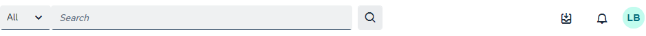
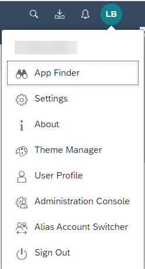

<!-- loio9f510de3f24241429628816d2de62bb2 -->

<link rel="stylesheet" type="text/css" href="css/sap-icons.css"/>

# Your Working Environment

When you log on to SAP Build Work Zone, advanced edition, you'll see various icons in the header bar of our site. This topic gives a short description about these features.

<a name="loio9f510de3f24241429628816d2de62bb2__section_i1m_bgg_d4b"/>

## The header bar

The header bar in your site looks something like this \(depending on certain configurations that your administrator may have made\).

.

<table>
<tr>
<th valign="top">

Feature

</th>
<th valign="top">

Description

</th>
</tr>
<tr>
<td valign="top">

*Search*



</td>
<td valign="top">

Use the standard search mechanism to search for content in your site or for the applications assigned to your roles. Use Enterprise Search to search for SAP S/4HANA applications \(if they've been configured to work with enterprise search\).

> ### Note:  
> Searching for site content from the search bar, isn't available if enterprise search is enabled.

For more information, see [How to Search in Your Site](how-to-search-in-your-site-a3a83b4.md).

</td>
</tr>
<tr>
<td valign="top">

*My Inbox*



</td>
<td valign="top">

Displays all tasks from SAP and non-SAP workflows.

</td>
</tr>
<tr>
<td valign="top">

*Notifications*



</td>
<td valign="top">

Displays a list of notifications to inform you of important updates, invitations, and approval requests. You can see your current notifications as well as a record of your past notifications.

> ### Note:  
> If @@notify is enabled and sent via a workspace, you'll only receive a notification if you’re following the workspace.

For more information, see [About Notifications](about-notifications-fc1ef68.md).

</td>
</tr>
<tr>
<td valign="top">

*Avatar* 

</td>
<td valign="top">

Clicking on your profile picture, opens the User Actions menu.

> ### Note:  
> If you haven't yet added a photo, your profile image consists of a circle with your initials. To add a different image, select *User Profile* from the User Actions menu and click the camera icon to upload a new one.
> 
> For more information about the user actions menu, see [How to Set Up Your User Profile](how-to-set-up-your-user-profile-a80f406.md).

</td>
</tr>
<tr>
<td valign="top">

*Employment Switcher*



</td>
<td valign="top">

**For SAP SuccessFactors Work Zone only**.

Enables a user to easily switch between their different employments and see only content that is relevant to the selected employment. If a user only has a single employment, the *Employment Switcher* won't be visible in the shell header.

For more information, see [SAP SuccessFactors Work Zone with Multiple Employment.](https://help.sap.com/viewer/04877e17a5da4908a6fea94949e160b5/Cloud/en-US/a9fd7463fc5e44399ea3d07b84b07e8f.html)

</td>
</tr>
</table>

<a name="loio9f510de3f24241429628816d2de62bb2__section_egb_1yy_zxb"/>

## User Actions Menu

The User Actions menu offers you various options to customize your working environment.

To open the User Actions menu, click the avatar with your profile picture.

> ### Note:  
> If you haven't yet uploaded a profile picture, you'll see a circle with your initials.

A typical User Actions menu would look like this depending on configurations set by your administrator:

The User Actions menu gives you direct access to the following features:

<table>
<tr>
<th valign="top">

Feature

</th>
<th valign="top">

Description

</th>
</tr>
<tr>
<td valign="top">

*Recent Activities*



</td>
<td valign="top">

Displays a Quick Access dialog showing the items you’ve searched for and worked with recently.

> ### Note:  
> If you’ve disabled the user activity tracking, this menu item isn’t shown.
> 
> To enable or disable this feature, see [User Settings](user-settings-2b739ae.md), and in the table, go to *User Activities*.

</td>
</tr>
<tr>
<td valign="top">

*Frequently Used*



</td>
<td valign="top">

Displays a Quick Access dialog showing the apps you’ve searched for and used most frequently over the last 30 days. An app must be used at least twice to appear in the list.

> ### Note:  
> If you’ve disabled the user activity tracking, this menu item isn’t shown.
> 
> To enable or disable this feature, see [User Settings](user-settings-2b739ae.md), and in the table, go to *User Activities*.

</td>
</tr>
<tr>
<td valign="top">

*App Finder*



</td>
<td valign="top">

Enables you to directly open the App Finder - a convenient tool to help you find the apps that you have permissions to use.

For more information, see [App Finder](https://help.sap.com/viewer/3d99fdeadde04524bdd33d35f1e13777/Cloud/en-US/48a5dbb0308b47d8969485845d5966ae.html).

</td>
</tr>
<tr>
<td valign="top">

*Settings*



</td>
<td valign="top">

A central area where you can view and maintain the settings for your environment.

For more information, see [User Settings](user-settings-2b739ae.md).

</td>
</tr>
<tr>
<td valign="top">

*User Profile*



</td>
<td valign="top">

Manage your user profile.

For more information, see [How to Set Up Your User Profile](how-to-set-up-your-user-profile-a80f406.md).

</td>
</tr>
<tr>
<td valign="top">

*Theme Manager*



</td>
<td valign="top">

Get direct access to the Theme Manager where you can manage the themes for your site.

</td>
</tr>
<tr>
<td valign="top">

*Administration Console*



</td>
<td valign="top">

If you’ve been assigned as an administrator, you’ll have direct access to the Administration Console.

> ### Note:  
> If you're not an administrator, you won't see this item in the menu.

For more information, see [Administration Console at a Glance.](https://help.sap.com/viewer/b03c84105ff74f809631e494bd612e83/Cloud/en-US/29ff49a0824b4b5098bfa301f2c0b60d.html)

</td>
</tr>
<tr>
<td valign="top">

*Alias Account Switcher*



</td>
<td valign="top">

If you're assigned to one or more user alias accounts, you can easily switch between them or you can go back to your primary user account.

For more information, see [Switching Between User Alias Accounts](switching-between-user-alias-accounts-3f23100.md).

</td>
</tr>
</table>

